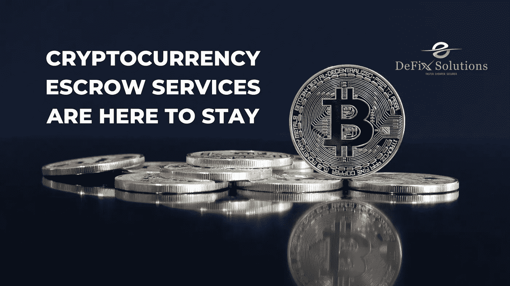

# 加密货币托管服务将继续存在

> 原文：<https://medium.com/coinmonks/cryptocurrency-escrow-services-are-here-to-stay-461f688687c2?source=collection_archive---------38----------------------->

有人可能会说数字化正达到顶峰。就在世界即将走向快速有效的交易系统之际，加密货币的出现受到了欢迎，被视为数字交易系统的意外之财。

当一个人对加密交易系统有一个坚实的理解时，实现一个方法并不困难。由于完全不受任何第三方活动的影响，因此人们普遍认为 Defi 是负责高效和有效完成该过程的主要系统。

根据这一观点，Defi 生态系统的进化实际上已经消除了对中间物的需求，这意味着术语“中间物”已经过时。托管与这些操作相关，因为它仍然活跃在加密货币的世界中，以及它是如何发展的。

## 托管是一个属于过去的术语吗？

在 Defi 生态系统形成之前，全世界都熟悉 Cefi 生态系统。Cefi 是一个集中的系统，大多数银行和金融机构都在其中运营。在 Defi 生态系统开发出来之前，全世界都接触到了 Cefi。

Defi 生态系统旨在简化分散式金融交易。该过程类似于这些机构在双方同意的情况下作为第三方坚持的过程。

因此，我们可以认为他们是领先的托管服务提供商。作为集中系统运行的目标是使所有相关方更容易执行安全且简单的程序，而不会将自己置于危险之中。

托管是一种已经存在了很长时间的做法，并不是一个全新的概念。任何人都毫不怀疑，该体系对支撑金融业的生态环境做出了重大贡献。

托管，管理与操作相关的几个额外的风险问题，被认为是彼此不熟悉的双方之间的主要保证形式。托管还扮演着主要担保人的角色。

区块链技术的发展已经消除了对集中式数据库的需要，这意味着现在可以使用这一选项。尽管安全性是实际系统管理的最重要的特性，但是大量的其他特性也在处理之中。

因此，加密货币交易的托管服务被视为分散式金融。这是因为用户不必依赖任何运营机构，就像传统形式的货币一样，这也是加密货币如此受欢迎的原因。

## **托管系统的需要**

在当今的数字货币市场中，加密货币的托管服务变得越来越普遍。除了受支持的令牌之外，人们通常还依赖交易所提供的可靠的托管服务。交易所提供这些服务。

毫无疑问，defi 系统具有丰富的自主性；然而，对于用户来说，有一个持续的需求，即获得他们可能相信、确保和依赖的值得信赖的、无风险的解决方案。

## **Defix 帮助用户**

用户和交易所本身总是需要一个值得信赖的托管服务。DeFiX 的目标是提供一个分散的托管平台，全世界的用户都可以利用这个平台。

这样做是考虑到会带来很大的便利。该系统的基础设施旨在促进各种简单、快速、安全的支付方式，所有这些都有助于高效管理数字资产。

DeFiX 旨在为用户提供他们可以放心依赖的简单性和速度。

> *交易新手？试试* [*密码交易机器人*](/coinmonks/crypto-trading-bot-c2ffce8acb2a) *或* [*复制交易*](/coinmonks/top-10-crypto-copy-trading-platforms-for-beginners-d0c37c7d698c)
> 
> *分散密码持有量，了解* [*币安替代品*](https://coincodecap.com/binance-alternatives)
> 
> *加入 Coinmonks* [*电报频道*](https://t.me/coincodecap) *和* [*Youtube 频道*](https://www.youtube.com/c/coinmonks/videos) *获取每日* [*加密新闻*](http://coincodecap.com/)

# 另外，阅读

*   [复制交易](/coinmonks/top-10-crypto-copy-trading-platforms-for-beginners-d0c37c7d698c) | [加密税务软件](/coinmonks/crypto-tax-software-ed4b4810e338)
*   [网格交易](https://coincodecap.com/grid-trading) | [加密硬件钱包](/coinmonks/the-best-cryptocurrency-hardware-wallets-of-2020-e28b1c124069)
*   [密码电报信号](/coinmonks/top-3-telegram-channels-for-crypto-traders-in-2021-8385f4411ff4) | [密码交易机器人](/coinmonks/crypto-trading-bot-c2ffce8acb2a)
*   [最佳加密交易所](/coinmonks/crypto-exchange-dd2f9d6f3769) | [印度最佳加密交易所](/coinmonks/bitcoin-exchange-in-india-7f1fe79715c9)
*   [开发者最佳加密 API](/coinmonks/best-crypto-apis-for-developers-5efe3a597a9f)
*   最佳[密码借贷平台](/coinmonks/top-5-crypto-lending-platforms-in-2020-that-you-need-to-know-a1b675cec3fa)
*   [免费加密信号](/coinmonks/free-crypto-signals-48b25e61a8da) | [加密交易机器人](/coinmonks/crypto-trading-bot-c2ffce8acb2a)
*   杠杆代币的终极指南