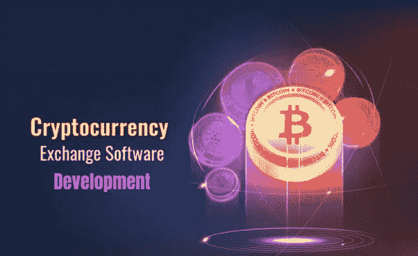
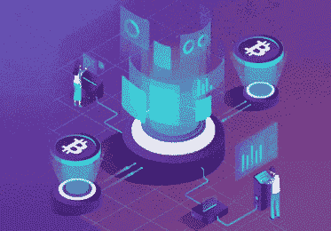

# 加密货币交换软件开发作为一项业务:它仍然是 Web3 的一个选择吗？

> 原文：<https://medium.com/coinmonks/cryptocurrency-exchange-software-development-as-a-business-is-it-still-an-option-for-web3-d6a498a3dd0e?source=collection_archive---------24----------------------->

**Cryptocurrency Exchange Software Development**

第一次报道的加密货币交易发生在 2009 年 1 月 10 日，当时假名中本聪向哈尔·芬尼发送了 10 BTC。比特币第一次被报道的商业用途发生在一年后，当时一名佛罗里达州男子转账 10，000 BTC 购买了两个披萨。快进到今天，我们已经见证了成千上万种加密货币的兴起和衰落，这一领域充满了努力使其货币成为头号货币的加密机构。但是终端用户如何应对如此多的密码呢？不用担心，因为加密货币交换软件的开发使人们能够无缝地在加密货币之间进行交换。

# 什么是加密货币兑换软件？

一款 [**加密货币兑换软件**](https://bit.ly/3s0orRs) 是一款帮助人们将法币兑换成加密货币的软件，反之亦然，同时允许加密-加密交易。虽然它们的基本功能是交换加密令牌，但现代交易所增加了增强的金融功能，如 NFTs 和赌注，以引领市场。在选择加密货币交易软件开发模式时，应该知道有多种可能的模式。它们可以基于集中式、分散式、混合式和 P2P 模式，从零开始构建，并且是可定制的白标解决方案。**币安、比特币基地、北海巨妖、Uniswap、PancakeSwap 和 dYdX** 是当今加密市场上流行的加密货币交易软件的例子。

**Crypto Exchange**

# 加密交换中的必备功能

✪ **加密钱包**，内置或集成到加密货币交换软件开发解决方案中，是必须的，因为它可以容纳加密货币。

✪ **匹配引擎**在寻找交易对(加密-加密、菲亚特-加密或加密-菲亚特)的最佳价值以实现低成本加密交易方面发挥了巨大作用。

✪ **智能合约**通过预编码条件帮助执行交易所加密交易，从而消除了该过程中涉及的中介。

✪ **流动性池**在加密货币交易软件开发中至关重要，可确保各种加密令牌在任何时候都有足够的流动性，不会出现中断。

✪ **管理门户**在此类交易所中至关重要，用于监督交易是如何进行的，并获得可用于更好决策和更新的分析统计数据。此外，门户还充当企业所有者对其企业的眼睛。

# 加密货币交换软件开发流程

👉首先，应该为他们的加密货币交换软件开发活动收集想法，并创建官方文档。

👉然后，使用各种技术堆栈和良好的编程实践，基于企业所有者的需求构建平台的用户端。

👉现在，加密货币交易所的法律框架已经建立，因为它通常也涉及法定交易的移动。

👉加密交易所的匹配引擎被集成到平台中，这确保了企业选择的交易对在任何时候都有效。

👉现在，该平台被整合到风险企业主希望的区块链中，流动性池被精心制作，为存储加密货币提供了空间。

👉加密交换的安全方面在这一点上与诸如 MFA、DDoS 和监狱登录等高级功能相集成。

👉然后，在加密交换中可用的加密令牌/硬币被存储在平台的流动性池中。

👉最后，推出加密货币兑换软件开发解决方案供公众使用。

# 回答名义上的问题

鉴于 2022 年大部分时间密码市场的情况，标题中的问题是必须回答的。但我们都知道，加密的波动性是双向的，下一次大繁荣可能会早于晚些时候出现。[**加密货币兑换软件开发**](https://bit.ly/3s0orRs) 在当前状态下，随着 NFT 和 metaverses 的地位越来越高，许多人已经开始采用它们，比以往任何时候都更需要作为一种商业选择。由于 cryptos 是 Web3 中的主食，所以这些应用程序是不可忽视的切入点。

# 散发出最后的光芒

我们可以说加密货币交易软件的开发对 Web3 的前景至关重要，因为它在最近有了巨大的增长。事实上，这些平台是新手进入 Web3 空间(甚至是区块链)的入口，这支持了经营这些业务的理念。我们可以肯定地发现，在未来的交流道路上将会有更多的演变。如果想办一个类似的平台，和专业的加密货币兑换软件开发公司联手品尝成功将是理想的。

> 交易新手？尝试[加密交易机器人](/coinmonks/crypto-trading-bot-c2ffce8acb2a)或[复制交易](/coinmonks/top-10-crypto-copy-trading-platforms-for-beginners-d0c37c7d698c)