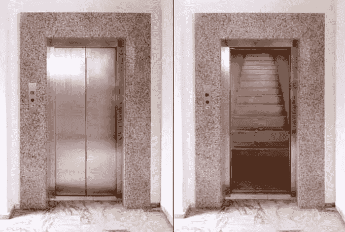
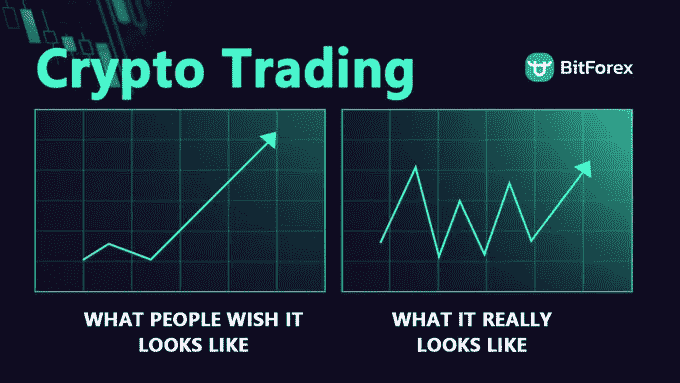

# 加密货币:期望与现实

> 原文：<https://medium.com/coinmonks/cryptocurrency-expectation-versus-reality-a90def5171f3?source=collection_archive---------29----------------------->

Expectation vs Reality

根据维基百科,“加密货币，有时被称为加密货币或密码，是以数字或虚拟形式存在的任何形式的货币，并使用加密技术来保护交易。加密货币没有一个中央发行或监管机构，而是使用一个分散的系统来记录交易和发行新的单位。”与传统货币不同，它不以实物形式存在，也不是由中央银行发行的。

**加密市场的投资者和交易者数量一直在增加。不同的投资者对他们持有的密码将如何产生大量利润有不同的积极预期。但是令人震惊的现实是，并不是你所有的密码都符合你的期望。我知道你看到过不同交易者或投资者的推文，解释他们购买的特定硬币或代币是如何大大超出他们的预期。我们中的一些人遇到过这样的推文，但你不知道的是，这些成功故事中有些纯粹是运气，有些纯粹是努力工作和适当的研究。**

**大多数交易者和投资者的期望大多时候是不现实的。作为投资者，你需要了解投资任何加密货币所涉及的风险。无论你投资的钱有多小，你都需要在投资前对加密货币做更详细的研究。了解和研究你将要购买的任何加密货币是至关重要的。在购买加密货币之前做好研究对你有好处。**

Expectation vs Reality

**我见过不少赌徒，他们自称是交易者，试图在一夜之间将 1000 美元的投资变成 100 万美元，这是一种不健康的预期，当他们最终失去所有资本时，他们会开始哀叹“加密是一个骗局”。虽然在 crypto 中把 1000 美元变成 100 万美元是可能的。我们已经看到了很多像柴犬，Doge，甚至 BTC 这样的秘密项目，让很多人变成了百万富翁。我们也看到很多人把赚来的钱输回了市场。我的导师总是说“交易不是 100 米短跑，它就像一场马拉松，所以要像对待马拉松一样对待它。”**

**事实是，你大部分时间都在关注你看到的那些甜蜜的头条新闻，关于那些今天在 crypto 上投资 100 美元，第二天就成为百万富翁的人。这些甜蜜的标题提高了你的期望，让你对现实视而不见，就像有些人的资本翻了三倍，而有些人的资本却在流失。**

大多数人对加密的第一个期望是，他们认为加密是一个快速致富的计划，因此他们期望从他们购买的加密中获得高回报。事实是，加密不是一个快速致富的计划，利润越高，风险越高。“交易越多，赚得越多；交易越多，赔得越多”

**另一个期望是，大多数人认为加密市场更可预测，不能被操纵，但现实是加密市场是不可预测的。一些投资者会随机购买一枚硬币，并期望 6 个月后他们回来查看时，它会增加到 10 倍或更多，但当现实出现时，他们会震惊地发现他们的投资已经大幅下跌。**

**一些投资者在高点买入一枚硬币，当硬币开始抛售时，他们会求助于祈祷和禁食，希望市场会朝着对他们有利的方向发展。在市场暴跌之后，这些投资者会开始哀叹“加密是一个骗局。”但是 Crypto 真的是一个骗局吗？还是你缺乏研究让你认为 Crypto 是一个骗局？**

投资者需要明白，加密市场并没有得到完全监管，这意味着你可能成为骗局的受害者。

*   **“拉地毯是炒作他们创造的硬币的常用手段，目的是拿走所有东西然后消失。”**

所以研究的重要性再怎么强调也不为过。

**当你不是市场的参与者时，观察和分析市场总是更容易，直到你成为市场的参与者，你的分析似乎才是完美的。**

**结论**

**随着最近围绕加密货币的大肆宣传，许多投资者开始参与进来。投资者持有不同的硬币，希望有一天会是 10 倍、100 倍甚至 1000 倍。**

当然，这有时会发生，但不要提高你的期望值。加密货币市场非常不稳定。也就是说，比特币现在价值 25000 美元，几小时或几天后价值 12000 美元。

加密不是一个快速致富的计划，做好你的研究(DYOR ),从你的内心中去除不健康的期望。就当我写的是友好的玩笑吧。

请不要忘记留下更多有趣的文章。你可以通过[**https://t.me/Cryptomayor0**](https://t.me/Cryptomayor0)与我电报联系

**或在推特上点击:**[**https://twitter.com/LateefSuleiman1**](https://twitter.com/LateefSuleiman1)

谢了。

> *交易新手？试试* [*密码交易机器人*](/coinmonks/crypto-trading-bot-c2ffce8acb2a) *或* [*复制交易*](/coinmonks/top-10-crypto-copy-trading-platforms-for-beginners-d0c37c7d698c)
> 
> *分散密码持有量，了解* [*币安替代品*](https://coincodecap.com/binance-alternatives)
> 
> *加入 Coinmonks* [*电报频道*](https://t.me/coincodecap) *和* [*Youtube 频道*](https://www.youtube.com/c/coinmonks/videos) *获取每日* [*加密新闻*](http://coincodecap.com/)

# 另外，阅读

*   [复制交易](/coinmonks/top-10-crypto-copy-trading-platforms-for-beginners-d0c37c7d698c) | [加密税务软件](/coinmonks/crypto-tax-software-ed4b4810e338)
*   [网格交易](https://coincodecap.com/grid-trading) | [加密硬件钱包](/coinmonks/the-best-cryptocurrency-hardware-wallets-of-2020-e28b1c124069)
*   [密码电报信号](/coinmonks/top-3-telegram-channels-for-crypto-traders-in-2021-8385f4411ff4) | [密码交易机器人](/coinmonks/crypto-trading-bot-c2ffce8acb2a)
*   [最佳加密交易所](/coinmonks/crypto-exchange-dd2f9d6f3769) | [印度最佳加密交易所](/coinmonks/bitcoin-exchange-in-india-7f1fe79715c9)
*   [面向开发者的最佳加密 API](/coinmonks/best-crypto-apis-for-developers-5efe3a597a9f)
*   最佳[密码借贷平台](/coinmonks/top-5-crypto-lending-platforms-in-2020-that-you-need-to-know-a1b675cec3fa)
*   [免费加密信号](/coinmonks/free-crypto-signals-48b25e61a8da) | [加密交易机器人](/coinmonks/crypto-trading-bot-c2ffce8acb2a)
*   杠杆代币的终极指南