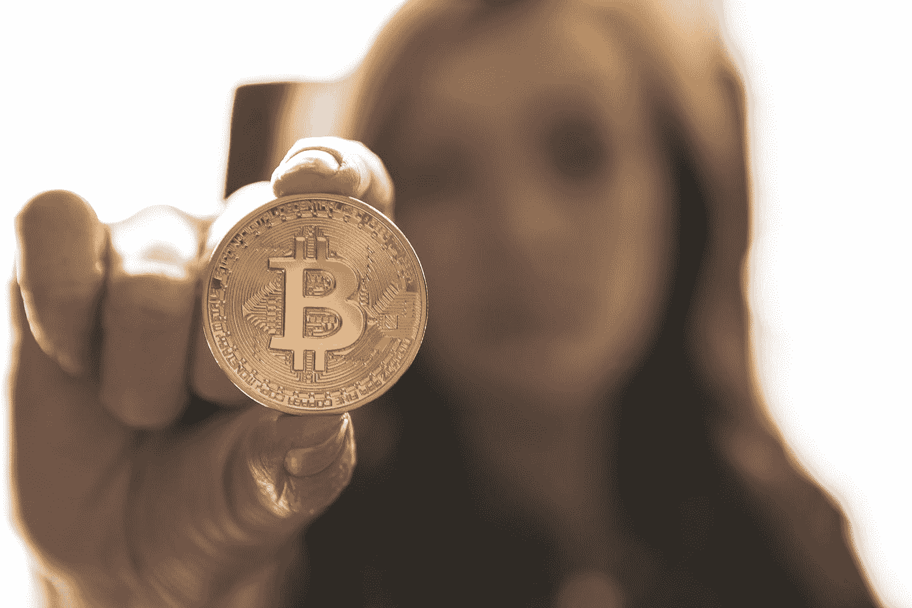
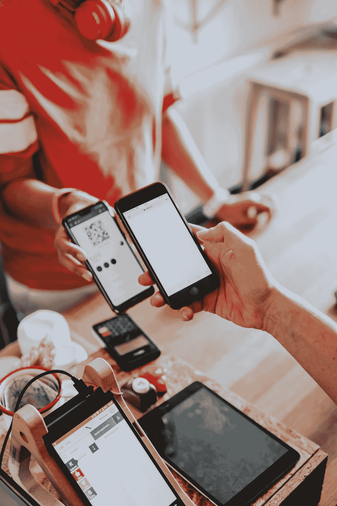

# 虚拟的加密货币:数字货币✅的简单解释

> 原文：<https://medium.com/coinmonks/cryptocurrency-for-dummies-a-simple-explanation-of-digital-currencies-cef22d002aa9?source=collection_archive---------53----------------------->

Photo by [André François McKenzie](https://unsplash.com/@silverhousehd?utm_source=medium&utm_medium=referral) on [Unsplash](https://unsplash.com?utm_source=medium&utm_medium=referral)

> ***加密货币(Cryptocurrency)是一种使用密码学进行安全金融交易的数字资产。它是分散的，这意味着它不受政府或金融机构等中央机构的控制。取而代之的是，它依靠一个计算机网络来验证和记录一个叫做区块链的分布式分类账上的交易。***

有许多不同的加密货币可供使用，其中最知名的是比特币。**比特币**是第一种被创造出来的加密货币，并且仍然是最广泛使用和最有价值的。其他流行的加密货币包括以太(以太坊区块链的本地令牌)、莱特币和 XRP。

**加密货币通常被用作一种交换手段**，类似于美元或欧元等传统货币。但是，它不是由实物资产支持的，也不是由中央权威机构发行的，它的价值是由市场需求决定的。加密货币可以在网上交易所买卖和交易，也可以存储在数字钱包中。

Photo by [David Dvořáček](https://unsplash.com/@dafidvor?utm_source=medium&utm_medium=referral) on [Unsplash](https://unsplash.com?utm_source=medium&utm_medium=referral)

**加密货币的主要优势之一是它允许快速安全的金融交易，而不需要银行等中介**。交易由区块链的计算机网络进行验证，这使得交易几乎不会被篡改。加密货币也是无国界的，这意味着它可以用来进行跨境支付，而不需要货币兑换或昂贵的费用。

Photo by [Tarik Haiga](https://unsplash.com/@tar1k?utm_source=medium&utm_medium=referral) on [Unsplash](https://unsplash.com?utm_source=medium&utm_medium=referral)

**加密货币的另一个关键特征是其匿名性**。虽然区块链的交易是公开的，但交易双方的身份却不为人所知。这可以使加密货币对重视隐私或生活在金融管制严格的国家的人具有吸引力。然而，这种匿名性也使加密货币容易受到洗钱和贩毒等非法活动的影响。

**使用加密货币存在一些风险**。首先，它的价值可能非常不稳定，这意味着它可以在短时间内大幅波动。这使得它作为投资有风险，并且很难用作交换手段。此外，加密货币交易所被黑客攻击并损失客户资金的情况时有发生，这凸显了选择声誉良好且安全的交易所的重要性。

**尽管存在这些风险，但许多人和组织看到了加密货币的潜力，并正在投资。虽然它仍然是一项相对较新的新兴技术，但它的应用越来越广泛，并且有可能改变我们思考和使用货币的方式。**

## ***总之，加密货币是一种使用密码学进行安全金融交易的数字资产。它是分散的，允许快速和安全的金融交易，而不需要中间人。虽然它有许多潜在的好处，但它也存在不稳定性和潜在的安全风险，并且尚未被广泛采用或理解。***

> 交易新手？试试[密码交易机器人](/coinmonks/crypto-trading-bot-c2ffce8acb2a)或[复制交易](/coinmonks/top-10-crypto-copy-trading-platforms-for-beginners-d0c37c7d698c)
> 
> 多样化的密码持有，了解[币安替代品](https://coincodecap.com/binance-alternatives)
> 
> 加入 Coinmonks [电报频道](https://t.me/coincodecap)和 [Youtube 频道](https://www.youtube.com/c/coinmonks/videos)获取每日[加密新闻](http://coincodecap.com/)

# 另外，阅读

*   [复制交易](/coinmonks/top-10-crypto-copy-trading-platforms-for-beginners-d0c37c7d698c) | [加密税务软件](/coinmonks/crypto-tax-software-ed4b4810e338)
*   [电网交易](https://coincodecap.com/grid-trading) | [加密硬件钱包](/coinmonks/the-best-cryptocurrency-hardware-wallets-of-2020-e28b1c124069)
*   [密码电报信号](/coinmonks/top-3-telegram-channels-for-crypto-traders-in-2021-8385f4411ff4) | [密码交易机器人](/coinmonks/crypto-trading-bot-c2ffce8acb2a)
*   [最佳加密交易所](/coinmonks/crypto-exchange-dd2f9d6f3769) | [印度最佳加密交易所](/coinmonks/bitcoin-exchange-in-india-7f1fe79715c9)
*   [面向开发人员的最佳加密 API](/coinmonks/best-crypto-apis-for-developers-5efe3a597a9f)
*   最佳[密码借贷平台](/coinmonks/top-5-crypto-lending-platforms-in-2020-that-you-need-to-know-a1b675cec3fa)
*   [免费加密信号](/coinmonks/free-crypto-signals-48b25e61a8da) | [加密交易机器人](/coinmonks/crypto-trading-bot-c2ffce8acb2a)
*   [杠杆代币](/coinmonks/leveraged-token-3f5257808b22)终极指南