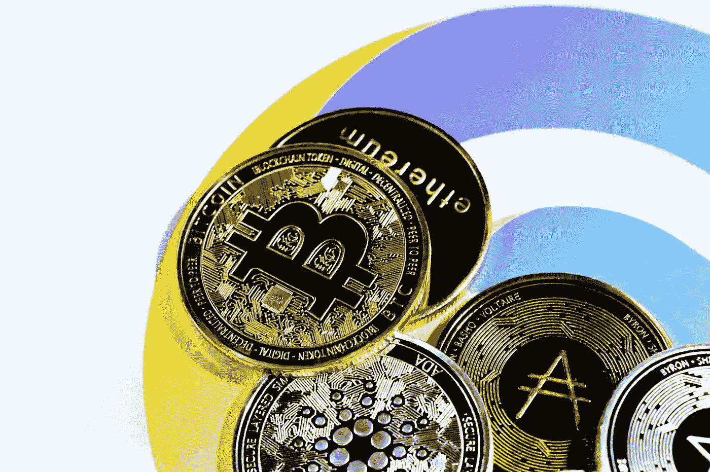

# 加密货币:它的工作原理和使用它的好处

> 原文：<https://medium.com/coinmonks/cryptocurrency-how-it-works-and-the-benefits-of-using-it-7d445f54824b?source=collection_archive---------31----------------------->

创造加密货币是为了解决一个问题。在互联网的早期，人们之间安全快速地转移资金并不容易。这是因为如果没有第三方(如银行)的参与，就无法做到这一点。

加密货币的诞生改变了这一切。它是一种数字形式的货币，允许您在没有第三方参与的情况下安全快速地转移资金。加密货币自诞生以来已经走过了漫长的道路，现在全球有数百万人在使用它。

## 点对点传输

创造加密货币是为了解决困扰互联网早期的问题。没有不涉及第三方的简单或安全的方式在人与人之间转移资金。这意味着如果你想给某人汇款，你必须通过银行或其他金融机构。这可能又慢又贵，这让许多人感到沮丧。

加密货币就是为了解决这个问题而产生的。它是一种数字形式的货币，可以在双方之间快速安全地转移，而不涉及任何第三方。这使它成为网上交易的理想选择，并受到全球数百万人的欢迎。人们通过比特币向他们在其他国家的家人汇款现在正成为一种常见的做法。

## 比特币是第一种加密货币

被称为比特币的加密货币是由一个化名为中本聪的人在 2009 年创造的。这个想法是创造一种分散的货币形式，可以在网上使用，而不需要银行或其他金融机构。加密货币基于区块链技术，这是一个记录所有交易的分布式数据库。

比特币迅速成为最知名和最受欢迎的加密货币，但现在有数千种不同类型的加密货币。加密货币已经变得流行，因为它提供了一定程度的匿名性，不受政府监管，并且可以用于在线购买商品和服务，而无需信用卡。

## 潜在风险

一些人也投资了加密货币来赚钱，因为加密货币的价值会波动。虽然加密货币有一些优势，但它也有一些风险，例如潜在的欺诈和盗窃。

与加密货币相关的另一个风险是很难追踪。虽然这似乎是一个优势，但也有一些情况下，人们由于对它的工作原理缺乏了解而损失了金钱。

## 一些银行系统可能会过时

加密货币有可能彻底改变我们转移资金的方式。通过简化支付的发送和接收，加密货币可能会取代电汇和信用卡等传统方式。如果你正在寻找一位了解加密货币并能帮助你创作内容来教育你的观众了解这项新技术的作家，[请在这里联系我](https://www.fiverr.com/share/GoXQWd)。我很乐意和你聊聊我的服务。

> 交易新手？试试[密码交易机器人](/coinmonks/crypto-trading-bot-c2ffce8acb2a)或者[复制交易](/coinmonks/top-10-crypto-copy-trading-platforms-for-beginners-d0c37c7d698c)