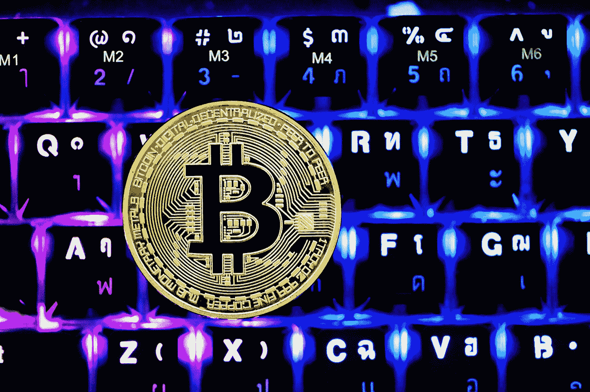

# 加密货币:值得冒这个险吗？

> 原文：<https://medium.com/coinmonks/cryptocurrency-is-it-worth-the-risk-a99343c05318?source=collection_archive---------46----------------------->

Photo by [Kanchanara](https://unsplash.com/@kanchanara?utm_source=medium&utm_medium=referral) on [Unsplash](https://unsplash.com?utm_source=medium&utm_medium=referral)

> 加密货币市场经历了艰难的一年，几个主要参与者面临破产和重大损失。

Core Scientific 就是这样一家公司，它是美国最大的公开交易加密采矿公司之一，主要铸造比特币。该公司于 12 月申请破产，理由是不断下降的加密…