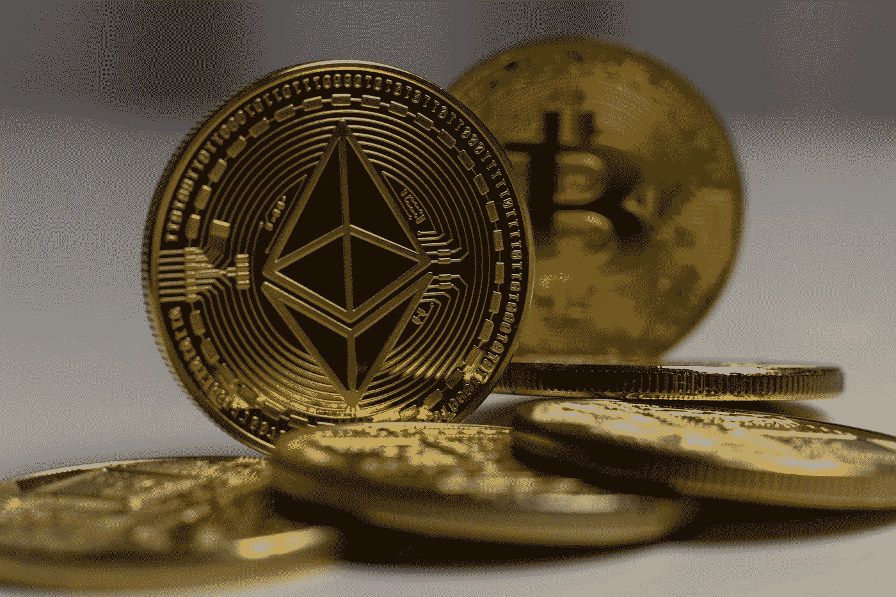
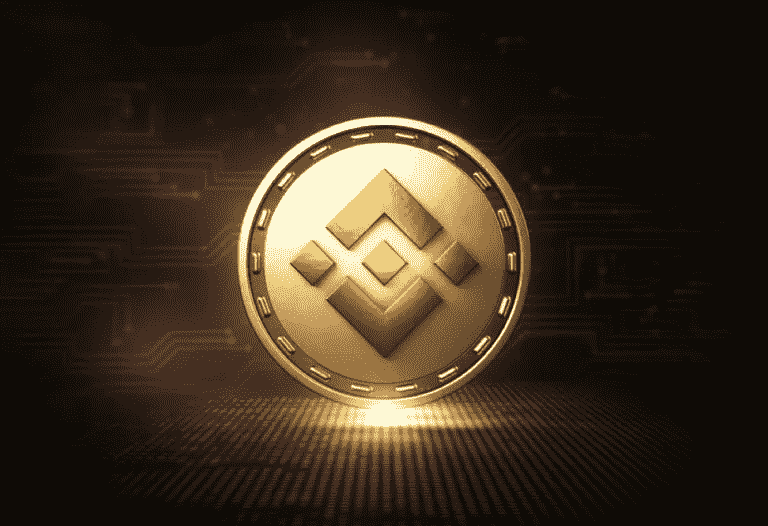
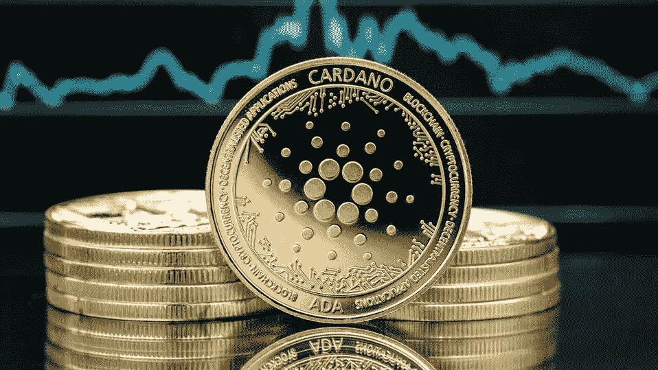
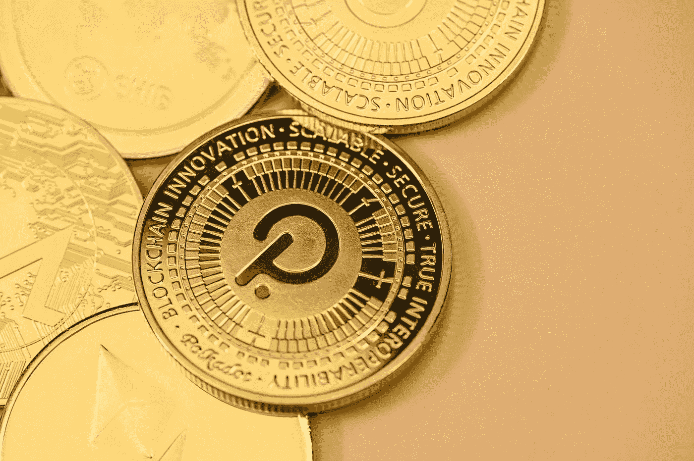

# 加密货币滚滚而来，其他人飘飘欲仙。

> 原文：<https://medium.com/coinmonks/cryptocurrency-is-rolling-others-are-stoned-7ae3a756bd06?source=collection_archive---------22----------------------->

# 投资五大加密货币

Photo by [Kanchanara](https://unsplash.com/@kanchanara?utm_source=medium&utm_medium=referral) on [Unsplash](https://unsplash.com?utm_source=medium&utm_medium=referral)

过去几年，印度的加密货币已被证明是一项出色的投资。尽管比特币和其他加密货币涨跌频繁，但它们一直主导着投资市场。

但是这些代币也会在一夜之间耗尽你的银行账户。投资加密货币可能很难，那么如何选择最好的加密货币呢？

**让我们一起去揭开 2022 年最值得投资的加密货币吧。**

# 比特币

加密货币相对较新，但比特币从一开始就存在了。

它的价格和市值远远高于任何其他加密货币投资选择，引领着加密世界。自从特斯拉开始接受比特币作为支付方式以来，它正在成为一种更加人性化的服务。到 2022 年，比特币将成为顶级加密货币，因为它被各种业务用于交易目的。

Photo by [Kanchanara](https://unsplash.com/@kanchanara?utm_source=medium&utm_medium=referral) on [Unsplash](https://unsplash.com?utm_source=medium&utm_medium=referral)

# 以太坊

它不是 2022 年领先的加密货币，但它明显优于许多其他货币。

智能合约可以使用网络部署，开发者可以创建自己的加密货币。**2022 年，它将成为第二大最受欢迎的加密货币和最受欢迎的区块链。**7 月的最后两周,《财富》杂志报道以太坊的价格上涨了 50%。

Photo by [Bastian Riccardi](https://unsplash.com/@shutter_speed_?utm_source=medium&utm_medium=referral) on [Unsplash](https://unsplash.com?utm_source=medium&utm_medium=referral)

# 币安硬币

随着时间的推移，币安硬币表现稳定，证明是一个极好的投资机会。

除了世界上最大的加密货币交易所币安之外，它还作为币安的本地令牌运营。美国，仅限于美国居民。**尽管币安的子项目广泛使用了硬币并取得了成功，但它仍然是一项高度不稳定的投资。**

# 卡尔多纳

投资者被 Cardano 网络吸引的原因有很多，包括其较小的足迹。**对于完成交易来说，像 Cardano 这样的节能网络比比特币这样的大型网络更好。因此，交易可以更快完成，价格也更低。**开发者可以使用 Cardano 的 AdaSwap 平台创建分散式金融应用，该平台最近推出了测试版。卡尔达诺的硬币价格可能会上涨，因为该网络的新地位是 Web3 网络。****

Picture Credit: Forbes Advisor

# 波尔卡多特

**它不仅是一种加密货币，也是一个区块链网络，开发者可以在其中构建创新的、分散的系统。**

Polkadot 的建立是为了将各个独立的区块链连接成一个统一的网络，甚至创建新的链。这种集成允许用户访问网络的安全和交易的股权证明验证，并使在区块链转移应用程序和令牌等数字资产变得更加容易。

Photo by [Traxer](https://unsplash.com/@traxer?utm_source=medium&utm_medium=referral) on [Unsplash](https://unsplash.com?utm_source=medium&utm_medium=referral)

# 离别赠言

长期投资者的回报往往会在几年或几十年的时间里增长。如果你认为区块链技术将在不久的将来爆发，长期投资加密货币可能是一个很好的选择。

尽管投资加密货币可能有利可图，但你应该记住，这涉及到许多风险，包括钱包黑客攻击。为了避免血汗钱的损失，你首先需要在投资之前了解什么是加密货币。

> 交易新手？试试[加密交易机器人](/coinmonks/crypto-trading-bot-c2ffce8acb2a)或者[复制交易](/coinmonks/top-10-crypto-copy-trading-platforms-for-beginners-d0c37c7d698c)