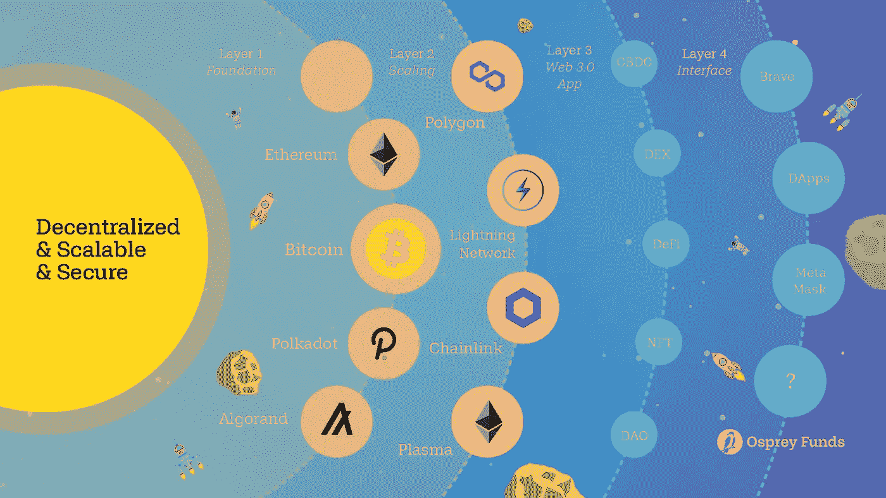

# 加密货币层

> 原文：<https://medium.com/coinmonks/cryptocurrency-layer-94a5a00586e7?source=collection_archive---------45----------------------->

加密货币不仅仅是比特币，以太网分为几个“层”。这些层中的每一层都具有不同的功能，例如第 1 层作为区块链本身，而第 2 层作为第 1 层之上的第三方的完整性。第 1 层和第 2 层以硬币或代币的形式拥有自己的项目。

# 基于加密层的各种项目:

## **第 0 层(L0)**

第 0 层或基础层是互联网、硬件和连接的术语，允许第 1 层(如比特币、以太坊、币安)平稳运行。第 0 层允许几件事情发生:
允许区块链相互交互是 Cosmo (ATOM)的一个例子，它通过“IBC 招标”(区块链之间的通信协议)创建了一个可互操作的区块链生态系统。如果 Dapp 可以在一个区块链上工作，它可以自动在另一个上工作，只要它们是使用相同的第 0 层构建的。每次交易也变得更快更便宜。

## **第一层(L1)**

第一层是区块链本身(比特币、以太坊和币安)，它们在自己的区块链上处理和完成交易。工作证明(采矿)，股权证明(委托)和所有技术细节，如封锁时间和争议解决方案。区块链最重要的方面是解决区块链、去中心化、安全性和可扩展性的三难问题。

## **第二层(L2)**

第 2 层是第三方集成，它与第 1 层结合使用，以提高可伸缩性和每秒事务数(TPS)。占据第 2 层的项目，如 Matic(多边形)、乐观、Arbitrum。

## **第三层(L3)**

第三层是应用层，它像 UI 一样与用户交互。第 3 层不仅提供 UI，还提供区块链内部和内部可操作性形式的实用程序，如 DEX、流动性池和 staking。分散式应用程序(dApps)是一种第 3 层接口，为区块链技术提供真实世界的应用程序。第三层的项目是 CryptoKitties，分散地(法力)，Uniswap，Pancakeswap，Axie Infinity。

在我看来，有增长潜力的项目大多来自第一层，因为他们会有自己的生态系统，会被第二层和第三层所利用。

> 交易新手？尝试[加密交易机器人](/coinmonks/crypto-trading-bot-c2ffce8acb2a)或[复制交易](/coinmonks/top-10-crypto-copy-trading-platforms-for-beginners-d0c37c7d698c)