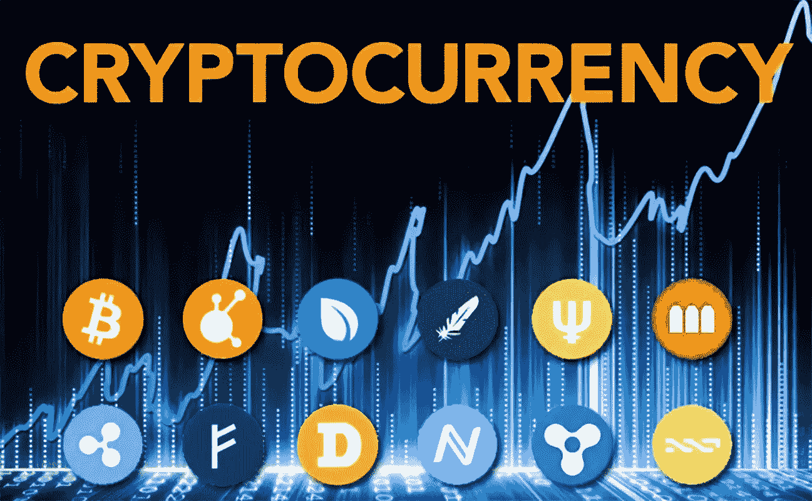

# 加密货币变得容易:加密货币初学者综合指南

> 原文：<https://medium.com/coinmonks/cryptocurrency-made-easy-a-comprehensive-beginners-guide-to-cryptocurrency-e5ab7c045022?source=collection_archive---------23----------------------->

作为数字空间中一个不断发展的概念，许多人很难理解加密货币到底是什么。虽然有些人已经屈服于这个概念的假定复杂性，但其他人就是不明白。

尽管这个术语看起来很复杂，但它在数字世界的众多人群中越来越受欢迎。这是加密货币世界令人兴奋和广阔的性质造成的。然而，如果你是初学者，这可能会让人不知所措，要求很高，而且有点困惑。

这是一种投资媒介，有可能让你在最短的时间内成为百万富翁。尽管如此，它也以波动性、流动性和高风险而闻名。盈利或亏损都归结于一些因素，这将在后面讨论。

在本文中，将向您介绍加密货币，它是如何工作的，为什么它会越来越广泛，以及您是否应该深入研究它。

**什么是加密货币？**

加密货币是一种虚拟或数字货币，通过加密技术保护，使其不可能被重复消费或伪造。已知的第一种加密货币是 eCash，它是由美国密码学家 David Chaum 在 1983 年以电子现金的形式提出的。

许多可用的加密货币是分散的，并在区块链技术上推出。通过“去中心化”，涉及加密货币的活动由几个地方和个人实体控制，而不是由单一机构控制。

也就是说，加密货币不是由任何政府机构或中央机构发行的。这使得他们不会受到政府的干涉、控制或操纵。然而，政府法规仍然可以直接或间接影响加密世界。

加密货币增长如此之快的原因之一是由于交易过程更快、更便宜。此外，由于这是一个分散的生态系统，一个地区的故障不会对其他地区产生太大影响。简单来说，如果一种货币失败了，其他货币也有可能不会。

采矿过程中的高能耗、欺诈和犯罪活动以及价格波动是加密货币的一些缺点。无论如何，考虑加密货币的理由比忽视它的理由多。没有一条路是没有障碍的，只是它不会通向任何地方。

**加密货币是如何工作的？**

术语“加密”是指为保护这些货币类型而采取的各种加密措施和加密算法。这些安全系统中的一些包括散列函数、公钥-私钥对、双因素认证、椭圆曲线加密等。

由于这些数字货币由加密系统支撑，因此无需任何中介(第三方)就可以更容易地检查在线交易的安全性。你可以开采或购买加密货币，这可以在几个交易所进行，如币安、比特币基地交易所、FTX、AAX、Opensea 等。

这些年来，密码世界发生了一些变化。其中包括在许多电子商务网站上采用支付方式，以及对经纪人和零售商的监管和许可等。然而，它们很少用于零售交易，因为不是每个人都有像数字钱包这样的最低要求。

它们广泛用于跨境和国际交易，是最受欢迎的交易工具。加密货币的价值可能暴涨或暴跌，这取决于汇率、经济问题、全球重大事件等因素。

例如，乌克兰政府宣布接受加密货币作为国际援助，以确保加密货币的增值。

**加密货币的优势**

1.**防止通货膨胀:**通货膨胀是指市场上商品和服务价格的上涨。尽管加密货币的价值会波动，但与传统货币相比，它仍然是一种稳定的货币。随着价值的增加，会有更多的需求，从而防止通货膨胀。

2.**自我治理和管理:**任何货币的发展都取决于负责机构如何维护和管理它。加密货币由分散的矿工和开发者团体存储和维护。每个交易平台都是不可变的，也就是说，它们长期保存交易记录。

3.**去中心化:**与中央政府控制的法定或传统货币不同，加密货币是去中心化的。在元宇宙,“分散”一词用于描述一个平台不是由一个实体控制，而是由几个控制和促进其发展的实体控制。

4.一种快速转移资金的方式

5.更容易的货币兑换

6.它节省了交易成本

**加密货币的缺点**

1.其匿名特性使其成为洗钱和其他非法金融活动的场所。

2.丢失数字钱包的任何细节都将导致钱包中所有可用资金的丢失。例如，如果您忘记了您的私人密钥，您将无法再次访问钱包。

3.正如最近在币安经历的那样，加密货币交易所容易受到来自第三方的黑客攻击和其他欺诈活动的影响。如果一个骗子通过侵入你的钱包进入了你的钱包，你所有的投资都有可能被卷走。

从事加密货币有很多好处，也有很多缺点。你需要做的就是把你的理由说清楚。你应该明确你加入这个平台的目的。这样可以防止你落入不明之手，或者在庞大的加密货币帝国中游荡。

**最终想法**

加密货币是否适合你是个时间问题。但是接下来，你应该远离行业内的噪音，做好你的仔细研究和背景调查。如果你问我的话，这是一个很有前途的行业，尤其是随着 web3 的整合和不可替代物的发展。

本内容中的元宇宙、Web3、区块链、NFTs 以及其他几个技术术语将在后续文章中详细解释。

你已经进入加密货币交易还是你是一个野心家？请分享你对此的想法。

关注我，获取更多关于加密货币和整个元宇宙的文章。你可以在评论区让我知道你接下来想看什么。我一定会满足你的要求。

> 交易新手？试试[密码交易机器人](/coinmonks/crypto-trading-bot-c2ffce8acb2a)或者[复制交易](/coinmonks/top-10-crypto-copy-trading-platforms-for-beginners-d0c37c7d698c)