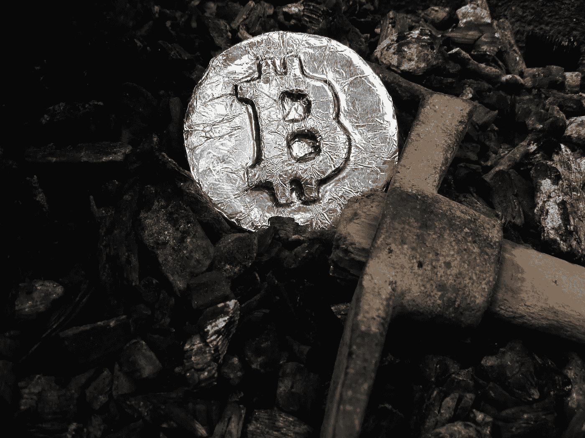
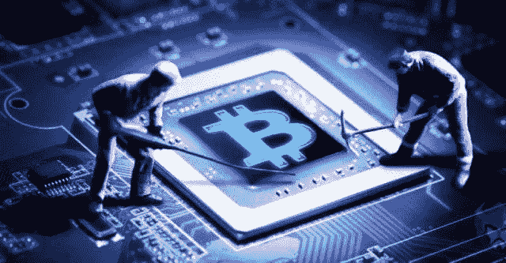
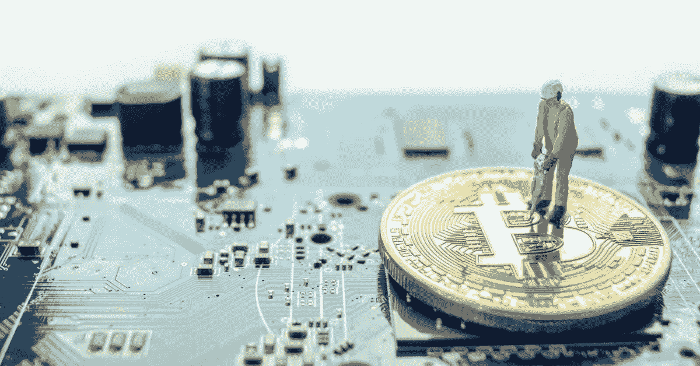
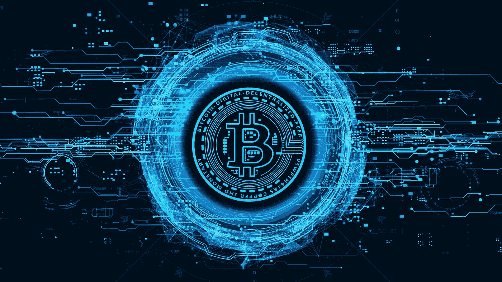
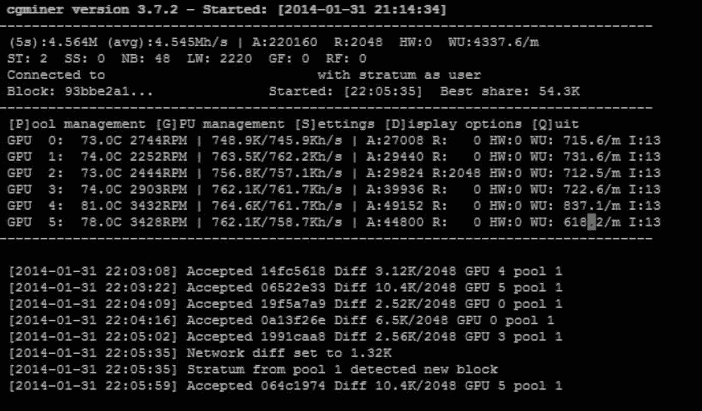
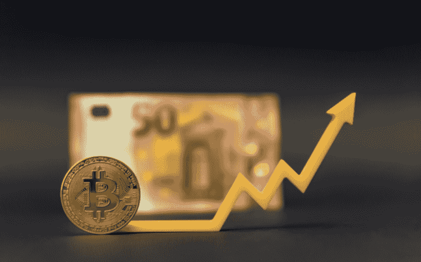

# 加密货币挖掘:如何通过挖掘比特币赚钱？

> 原文：<https://medium.com/coinmonks/cryptocurrency-mining-how-to-make-money-mining-bitcoins-be3c82cfbaec?source=collection_archive---------7----------------------->

## 订阅我的媒介账号:[https://aryanbajaj13.medium.com/subscribe](https://aryanbajaj13.medium.com/subscribe)

## 这是加密货币系列的第六篇也是最后一篇文章……请保持联系，了解更多如此精彩的内容！

你可能听说过比特币挖矿，但不知道它实际上是什么。比特币挖矿是将比特币交易记录加入区块链账本，并获得新比特币作为奖励的过程。本文分解细节，让你自己动手挖掘比特币！

# 加密货币挖掘基础知识

加密货币挖掘是验证交易并将其添加到区块链公共总账的过程。作为对他们工作的回报，矿工将获得加密货币代币。

加密货币挖掘是一个资源密集型过程，需要强大的计算机和专门的软件。为了盈利，矿商必须仔细计算他们的成本和收入。

加密货币挖掘完整指南将带你了解开始挖掘比特币所需的一切。我们将介绍加密货币挖掘的基础知识。

# 如何挖掘比特币？

最受欢迎的加密货币之一是比特币，如果你想进入采矿游戏，有几件事你需要知道。在本指南中，我们涵盖了从设置采矿钻机到实际开采比特币的所有内容。

如果你真的想从开采比特币中赚钱，那么你需要投资一个高质量的采矿平台。这是一台专门为挖掘加密货币而设计的专用计算机。你可以建造自己的采矿设备，也可以购买一个预先组装好的。

一旦你设置好采矿设备，你需要下载一些采矿软件。这将使您的计算机连接到比特币网络并开始挖掘。有许多不同的采矿软件程序可用，所以在选择之前一定要做一些研究。

一旦你设置了你的采矿软件，你将需要加入一个采矿池。这是一群矿工，他们一起开采比特币，并与池中的所有人分享回报。如果没有矿池，开采一枚比特币可能需要数年时间！

现在你已经设置好了一切，你可以开始采矿了！只要启动你的采矿软件，让它运行。

# 采矿方式的类型

谈到加密货币，有两种主要的挖掘类型:

## 1.单独采矿

## 2.池采矿

**单人采矿**可以让你把所有的奖励都留给自己，这也意味着你要承担整个过程的负担，包括装备费用，电费等等。

**池采**，另一方面，涉及到把你的处理能力贡献给一群矿工，然后他们根据他们的贡献分享奖励。

至于哪个更有利可图，这实际上取决于许多因素，包括你正在挖掘的加密货币的现行汇率，挖掘过程的难度，以及你的处理能力的大小。不过，总的来说，联营开采通常更有利可图，因为它允许你将成本(和回报)分摊给一群人。

# 加密货币挖掘中使用的不同工具

加密货币挖掘可以使用不同的工具。然而，一些最受欢迎的包括:

## ASIC 矿商:

这些是专门设计的机器，专门用于挖掘加密货币。它们通常比其他类型的挖掘器更昂贵，并且提供更高的散列率。

## FPGA 矿工:

现场可编程门阵列是另一种可用于加密货币挖掘的挖掘器。它们比 ASIC 挖掘器便宜，但散列率较低。

## CPU 挖掘器:

CPU 挖掘器是一种使用中央处理器挖掘加密货币的挖掘器。这是最不受欢迎的矿工类型，因为它不如其他类型的矿工有效率。

# 密码开采有利可图吗？

加密货币开采可能是一项非常有利可图的业务。如果你有合适的设备和技术，你可以通过挖掘比特币赚很多钱。然而，要判断加密挖掘是否有利可图并不总是那么容易。在决定是否开始采矿之前，您需要考虑几件事情:

首先你需要考虑的是你的采矿设备的成本。你需要考虑 ASIC 矿机的价格、运行它的电力成本以及任何其他相关成本。如果你的采矿设备很贵，那就不值得开始采矿，除非你有信心能够盈利。

另一件要考虑的事情是加密挖掘所涉及的时间承诺。设置采矿设备并使其平稳运行可能需要大量时间。如果你不准备投入时间，开始采矿可能不值得。

最后，你需要考虑采矿的潜在回报。你这么做是为了经济回报还是因为你对这项技术感到兴奋？如果你是为了钱，你将需要弥补所有的成本，并投入你唯一的努力来赚钱，如果你是来学习一项新技术，那么你应该钻研，因为你探索自己越多，你将学到越多。

最重要的是不要忘记首先你必须学习，然后你可以从学习中去掉 l。

学习！赚！成长！

## 这是加密货币系列的第六篇也是最后一篇文章……请保持联系，了解更多如此精彩的内容！

# 关于作者

我最近完成了 BBA(商业分析)从基督大学，拉瓦萨，浦那校区。

网站—[acumenfinalysis.com](http://acumenfinalysis.com/)(看看这个)

# 联系人:

如果你对我下一篇文章的内容有任何问题或建议，请写信给 aryanbajaj104@gmail.com。

如果你想了解我最新的文章和项目，[在 Medium](https://aryanbajaj13.medium.com/) 上关注我。

## 订阅我的媒介账号:【https://aryanbajaj13.medium.com/subscribe 

# 通过以下方式与我联系:

[领英](https://www.linkedin.com/in/aryan-bajaj-b62364191)