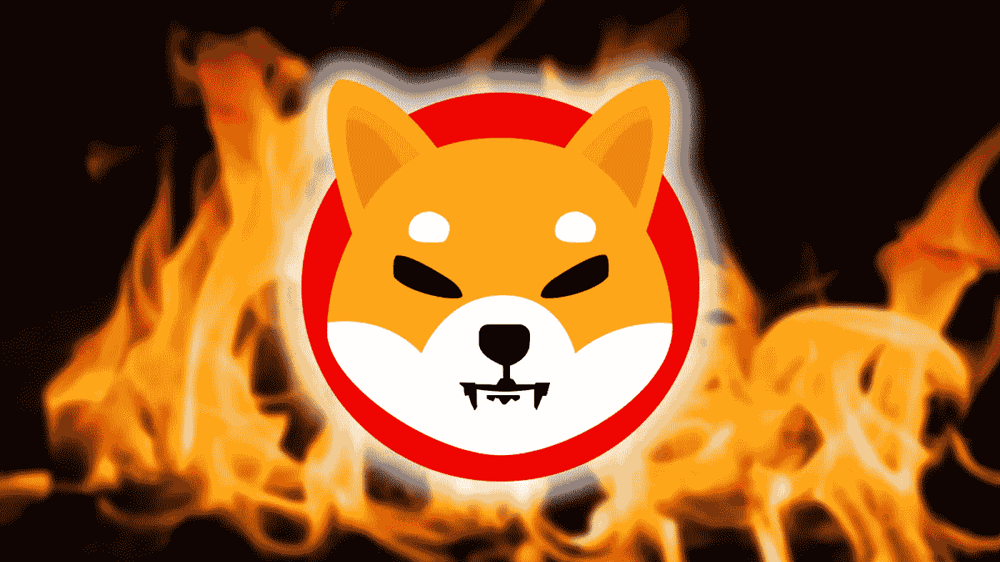
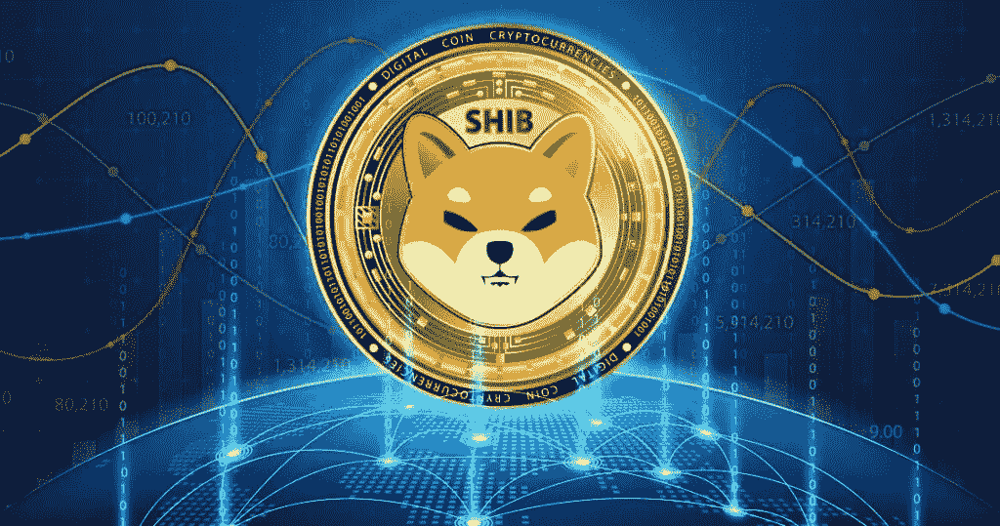
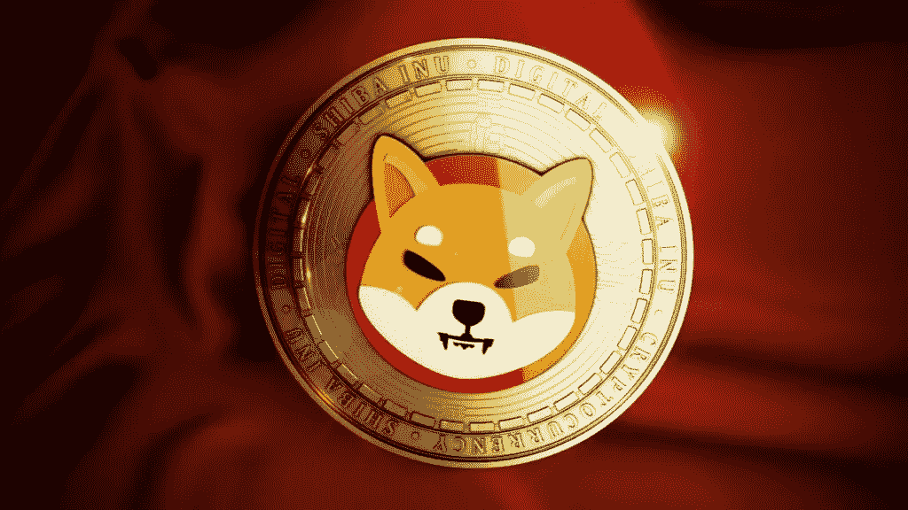
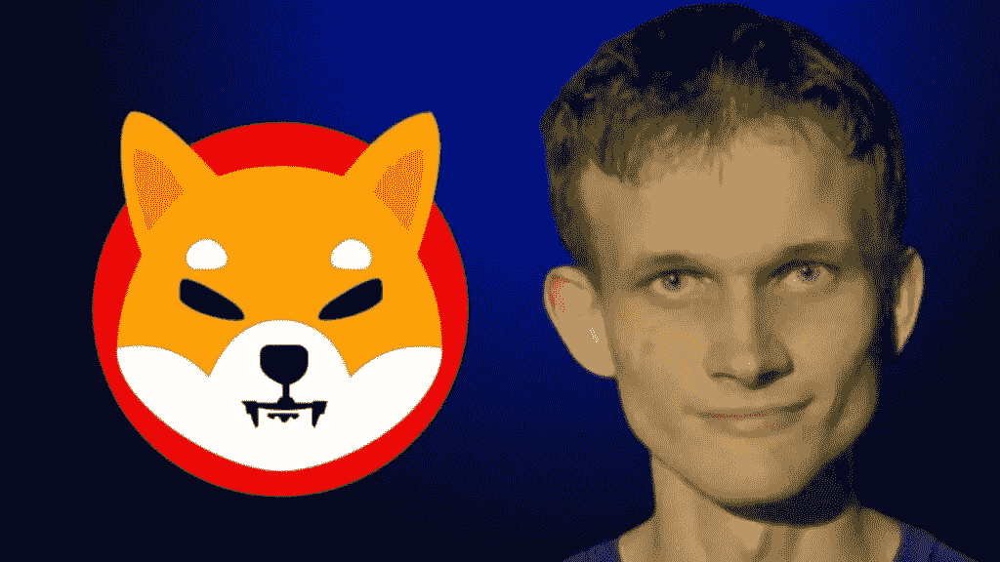
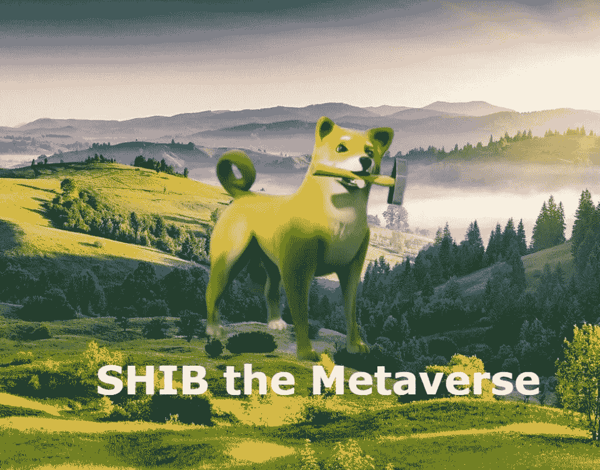

# 加密货币柴犬:创造的历史和与 Doge 的区别

> 原文：<https://medium.com/coinmonks/cryptocurrency-shiba-inu-the-history-of-creation-and-difference-from-doge-f6be45af329?source=collection_archive---------45----------------------->

**什么是柴犬:DOGE 加密货币模因的模仿是如何出现的，它的哲学是什么，它可以在哪里交易**

2022 年 5 月底，由于 Ryoshi Research coin 的匿名创始人的所有记录都从他的 Twitter 页面上删除，再次出现了关于加密货币 [**柴犬(SHIB)**](https://bit.ly/ProjectSerenityCryptoOfficial) 的未来的谈论。与此同时，该页面整整一年没有更新，最后一条推文是在 2021 年 5 月 29 日。此外，作者的所有旧出版物都从 Medium journalism 平台上删除，取而代之的是 Ryoshi 的账户上出现的题字:“有一天我会毫无预警地离开。”许多分析师此前曾表示，柴犬将在未来十年贬值。

与此同时，在 2021 年 10 月，SHIB 汇率每月增长 1000%，达到 0.00008616 美元。然而，现在，到 2022 年 8 月，该比率与历史最高水平相比下降了 70%以上，降至 0.00001197 美元。

这是哪种硬币，谁是幕后黑手，柴犬加密货币的价值预测是什么——在我们的材料中。

**什么是柴犬，谁创造了它**

柴犬(SHIB)加密货币于 2020 年 8 月出现。它是由一个化名为 Ryosi (Ryoshi)的匿名人士创建的。这枚硬币将自己定位为“Dogecoin 杀手”，它的标志是一只柴犬，这正是 DOGE 硬币上的描绘。

甚至在柴犬之前，Ryoshi 就描述了创建加密货币的三个主要规则。基于他们，这一切都是一个大实验:

不要花一美元去创造一枚硬币；

项目的创建者与整个社区一起获得硬币；

零美元投入加密货币推广。

该公司有一种所谓的 woof paper——一种对白纸的模仿，但带有 woof(“汪”)。它谈到了加密货币的“使命”:

“我们想:如果加密货币项目 100%由社区驱动会怎么样？我们的创始人 Ryoshi 说，柴犬是分散资产世界中的一个自发实验。我们中的许多人当时无法想象这个概念会成为进化的开端……”

这种加密货币的社区自称柴犬军。它有超过 12 万人。woof 的论文称，该项目是从零开始的，开发者、设计师、营销人员和其他团队成员以前从未一起工作过。自然，这个币整个社区都爱柴犬。

柴犬是一个运行在区块链以太坊上的 ERC-20 令牌，因为它已经“证明了自己”,并帮助许多人成功创建了加密项目。“它让我们真正去中心化，不像其他‘花哨’的硬币，”该文件称。加密货币也在等待 ETH 扩大规模，ShibaSwap 将成为“最受欢迎的”以太网加密交易所。

**柴犬加密货币汇率的历史**
回到 2021 年 5 月 7 日，柴犬币的价格微乎其微——每枚 0.000001478 美元。而在 5 月 11 日高峰时，已经花了 0.00003641 美元。这是在 OKX、币安、FTX、火币交易所加入的背景下发生的。然后一周时间，柴犬加密货币增长 2260%。

下一个(也是目前为止最高的)价格记录发生在 2021 年 10 月 27 日。价格达到了 0.00008 美元。这种快速增长与有关比特币可能在罗宾汉交易所上市的传言有关。2022 年 1 月，Twitter 再次开始说柴犬将在 2 月出现在交易所，但这还没有发生。

3 月底，柴犬持有者的数量在 10 天内减少了 60，000 人，几乎减少了 5%。与此同时，大型投资者继续积累“迷因”令牌。

**您对 SHIB/美元的价格预测是什么？**
尽管如此，分析师们认为柴犬是不稳定的，就像 DOGE 或 GameStop 等其他迷因币或股票一样。“围绕像 SHIB 这样的迷因币的炒作是一种社会现象，而不是一种金融现象，”AAX 密码交易所的研究和战略主管本·凯斯林说。

**维塔利克·布特林和柴犬**

硬币的开发者向以太的创造者维塔利克·布特林发送了 505 万亿枚硬币。他捐了 50 多万亿(当时是 11.4 亿多美元)在印度抗击冠状病毒，他烧掉了剩下的 90%的硬币。这大约是 65 亿美元。布特林还承诺将剩余的柴犬捐给慈善机构。

同时，Ryoshi 声称他没有柴犬加密货币。因此，这么多硬币转移到布特林手中，看起来就像是货币的命运从创始人手中转移到另一个人手中。毕竟，如果 ETH 的创始人决定出售他的资产，SHIB 的价值可能会崩溃。

据专家称，良史的这一步是经过深思熟虑的。“柴犬币军认为，任何成功都是由某种脆弱性驱动的，”肖说。

**柴犬价格预测**

3 月 31 日，柴犬团队透露了推出他们自己的元宇宙的细节。根据他们的说法，该领土将被分成 10 万多块土地，价格从 0.2 埃特到 1 埃特不等。Shiba 元宇宙:元宇宙将使用所有的柴犬生态系统标志，包括 SHIB、皮带和骨头。

4 月 9 日，一个名为 Shibaswap 2.0 的项目烧掉了价值 34554 美元的 14 亿 SHIB，以增加通缩供给。

尽管 meme-token 目前贬值，但 SHIB 社区希望其价值将超过 0.01 美元。“1 分钱梦想”的标签已经在网上传播开来。社区成员表示，流通中的 SHIBs 数量庞大，约为 549 万亿。他们认为，为了达到 1 美分的价格，柴犬需要更多的燃烧。因此，每年需要销毁数万亿枚硬币才能使其退出流通，当市场出现短缺时，价格就会上涨。

要做到这一点，Shibarium 和 ShibaSwap 2.0 等即将到来的开发应该以这样一种方式工作，即向用户收取的小额交易费据信仅用于烧社区成员。

反过来，金融专家更加怀疑。

**“柴犬要达到美元，它的市值必须是一万亿美元。相比之下:整个美国国债为 23.3 万亿美元，而这个惊人的数字还不到所需资本总额的 3%……考虑到这一点和目前的趋势，SHIB 的价格将保持在其估计价值之内——不到一美分的几分之一"**

[**如果你想了解更多关于如何利用加密货币赚取巨额利润和被动收入，请点击这里**](https://bit.ly/ProjectSerenityCryptoOfficial)

免责声明:本文中提供的信息仅是作者的观点，而非投资建议，仅用于教育目的。通过使用这些信息，您同意这些信息不构成任何投资或财务指示。在做出任何投资决定之前，一定要进行自己的研究，并咨询财务顾问。

> 交易新手？尝试[加密交易机器人](/coinmonks/crypto-trading-bot-c2ffce8acb2a)或[复制交易](/coinmonks/top-10-crypto-copy-trading-platforms-for-beginners-d0c37c7d698c)