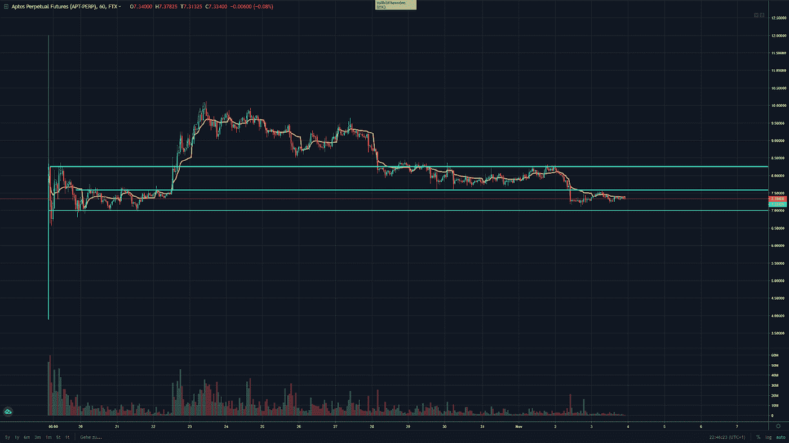

# 加密货币交易聚焦——Aptos(APT)

> 原文：<https://medium.com/coinmonks/cryptocurrency-trading-spotlight-aptos-apt-156e0fac64e1?source=collection_archive---------17----------------------->

这是我之前发表的关于 Aptos 硬币($APT)的文章的更新。我认为，如果它能保持其更高低点的趋势，它可能会突破 10 美元的范围，但市场似乎另有决定(见第一篇 Aptos 文章:[https://medium . com/coin monks/Aptos-trading-spot light-apt-9b 1628240 da3](/coinmonks/aptos-trading-spotlight-apt-9b1628240da3))。

在一个更强劲的市场，这可能是真的，但我们不是在这样的。无论如何，情况已经发生了变化，Aptos 正在下降，来到 7 美元关口的重要支撑线，这是下图中的绿色趋势线。

你可以看到，自从开始交易以来，它一直保持在这个水平，每个在 7 美元区域购买加密货币 Aptos 的人都处于绿色状态。如果价格开始进一步下跌，我认为我们可以看到价格进一步下跌，因为我看到迄今持有的人出售，也有卖空者猜测价格下跌。我的想法是等待它保持(然后远离 7 美元的支撑)或突破(然后做空，使用 7 美元线作为阻力和风险水平)。

我也可能再次错了，我不是一个能告诉市场走向的魔术师，但这就是我如何在计算风险的情况下交易。如果事情不像我预测的那样，你也可以对我的想法进行补偿交易，也许这样会更好。

一如既往，这不是财务建议，祝你愉快！

尼克拉斯

> 交易新手？试试[密码交易机器人](/coinmonks/crypto-trading-bot-c2ffce8acb2a)或者[复制交易](/coinmonks/top-10-crypto-copy-trading-platforms-for-beginners-d0c37c7d698c)