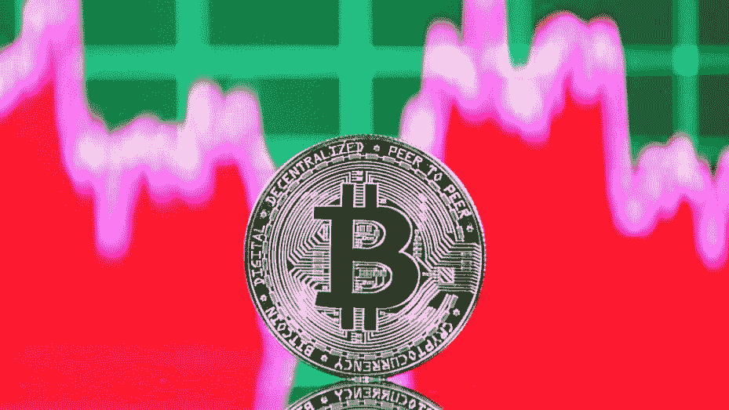
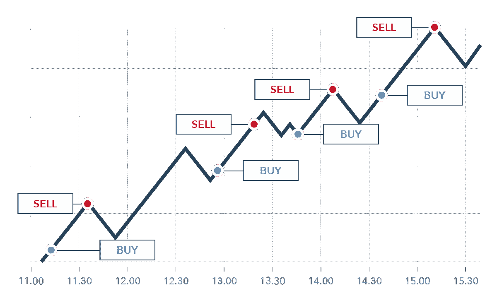

# 加密货币交易:完整的加密货币交易指南

> 原文：<https://medium.com/coinmonks/cryptocurrency-trading-the-complete-cryptocurrency-trading-guide-6f16b5a953a1?source=collection_archive---------18----------------------->

## 订阅我的媒介账号:[https://aryanbajaj13.medium.com/subscribe](https://aryanbajaj13.medium.com/subscribe)

## 这是加密货币系列的第四篇文章…保持联系，了解更多信息！

想象一下，你的投资一夜之间获得超过 1000%的回报。

听起来像是一个不现实的提议，直到你学会如何交易加密货币，仅在一天内价格就可能波动高达 10%。投资者可以减轻波动风险的方法之一是交易或投资加密货币，而不是流行的股票或债券。在本文中，我们探索了所有你需要知道的关于加密货币和交易的知识。

# 你为什么想要交易加密货币？

人们想要交易加密货币的原因有很多。一个原因是加密货币以其波动性而闻名，这可以为交易者带来快速而有利可图的收益。另一个原因是，交易加密货币提供了高度的匿名性，这对许多用户来说很有吸引力。最后，随着分散交易所的出现，现在在交易加密资产时有了更大程度的自由和灵活性。

# 如何在交易所交易加密货币？

为了在交易所交易加密货币，您首先需要在交易所创建一个账户。一旦您创建了一个帐户，您将需要在您的帐户中存入一些资金，以便开始交易。为此，您通常需要将您的银行帐户或信用卡链接到交易所。一旦你存入资金，你就可以开始在交易所买卖加密货币。

在交易所交易加密货币时，需要记住几件事。首先，选择一个信誉好、值得信赖的交易所很重要。市场上有许多不同的交易所，并不是所有的交易所都是平等的。在任何交易所注册账户之前，一定要做好调查。

另一件需要记住的事情是，加密货币的价格可能会波动。这意味着一个特定硬币的价值可以很快上升或下降。在进行任何交易之前，确保你了解所涉及的风险。

最后，记得分散投资组合。可以说，不要把所有的鸡蛋放在一个篮子里。将你的投资分散到不同的硬币和交易所，以最小化你的风险，最大化你的利润。

# 如何从交易加密货币中获利？

如果你知道自己在做什么，加密货币交易可能是一项有利可图的活动。有很多方法可以从交易加密中赚钱，而对你来说最好的方法取决于你自己的目标和目的。

如果你只是想快速获利，那么日内交易可能是你最好的选择。日间交易包括在一天内多次买卖加密货币资产，以便利用微小的价格波动。虽然这可能是一个有利可图的策略，但它的风险也很大，因此并不适合所有人。

如果你对产生长期收益更感兴趣，那么摆动交易或头寸交易可能更合你的胃口。摇摆交易包括持有资产几天或几周，以便利用更大的价格波动。头寸交易类似，但时间跨度更长；你可以持有资产几个月甚至几年，而不是几天或几周。

当然，加密货币除了交易还有其他赚钱方式。你也可以挖掘它，或提供服务，以换取支付加密。但是，如果你的目标只是简单地交易并从数字资产的价格波动中获利，那么投机可能就是你需要做的一切，等待正确的时机，因为时机将在这种情况下发挥重要作用。

有趣的事实
高盛团队跟踪了至少 20 个其他硬币项目，并计划从 3 月 18 日开始运行一个系统的交易策略，以对抗芝加哥期权交易所准备推出的衍生品——一个仅交易一个月的期货合约。

首次发行硬币(ico)正变得日益流行。目前，65%的被调查者听说过 ICOs(首次发行硬币),收入超过 50 万美元的被调查者中有 6%做出了回应？他们参加过 ICO，另有 9%的人有兴趣参加。

# 安全交易

在交易加密货币时，安全性永远是重中之重。为了在交易时保持安全，有一些关键的事情要记住:

1.保持您的私钥私密。这似乎是显而易见的，但重要的是要记住，您的私钥是您访问加密货币的基础。如果其他人获得了您的私钥，他们可以在未经您允许的情况下获取您的加密货币。

2.使用安全交换。当你准备好交易时，确保你使用的是一个信誉良好且安全的交易所。市场上有很多交易所，但并不是所有的交易所都是平等的。选择交易所时，要考虑安全特性、用户评论和易用性等因素。

3.小心第三方服务。有很多服务声称可以为加密货币交易者提供安全或其他功能。然而，并非所有这些服务都是平等的。在使用任何第三方服务之前，请务必做好调查，并且只使用信誉良好的提供商提供的服务。

通过遵循这些简单的提示，您可以在交易加密货币时帮助保护自己的安全。

# 结论

加密货币交易可能是一种很好的赚钱方式，但也有风险。如果你不小心，你可能会失去所有的投资。也就是说，如果你做了研究并了解了其中的风险，你可以通过交易加密货币赚很多钱。

## 这是加密货币系列的第四篇文章…保持联系，了解更多信息！

# 关于作者

我最近完成了 BBA(商业分析)从基督大学，拉瓦萨，浦那校区。

网站—[acumenfinalysis.com](http://acumenfinalysis.com/)(看看这个)

# 联系人:

如果你对我下一篇文章的内容有任何问题或建议，请写信给 aryanbajaj104@gmail.com。

如果你想了解我最新的文章和项目，[在 Medium](https://aryanbajaj13.medium.com/) 上关注我。

## 订阅我的媒介账号:【https://aryanbajaj13.medium.com/subscribe 

# 通过以下方式与我联系:

[领英](https://www.linkedin.com/in/aryan-bajaj-b62364191)

> 交易新手？尝试[加密交易机器人](/coinmonks/crypto-trading-bot-c2ffce8acb2a)或[复制交易](/coinmonks/top-10-crypto-copy-trading-platforms-for-beginners-d0c37c7d698c)