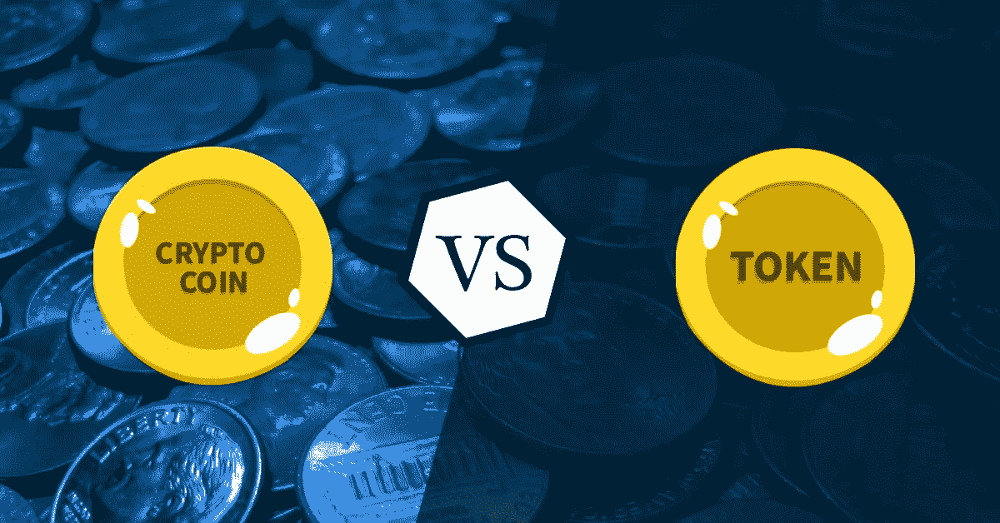

# 加密货币:硬币和代币有什么区别？

> 原文：<https://medium.com/coinmonks/cryptocurrency-what-is-the-difference-between-coins-and-tokens-743b93521084?source=collection_archive---------46----------------------->

Coin vs Token

如果你是加密货币行业的新手，仍然对所有这些术语感到困惑，这篇短文为你提供了区分硬币和代币所需的 5 个要点。

我会在媒体上发布更多有教育意义的内容。欢迎在这里关注我，或者直接在我的推特[https://twitter.com/MarkFobo](https://twitter.com/MarkFobo)上关注我。

1.  硬币使用自己的区块链，拥有自己的协议。我们可以考虑#比特币、#以太坊、#索拉纳、#卡尔达诺、#雪崩、# Fantom……
2.  令牌没有自己的区块链，而是建立在现有的基础上，利用主网络(也称为主网)开发的协议
3.  硬币可以在集中交易所(CEXs)直接购买，也可以在分散交易所(dex)购买代币。一些代币也可以通过自己的方式到达 CEX，但通常是从 DEX 开始旅程
4.  更进一步，一些硬币可以在不同的网络上被表示为代币。例如，在 Fantom 链上运行的#BNB peg 令牌。当 BNB 在它自己的区块链上是一枚硬币时，通过桥接机制，它可以从一个网络转换到另一个网络，成为在另一个主网上使用的令牌。
5.  有许多不同的令牌，平台令牌、安全令牌、交易令牌、实用令牌、治理令牌……

现在你知道了主要的区别…你会说 shitcoins 和 memecoins 通常是硬币…或者代币吗？

> 交易新手？试试[密码交易机器人](/coinmonks/crypto-trading-bot-c2ffce8acb2a)或者[复制交易](/coinmonks/top-10-crypto-copy-trading-platforms-for-beginners-d0c37c7d698c)