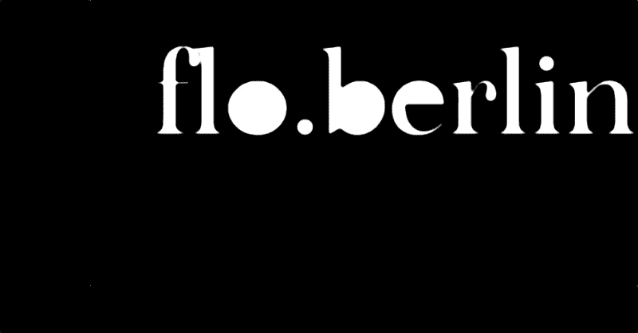

# 密码经济学:以太坊旁的区块链

> 原文：<https://medium.com/coinmonks/cryptoeconomics-blockchains-beside-ethereum-16e259988c5a?source=collection_archive---------18----------------------->

除了比特币和以太坊，自 2009 年以来，出现了许多不同的区块链协议。首先，这些区块链实现可以分为不同的类别。虽然比特币和以太坊的目标是公开和无许可的，但其他区块链技术遵循其他方法。为企业环境打造的区块链，例如， [*食品信托*](https://www.ibm.com/dk-en/blockchain/solutions/food-trust) *，*有财团方式，其中…