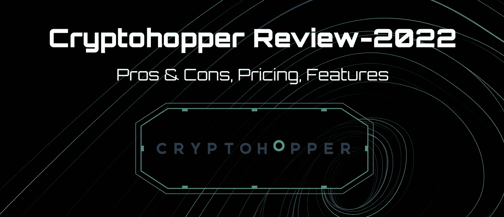
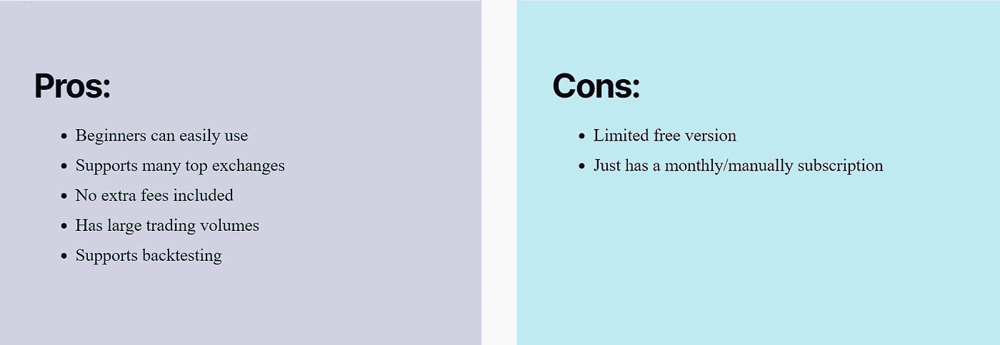
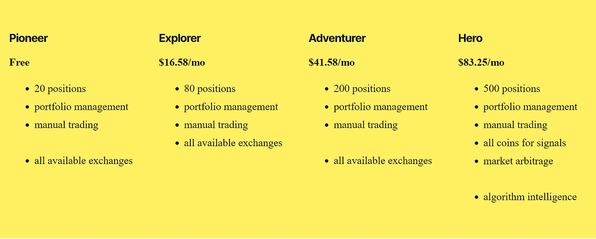

# 隐跳虫评论

> 原文：<https://medium.com/coinmonks/cryptohopper-review-aa4c061494d4?source=collection_archive---------42----------------------->

如今，交易机器人已经成为加密货币交易者的热门工具。数字货币交易机器人实际上是一种编程算法，它检查市场并为交易引入良好的头寸。其中最受欢迎和最可靠的是 Cryptohopper 机器人。

**Cryptohopper** 机器人是由来自荷兰阿姆斯特丹的两兄弟 Ruud 和 Pim Feltkamp 于 2017 年设计和创造的，目的是简化交易过程，帮助交易者利用更多机会，增加利润额，将损失降至最低。

使用加密漏斗你可以从不同来源的免费和付费信号中受益。Crypto Hopper 一天 24 小时工作，除了比特币，还有 75 种其他加密货币可以通过这个机器人进行交易。

接下来，我们将了解更多关于这个机器人的特性。

**隐翅虫的优点&缺点**

**隐漏斗特征**

Crypto Hopper 机器人的每个功能都是为了满足用户的特定需求而创建的。

在本文中，我们讨论其中的 9 种:

**1。自动交易**

使用 Crypto Hopper 自动完成交易。可以尝试半自动交易、镜像交易、全自动交易等不同的交易风格。

**2。投资组合管理**

从一个地方免费连接您的所有交易所并管理您的投资组合。

**3。镜像交易**

你可以复制专家交易员的信号或者下载他们的策略导入到这个平台，实现利润最大化。

**4。拖尾特征**

永远不要过早买入/卖出。使用跟踪功能让你的漏斗跟随市场趋势。轻松跟踪价格，并在价格下跌时自动买入或卖出。

**5。票据交易**

通过练习模拟交易成为更好的交易者。有了这个，你就不用拿你的资本冒险了。在真实帐户上部署您的 Hopper 之前，请使用 Hopper 模拟器。

**6。DCA**

DCA 或美元成本平均法是一种在长期购买时用来平衡平均购买价格的技术。在 Crypto Hopper 中也可以利用这个特性。

**7。回溯测试**

回溯测试工具允许您轻松使用历史见解和图表数据来确定您的策略在过去的表现和/或预测未来。回测你的漏斗，看看它的表现如何。

使用回溯测试工具，你可以准确地看到 Hopper 机器人在哪里买卖你的货币，从而优化你的策略。尽管过去的信息不能保证对未来的正确理解，回溯测试工具是调整策略和学习交易的最重要的方法之一。

8。战略设计师

秘密漏斗机器人的一个独特之处是可以在其中设计策略。有了这个特性，你可以组合不同的指标并测试它们的有效性。

**9。套利**

使用加密货币市场的错误与套利机器人在加密漏斗！借助套利，你可以从一种货币在不同交易所的差价中获利。

**Cryptohopper 定价**

使用这个机器人有几种主要方法。当然，crypto Hopper bot 允许用户免费测试这个系统 7 天。有可能每月和每年支付的方法。

cryptohopper bot 方法如下:

**支持交易所**

Cryptohopper 目前支持 18 个交易所，其中最重要的是:

FTX、Bybit、Bittrex、Okx、Cryptopia、Huobi、北海巨妖、Kucoin 和 Poloniex。

**加密料斗替代方案**

有几个具有类似功能的替代加密交易机器人。

*   ****。**用于发展加密货币社交交易行业的最佳工具。两者都是初学者友好的机器人。**
*   **[**Bitsgap**](https://bitsgap.com/?ref=8c1ea0df-bot) **。**是交易员管理其加密货币投资组合所需的工具。**
*   **[**市侩**](https://tradesanta.com/) **。**是一个基于云的加密货币交易机器人，适用于业余爱好者和专家级加密投资者。**

> **交易新手？尝试[加密交易机器人](/coinmonks/crypto-trading-bot-c2ffce8acb2a)或[复制交易](/coinmonks/top-10-crypto-copy-trading-platforms-for-beginners-d0c37c7d698c)**