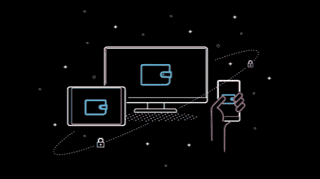

# 密码劫持——它是什么，你如何保护自己的安全？

> 原文：<https://medium.com/coinmonks/cryptojacking-what-is-it-and-how-you-can-keep-yourself-safe-46013ce77a90?source=collection_archive---------42----------------------->

加密货币矿工将需要计算机或采矿阵列具有足够的处理能力来生产货币并从自己的工作中获利。但有时，矿工可能无法获得工作所需的计算能力，有人可能会求助于密码劫持来获得想要的货币。

密码劫持是一种威胁，可能会损害您的计算机。它需要一个人在未经用户许可的情况下访问他人的计算机来挖掘加密货币。黑客将利用计算能力收集货币，而受害者的计算机速度变慢，无法照常执行程序。人们可以用它来收集 Monero 加密货币或其他任何有价值的东西。

# **流程如何运作**

每个加密货币矿工都需要挖掘加密货币的计算能力。但矿商生产一些货币可能需要一段时间。采矿者必须利用能够处理更多处理能力的最先进的计算设备来开采这种货币。加密采矿的巨额电费和冷却需求只会让这种做法更难管理。

这也是为什么很多矿工会转向隐劫。他们希望尽快让自己的数字钱包装满货币。采矿需要在区块链上工作，并在任何其他用户之前加入到该链中，从而给予采矿者硬币奖励。密码劫持为黑客提供了更多的力量，产生了获得所述回报的更好机会。

当黑客使用不择手段的手段来挖掘货币时，加密劫持就起作用了。矿工会用以下三种方法之一侵入其他计算机:

## **加载代码**

第一种用于密码劫持的方法需要在不信任的计算机上加载密码挖掘代码。黑客将利用网络钓鱼骗局来实现这一目的。

1.用户将会收到一封电子邮件，告诉他点击一个链接。黑客会发送这封看起来合法的邮件。

2.用户点击链接。该链接生成在计算机上添加加密挖掘脚本的代码。

3.检测到的密码劫持脚本将在计算机上执行。

该脚本在后台运行，并将数据发送给黑客。计算机将读取密码挖掘所需的各种数学方程。计算机将检查这些等式，并将结果传输到黑客可以控制的服务器，从而增加一个人的计算能力。

## **脚本注入**

第二种方法涉及在网页上注入密码劫持脚本。黑客可能闯入网站并将密码劫持脚本添加到网站中。该脚本将在用户访问该站点时执行。用户的计算机不会存储任何代码，但在收集数据时，它仍然可以访问相同的数学方程。

## **云接入**

黑客也可以通过云链接访问计算机。黑客会检查云网络的代码，寻找访问云的 API 密钥。然后，用户可以从云系统收集计算能力。这项工作更难完成，但它提供了最大量的计算资源。

# 如何检测密码劫持？

不知情的受害者很容易成为密码劫持计划的一部分。最糟糕的是，大多数人都不知道他们的计算能力被一个货币矿工滥用了。检测到的密码劫持并不总是容易识别，除非你了解计算机编码是如何工作的。

但是，您可以通过以下几点来判断您的计算机是否正在遭受加密劫持:

*   你的计算机运行得不如往常好。加载一些程序可能需要一段时间。
*   你电脑的某些部分过热了。个人电脑在运行更多程序时容易过热。甚至电脑里的风扇也会变得不知所措。
*   您计算机上的 CPU 使用率明显高于或接近其最大值。
*   您可能会注意到电脑上文件的变化，尤其是在运行网站时。黑客可能改变了编码。

您可能需要对您的计算机进行恶意软件或病毒扫描，以了解哪些问题持续存在。有时，在完成审查后，您可能会发现导致密码劫持攻击的原因。

# **如何保证自己的安全**

密码劫持对任何计算机都是一种威胁，但是您可以使用一些措施来防止密码劫持成为威胁。

## 1.当心你收到的任何电子邮件。

防止密码劫持的第一步是在审查您的电子邮件时进行尽职调查。确保你收到的任何电子邮件都是明智的，并且不包含任何不寻常的代码或其他有害功能。

## 2.使用适当的浏览器扩展。

您可以在计算机的浏览器上安装反加密挖掘浏览器扩展。该功能将识别可能用于加密挖掘的代码和进程，并阻止它们在您的计算机上运行。看到这些脚本如何出现在任何网站上，有一个阻止它们的扩展可能是必不可少的。

## 3.安装广告拦截工具。

有时来自密码黑客的恶意代码会来自在线广告。广告拦截器可以阻止此类广告出现。您可以使用广告拦截器来识别何时出现不同的弹出窗口。一个拦截器也可以让你选择打开一些弹出窗口，如果有必要的任何个人操作，你可能会利用。

## 4.上网时注意你去的地方。

有时，黑客会在不受保护的网站上使用他们的采矿代码。这些包括不使用 SSL 认证来保护每个人的数据和监控内容的网站。如果你想保持安全，你必须避免进入这些不受保护的网站。

请记住，如果管理不善，加密劫持可能会对您的计算机造成危险。如果你在网上注意你在做什么，并且你有正确的程序来停止这种担心，你就可以防止这个问题。

> 交易新手？试试[加密交易机器人](/coinmonks/crypto-trading-bot-c2ffce8acb2a)或者[复制交易](/coinmonks/top-10-crypto-copy-trading-platforms-for-beginners-d0c37c7d698c)