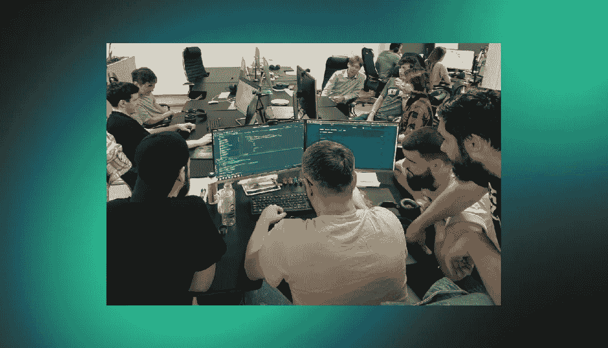

# Crypton Backenders

> 原文：<https://medium.com/coinmonks/crypton-backenders-679a284b8f94?source=collection_archive---------35----------------------->

网站的幕后功能被称为“后端”。

一个网站是由技术和编程的[组合而成的，它由用户看不到的三部分组成:服务器、应用程序和数据库。](https://crypton.studio/blog/Crypton-Backenders)

# 后端开发人员是做什么的？

他们使用代码来帮助浏览器与数据库通信，并存储、理解和删除数据。

他们通过将数据转换并返回到用户可以与之交互的前端代码，为工程技术提供最有效和高效的解决方案，例如:填写表单、创建个人资料、在线购物等。

后端开发人员构建并维护技术，使网站面向用户的一面得以存在。

# 后端开发人员的职责包括:

―数据库的创建、集成和管理

――构建服务器端软件的后端框架

――网络服务器技术

――云计算集成

―安全设置和黑客

―报告—生成分析和统计数据

――网站文件和数据库的备份和恢复技术

# 后端开发人员技术技能

为了使服务器、应用程序和数据库相互通信，后端开发人员使用 PHP、Ruby、Python、Java 和。Net 来构建应用程序，以及 MySQL、Oracle 和 SQL Server 等工具来查找、保存或更改数据，并在前端代码中将其提供给用户。

**编程语言:**任何后端开发人员都需要精通 Python、Java、PHP 等后端编程语言。这些使得网站在与数据库、框架和服务器一起使用时能够正常运行。Python 是最受欢迎的编程语言之一，因为它与人工智能(AI)和机器学习兼容，并且非常适合编写清晰和逻辑的代码。前端语言 HTML、CSS 和 JavaScript 的基础知识是加分项。

**框架:**框架是后端编程语言的库，有助于构建服务器配置。它们往往与编程语言联系在一起，所以如果你熟悉 Python，你也会知道 Flask、Django 或其他基于 Python 的框架，等等。

**数据库和服务器:**您需要了解如何从数据库中堆叠和恢复数据，因为后端编程控制着对这些信息的访问，包括存储和恢复。MongoDB 和 MySQL 是流行的数据库程序。数据库存储和组织客户端的数据，以便可以轻松地安排和恢复，就像您可能使用云存储来存储照片一样。然后，这个数据库运行在一个根据请求提供数据的服务器上。

**应用程序接口(API):**API 是开发应用软件的一系列定义和规则。除了互联网浏览器网站，公司通常还想要一款适用于 iOS 或 Android 的移动应用。像 JavaScript 这样的应用程序构建语言的知识会扩大你的工作机会。

**可访问性和安全检查:**你应该掌握网络协议和网络安全方面的知识。作为一名后端开发人员，知道如何保护数据库和服务器对您的成功至关重要。

**沟通:**一个后端 web 开发人员需要彻底理解工程师的愿景来执行它。强大的书面和对话技能将帮助您与团队成员和利益相关者交流任何想法和解决问题。

在与业务所有者沟通并了解他们的需求和技术要求之后，后端开发人员使用上述工具创建具有清晰、文档良好的代码的 web 应用程序。

解决问题和分析思维:开发 web 或移动应用程序时，你需要找到创造性的解决方案，例如调试代码和修改代码，而不会使整个网站崩溃。作为一名开发者

联系我们，让我们一起开始你的项目！ [https://crypton.studio](https://crypton.studio/)

> 加入 Coinmonks [电报频道](https://t.me/coincodecap)和 [Youtube 频道](https://www.youtube.com/c/coinmonks/videos)了解加密交易和投资

# 另外，阅读

*   [币安期货交易](https://coincodecap.com/binance-futures-trading)|[3 comas vs Mudrex vs eToro](https://coincodecap.com/mudrex-3commas-etoro)
*   [如何购买 Monero](https://coincodecap.com/buy-monero) | [IDEX 评论](https://coincodecap.com/idex-review) | [BitKan 交易机器人](https://coincodecap.com/bitkan-trading-bot)
*   [CoinDCX 评论](/coinmonks/coindcx-review-8444db3621a2) | [加密保证金交易交易所](https://coincodecap.com/crypto-margin-trading-exchanges)
*   [红狗赌场评论](https://coincodecap.com/red-dog-casino-review) | [Swyftx 评论](https://coincodecap.com/swyftx-review) | [造币厂评论](https://coincodecap.com/coingate-review)