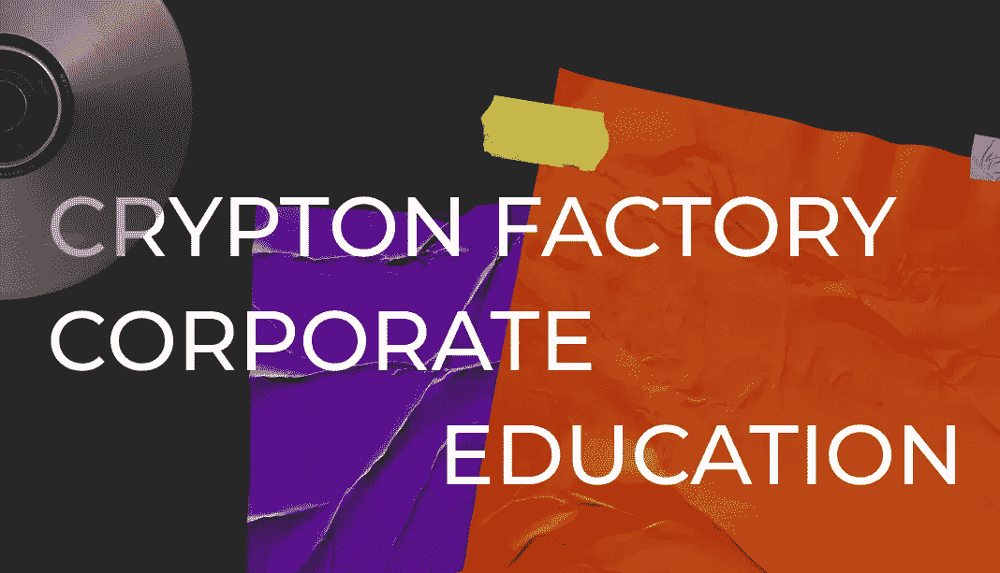

# CRYPTON 工厂企业教育

> 原文：<https://medium.com/coinmonks/crypton-factory-corporate-education-873e09a94323?source=collection_archive---------45----------------------->

正如你们大多数人所知，2021 年，我们启动了 [Crypton Factory](https://factory.crypton.studio) 实习计划，对区块链开发领域的程序员进行再培训，并保证获得 [Crypton Studio](https://crypton.studio) 的工作机会。

此外，我们为区块链公司的开发人员实施[定制再培训项目](https://crypton.studio/blog/Crypton-Factory-Corporate-Education-)。

> 交易新手？尝试[加密交易机器人](/coinmonks/crypto-trading-bot-c2ffce8acb2a)或[复制交易](/coinmonks/top-10-crypto-copy-trading-platforms-for-beginners-d0c37c7d698c)

# 提供哪些领域的培训？

这完全取决于你的要求。我们可以组织:

## 管理或行政课程。

比如项目经理，分析师，设计师。

## 发展课程。

比如智能合约开发者，flutter，go。

## 一般课程，深入这个或那个区块链的细节。

# 我们要教什么？

我们将专业地满足您的所有需求。接受我们的培训后，您的员工将会学到:

*   灵活适应变化
*   与区块链合作
*   做出非常规且可行的决策
*   看到自我发展的增长点

# 课程有多长时间？

它可以是一周的强化课程，也可以是 1-2 个月的完整课程。这取决于你的需求。

# 学习形式是什么？

讲座，有截止日期的实际任务，与 Crypton Studio 当前技术负责人的磋商。

# 为什么是我们？

Crypton Studio 进入国际市场已超过 6 年，是欧洲最大的区块链公司。我们从经验中了解到，找到一个有价值的区块链开发者很难，适应密码行业永无止境的变化就更难了。所以我们创建了 Crypton 工厂，现在我们自己培训开发人员！

订购 https://factory.crypton.studio/corporate Crypton 工作室[的课程](https://factory.crypton.studio/corporate)