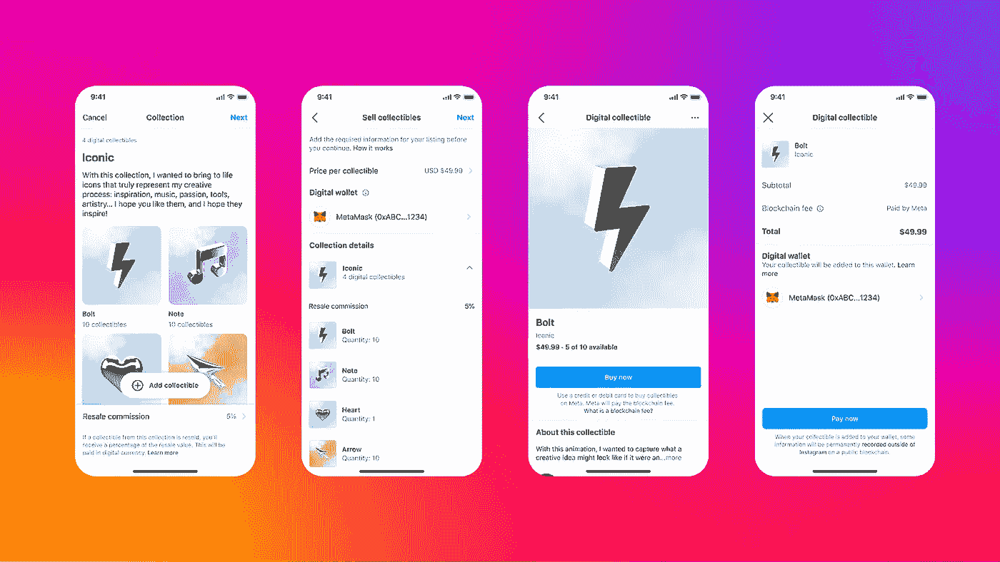
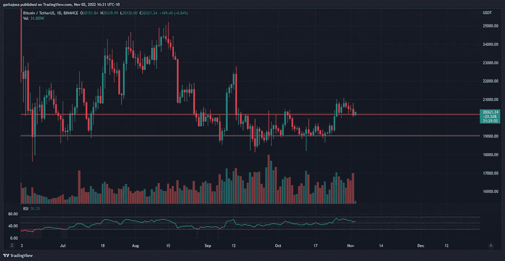
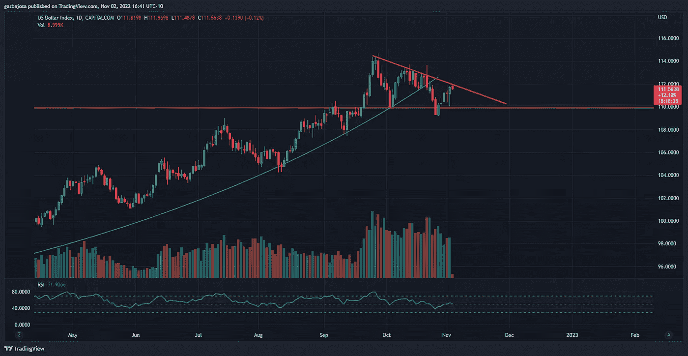
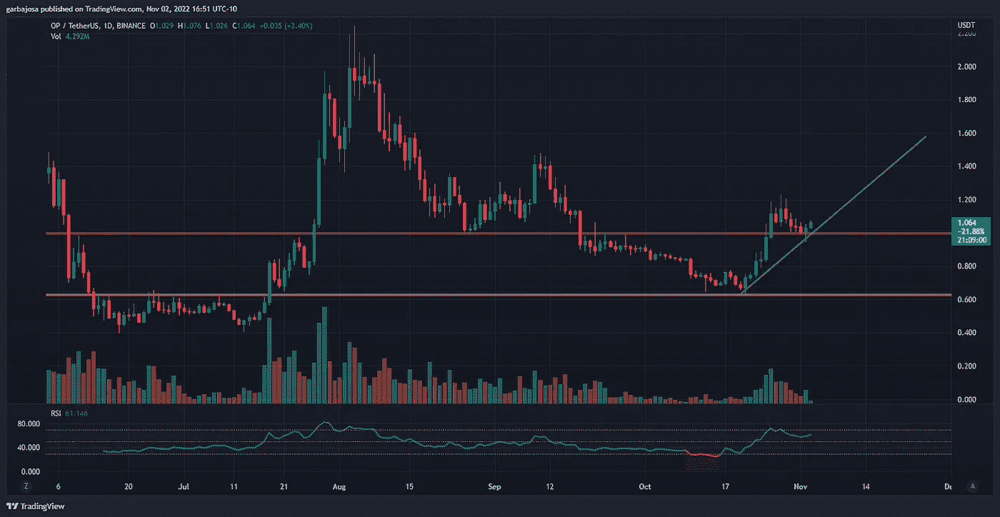
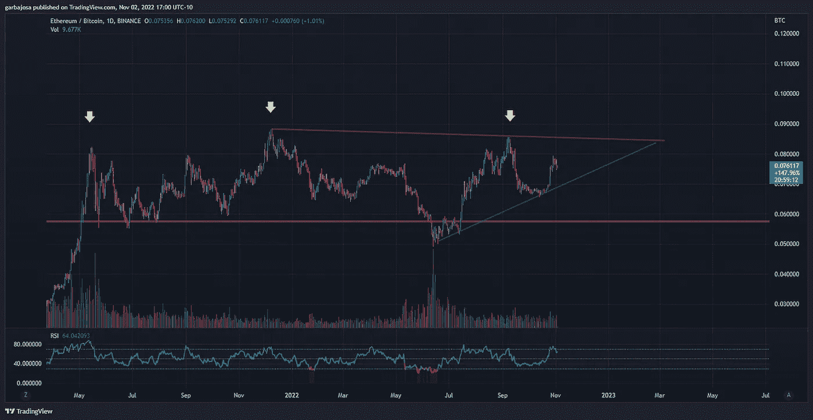
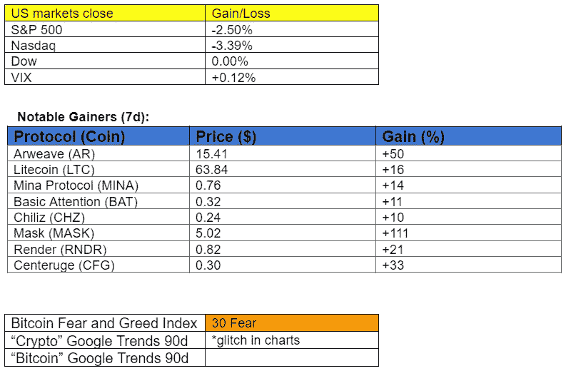

# Crypto 最大的现实世界整合日。(苹果、Meta、Instagram、Twitter)

> 原文：<https://medium.com/coinmonks/cryptos-biggest-day-of-real-world-integration-apple-meta-instagram-twitter-b414ba2fcfc5?source=collection_archive---------2----------------------->

## 每日征服#118

最好的每日新闻、见解和阿尔法信息来源。

Photo by [NASA](https://unsplash.com/@nasa?utm_source=medium&utm_medium=referral) on [Unsplash](https://unsplash.com?utm_source=medium&utm_medium=referral)

*密码市场是一个狂野、奇妙而令人生畏的地方；不要一个人跋涉！订阅加密征服者，让我们成为您的向导。*

订阅这份每日时事通讯，永不错过任何一期。(零成本)

**概述**

*   Crypto 最重要的现实世界整合日。
*   市场:加密技术在 FOMC 日的表现优于股票。
*   一些替代硬币看到了巨大的收益。
*   币安会收购一些银行吗？
*   政府不能不印更多的钱。

早上好，家人，

感觉 crypto 在现实世界的整合上失败了吗？没那么快！昨天被证明是这方面最乐观的一天。因此，让我们来看看发生的一些令人瞠目结舌的事件。

**Instagram 的 NFT 推送**

*来源:* [*元*](https://www.facebook.com/creators/2022-launching-new-creator-tools)

拥有 25 亿用户的 Instagram 是世界上最著名的社交平台之一，最近[整合了](https://about.fb.com/news/2022/05/introducing-digital-collectibles-to-showcase-nfts-instagram/)的 NFT 作为个人资料图片。昨天，该公司通过[宣布](https://twitter.com/MihailoBjelic/status/1587936749233504257?s=20&t=1znSrjSk6txWUdedtpX0xw)用户可以使用**多边形网络**作为背景，通过应用程序创建和销售自制的 NFT。该应用程序还将推出一个 NFT 市场。哦，还有更多。Meta 计划使用分散存储解决方案 **Arweave (AR)** 来[存储](https://twitter.com/ArweaveTeam/status/1587937673955926016?s=20&t=6biCyBEe7CYcxpBN0gtRbQ)所有的 NFT 数据。AR 今天上涨了 63%。

**推特的 Web3 猜测**

除非你一直生活在岩石下，否则你知道埃隆·马斯克上周收购了 Twitter。马斯克将 **Dogecoin** 和加密支付整合到平台中的猜测让 DOGE 在上周攀升了惊人的 127%。让事情变得更有趣的是，加密集团币安投资了 5 亿美元进行收购，然后推出了由**【BNB】****DOGE**和**MASK**token 组成的[“蓝鸟指数】](https://www.binance.com/en/support/announcement/binance-futures-will-launch-usd%E2%93%A2-m-binance-bluebird-index-perpetual-contracts-with-up-to-25x-leverage-6971c0a0c4fe43ef9969c1d6252dea74)。那么，有没有一个迫在眉睫的 Web3 合作伙伴关系将 Twitter 带入一个新时代？MASK 在过去 24 小时内上涨了 64%**并在他们的 Twitter 上发布了这个消息:**

**苹果设备上集成的渲染应用**

苹果两周前发布了这个宣传视频，其中包括对 Octane X 的大声疾呼，Octane X 是一个在所有苹果设备上免费订阅一年的 Web3 应用程序。Octane X 恰好利用一个名为 **Render (RNDR)** 的分布式区块链 GPU 渲染平台区块链来提供清晰的视频和图片。此外，Render 团队将于 11 月 4 日在葡萄牙里斯本召开的 Solana Breakpoint 会议上亮相。cryptoverse 一定刚刚意识到这个发展，因为 RNDR 在过去的七天里上升了 92%。

市场更新🌍

**BTC/USDT 1D**

在联邦基金利率公告和杰罗姆·鲍威尔(Jerome Powell)昨日的后续讲话期间，比特币经历了动荡的一天。交易员将 BTC 价格推高至 20，800 美元的高点，随后又将其抛至 20，060 美元。如果 20000 美元作为可行的支撑，对 21000 美元阻力的再次测试可能很快就会发生。尽管下跌，BTC 继续跑赢标准普尔 500 和纳斯达克，分别下跌了 2.50%和 3.45%。少数中型股 altcoins 在重要催化剂的推动下出现了显著增长: **Arweave (AR) +50%** ， **Mask Network (MASK) + 111%，Render (RNDR) + 21%** 。BTC 收盘下跌 1.62%，至 20，150 美元。

*高分辨率* [*图表*](https://www.tradingview.com/x/N3IFFNrr/) 。

**美元指数(DXY)**

随着交易者抛售美国股票，DXY 飙升，目前正在测试下降趋势阻力(红色)。这个水平对 DXY 是否继续下跌趋势至关重要。DXY 似乎在日线图上创造了一个[下降三角形形态](https://www.investopedia.com/terms/d/descendingtriangle.asp)，110 为底部支撑(黄色)。这种形态通常出现在价格下跌之前，但在价格坚决跌破基础支撑位之前，这种形态不会被确认。DXY 仍然是投资者现在可以监控的最重要的图表之一。

*高分辨率* [*图表*](https://www.tradingview.com/x/Evnemlls/) 。

我现在最喜欢的加密图表之一是乐观图。OP price 拒绝了 1.00 美元的支撑位，并在昨天创造了一根针棒蜡烛，看起来准备再次上涨。最终，OP 可能突破 1.20 美元阻力位(黄色)并继续反弹。OP 完成日蜡烛上涨+2.39%至 1.02 美元。

*高分辨率* [*图表*](https://www.tradingview.com/x/wCWEPlPX/) 。

**瑞士联邦理工学院/BTC 比率**

拉乌尔·帕尔最近在推特上问，瑞士联邦理工学院/BTC 是否是“世界上最乐观的主要资产价格图表”之一如果 crypto 继续攀升，预计 ETH 的表现将优于 BTC，如果三角形形态的顶部阻力(红色)未能保持，ETH 可能会开始在 BTC 取得重大进展。

*高分辨率* [*图表*](https://www.tradingview.com/x/RApEG61V/) 。

如果你喜欢这份报告，并且认为它值 20 分(0.01 美分)，请点击下面的鼓掌按钮来支持我的写作。(最多 50 次！)谢谢！

# 新闻观察📰

币安银行？据《彭博》报道，币安首席执行官赵昌鹏正在考虑收购一些银行，作为弥合传统金融和加密之间鸿沟的一种方式。此外，CZ 指出，当公司向客户推荐银行时，收购银行将有助于币安支撑损失的价值。

**新闻花絮:**

*   线索:[亚美尼亚生态系统分析](https://twitter.com/yashcrypto21/status/1587517126679887872?s=20&t=IBuvH_f5QOODv0l2IESZOw)
*   波巴网络[为 BNB 连锁店推出](https://twitter.com/bobanetwork/status/1587448216181678087) L2 称重解决方案。
*   Chainlink [推出针对 DeFi 衍生品的 oracle](https://twitter.com/ChainLinkGod/status/1587585168021364741) 解决方案。
*   新加坡[试点](https://www.mas.gov.sg/news/media-releases/2022/first-industry-pilot-for-digital-asset-and-decentralised-finance-goes-live) DeFI 应用。
*   富国银行抵押贷款部门[准备](https://twitter.com/JeffWeniger/status/1587871002654134275?s=20&t=_2eWHu8nSuM74bK6nAIpig)大规模裁员。
*   Dapper Labs [解雇了 22%的员工。](https://www.theblock.co/post/182461/dapper-labs-feldman-a-difficult-day-as-company-lays-off-22-of-staff)
*   比特币基地的首席产品官[下台](https://twitter.com/tier10k/status/1587900417781903361?s=20&t=C3JFWnEjrLKCJM3EjK3NOQ)。

**NFT &元宇宙更新🐵**

*   Visa 和 Crypto.com 一起，为世界杯相关的非足球运动员举办慈善拍卖。
*   华纳兄弟探索频道和 HBO to l [aunch](https://nftlately.com/warner-bros-discovery-and-hbo-to-launch-game-of-thrones-nfts/) 权力的游戏 NFTs

**我的五分钱……**

一方面，政府在抗击通货膨胀，另一方面，它继续印钞。

拜登政府刚刚宣布向 T21 提供 130 多亿美元的援助，帮助美国公民支付电费和进行节能住宅升级。

这两个想法是矛盾的。虽然政府希望在财政上帮助公民，但他们的钱继续因过度印刷引起的通货膨胀而贬值。此外，虽然这个想法似乎是出于善意，但在中期选举之前宣布这一消息并非巧合。

# 加百列

*关注我* [*推特*](https://twitter.com/web3_gabri) *每日更新！*

仅供娱乐之用！不是财务建议。

> 交易新手？试试[加密交易机器人](/coinmonks/crypto-trading-bot-c2ffce8acb2a)或者[复制交易](/coinmonks/top-10-crypto-copy-trading-platforms-for-beginners-d0c37c7d698c)