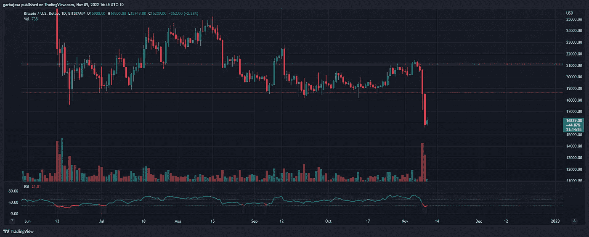
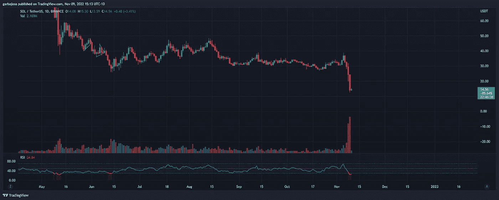
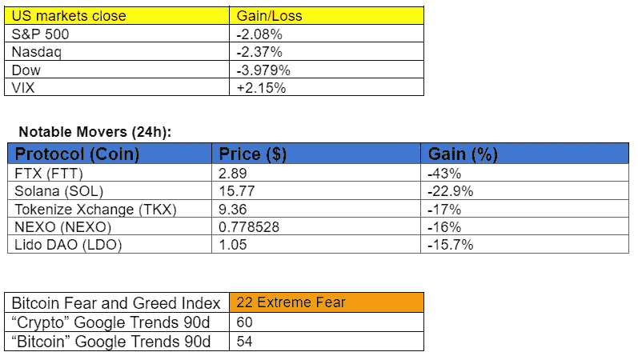

# Crypto 最黑暗的一天

> 原文：<https://medium.com/coinmonks/cryptos-darkest-day-d17da98c81a?source=collection_archive---------19----------------------->

## 秘密征服#120

***最好的每日新闻、见解和阿尔法来源。***

Photo by [Yosh Ginsu](https://unsplash.com/@yoshginsu?utm_source=medium&utm_medium=referral) on [Unsplash](https://unsplash.com?utm_source=medium&utm_medium=referral)

***密码市场是一个狂野、奇妙而令人生畏的地方；不要一个人跋涉！订阅加密征服者，让我们成为您的向导。***

**S** [***订阅***](https://tradergabi.substack.com/subscribe?) ***到此每日简讯，永不错过一期。*(零成本)**

**概述**

*   币安退出了 FTX 的交易。
*   市场:索拉纳(SOL)领跌。
*   币安发誓要做一个储量证明的承诺；其他人跟随。
*   NEXO 躲过了 FTX 的子弹。
*   埃隆·马斯克说推特会做“傻事”。

不透明的中央集权企业的失败和企业本身一样古老而普遍。这不是密码崩溃。这是一场贸易/公司的崩溃。

我们现在陷入了困境。

*而我们做到了* ✊血脉里有火

*   [***redphone.eth，Twitter***](https://twitter.com/redphonecrypto/status/1590394166206353409?s=20&t=3yGojabUP66OGLOfGIy3sQ)

早上好，家人，

在关注美国中期选举和 11 月核心通胀指数(CPI)发布的一周里，FTX 崩溃理所当然地占据了中心舞台。

正在考虑收购 FTX 的币安看了一眼天平后，突然改变了主意。据报道，FTX 有一个高达 80 亿美元的窟窿。仅山姆·班克曼·弗里德(SBF 饰)就欠了贷方超过 6 . 5 亿美元，有传言称他可能正在潜逃。不幸的是，大部分债务都是由于不当使用客户资金来杠杆化公司运营造成的——FTX 没有得到救助。

在司法部对该公司展开调查后，当局同样也参与了这场秀。

# 市场更新🌍

**BTC/美元 1D**

FTX 事件导致资产价格全面下跌，严重损害了 crypto 的形象。因此，BTC 未能守住 19k 美元的支撑位，并触及 15632 美元的两年低点。缺乏流动性将引发剧烈的价格波动，这将在未来几天到几周内考验杠杆头寸。BTC 收盘下跌 14.41%，至 15，887 美元。

*高清* [*图表*](https://www.tradingview.com/x/YCJiBYJL/) 。

**索尔/USDT·1D**

下一个挑战以太坊的协议现在面临一些灾难性的挑战。首先，FTX [发行的](https://twitter.com/weremeow/status/1590461628864397312?s=46&t=Iy8onFkO8S56vqV33DYH-g)索拉纳区块链上有许多打包资产，这可能导致一连串的问题和进一步的清算。更重要的是，其最大的投资者 FTX 风险投资公司已经和 FTX 家族的其他成员一起破产。当这些前巨头开始解除资产负债表时，SOL token 可能会继续遭受损失。SOL 下跌了 42%，至 14.46 美元。

*高分辨率* [*图表*](https://www.tradingview.com/x/plKa3lK5/) 。

# 新闻观察📰

**币安的准备金证明质押。**受最近事件的启发，币安首席执行官赵昌鹏(CZ) [表示](https://twitter.com/cz_binance/status/1590055819416330240?s=61&t=yfx9u3yMhAewLTf-wNhWXg)公司将很快启动储量证明审计系统，以便对其持有的资产进行核实。该系统使用 Merkle 树技术来实现完全透明。这一声明导致包括 Crypto.com 在内的许多其他 T21 交易所表示将实施类似的策略。

**NEXO 的最后一分钟沟。根据下面的推文，crypto exchange NEXO 在倒闭前几小时从 FTX 撤回了总计 2 . 19 亿美元的资金。**

**新闻花絮:**

*   埃隆·马斯克表示，在接下来的几个月里，Twitter 将会做很多愚蠢的事情。
*   地铁[在德国测试](https://cointelegraph.com/news/subway-accepts-bitcoin-so-users-can-get-a-sandwich-on-the-lightning-network)比特币的闪电网络。
*   银河数码[对 FTX 的敞口为](https://cointelegraph.com/news/galaxy-digital-discloses-77m-exposure-to-ftx-48m-likely-locked-in-withdrawals)7600 万美元。

**NFT &元宇宙更新🐵**

*   OpenSea 将继续对所有现有的收藏征收创作者费用。

# **我的五分钱**

对于整个加密领域来说，这绝对是一个艰难的时期。像该领域主要参与者——在这种情况下是 FTX——的崩溃这样的意外事件只会造成伤害。比特币和整个市场可能需要一段时间才能恢复，但从核心来看，区块链和许多建立在此基础上的 web3 项目的基本面没有改变。我们必须记住，FTX 是一个集中的加密交易所，而不是一个有代表性的网络 3。

与此同时，我们看到了形势的一线希望——也就是说，许多加密交易所现在同意提供储量证明，这将向所有人公开。在这种情况下，增加透明度是好事。

如果你想知道…我们在这个领域的信念会受到考验吗？没门儿！

注意安全，戏谑之家。

# 加百列

*关注我* [*推特*](https://twitter.com/web3_gabri) *每日更新！*

> 交易新手？尝试[加密交易机器人](/coinmonks/crypto-trading-bot-c2ffce8acb2a)或[复制交易](/coinmonks/top-10-crypto-copy-trading-platforms-for-beginners-d0c37c7d698c)