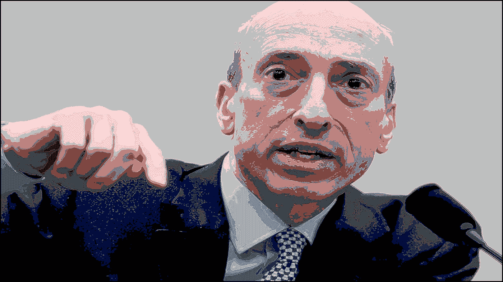
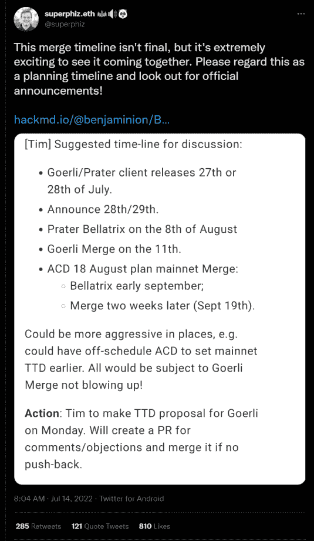
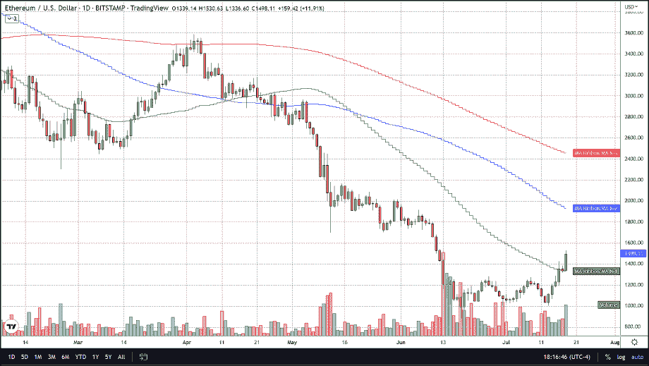
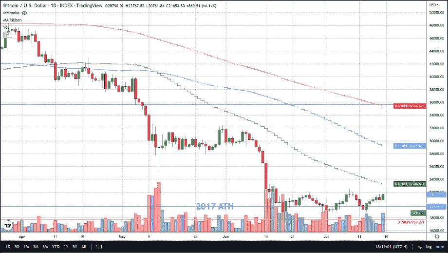

# Cryptos 终于得到了一些正面的宣传，在周末引发了上涨

> 原文：<https://medium.com/coinmonks/cryptos-finally-get-some-positive-publicity-sparking-gains-over-the-weekend-a4014bc854ed?source=collection_archive---------51----------------------->

过去几个月，加密货币领域一直受到大公司破产和失去投资者资金的头条新闻的困扰。比如总部位于新加坡的对冲基金三箭资本(Three Arrows Capital)，该基金在加密领域拥有大量业务，但在破产时仍负债累累。

然后是 Terra 的 Luna 的崩溃，它在死亡螺旋之前是三个最稳定的硬币之一。虽然崩溃是由于其算法机制，负责保持其与美元 1 比 1 的比率。泰瑟和 USDC 以不同的方式保持联系汇率，实际上他们有储备来支持他们的硬币。

其他大型机构也遭遇了类似的命运，因为它们在比特币和其他加密货币上支付巨额收益率的商业模式在长期熊市中被证明是不可持续的，导致 Celsius、Voyager 和其他机构因没有偿还过度杠杆化资产负债表所需的资本而停止从其平台上撤资。但来自华盛顿监管机构的帮助可能会改变投资者的信心，并在未来保护投资者的资本。

就在最近，美国证券交易委员会主席加里·詹斯勒宣布，他愿意帮助他称之为“蛮荒西部”的金融领域的公司。就像在《与狼共舞》中一样，这个领域很快就会被殖民化，任何涉足这个领域的人基本上都是凯文·科斯特纳，他们可能会瞥见一个真正未被驯服的狂野金融领域的末日。

*“有一条潜在的前进道路，”* SEC 主席加里·詹斯勒(Gary Gensler)在接受雅虎财经(Yahoo Finance)采访时表示，他的评论指出了 SEC 如何与加密行业合作向前发展，并补充说该机构有权豁免某些监管和披露要求*。“我已经对这个行业、贷款平台和交易平台说:‘进来，和我们谈谈。’”*

另一个点燃交易者看涨情绪的标题是以太坊内部人士上周在 Twitter 上发布的时间线。

自从这条推文发布以来，以太坊在不到一周的时间里飙升了 40%，从 7 月 13 日的略高于 1000 美元攀升至美国东部时间下午 6 点的近 1500 美元。比特币同期上涨了 10%。与 PoS 的合并是 crypto 领域最令人期待的事件，已经持续了一年多。合并可能在 9 月 19 日那周完成的消息给以太坊打了一针强心剂，这正是它所需要的，并可能结束目前正在进行的加密冬天。

值得注意的是，虽然 BTC 尚未挑战其 50 天或 200 周移动平均线，但 ETH 已成功消除其 50 天移动平均线的阻力，这表明 ETH 在未来几周和几个月可能有最大的上涨潜力。

任何对我们致力于比特币交易的免费服务感兴趣的人，只需点击这个[链接](https://www.thegoldforecast.com/bitcoin)。

> 交易新手？试试[密码交易机器人](/coinmonks/crypto-trading-bot-c2ffce8acb2a)或者[复制交易](/coinmonks/top-10-crypto-copy-trading-platforms-for-beginners-d0c37c7d698c)

*原载于*[*https://thegoldforecast.com*](https://thegoldforecast.com/crypto/2022/cryptos-finally-get-some-positive-publicity-sparking-gains-over-weekend)*。*