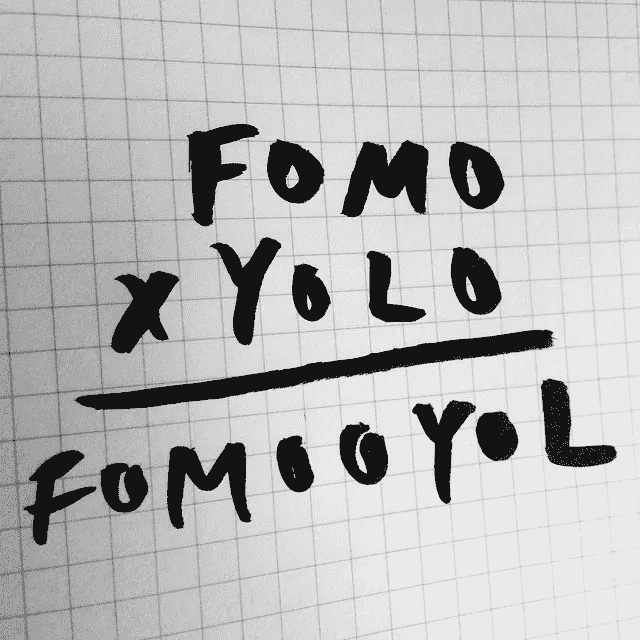

# Crypto 的不符合性让 FOMO 有了更深的认识

> 原文：<https://medium.com/coinmonks/cryptos-lack-of-compliance-puts-fomo-into-further-perspective-861216398a4d?source=collection_archive---------19----------------------->

Image Credit: [Austin Kleon](https://www.flickr.com/photos/deathtogutenberg/)

37 岁的 Sergei Potapenko 和 Ivan Turogin 于上周在爱沙尼亚被捕，并被引渡到美国，面临电信诈骗和共谋洗钱的指控。由于我住在太平洋西北部，这个案件在我家附近发生，在西雅图的一个美国地方法院，对这些骗子的起诉在 T2 被公开。此外，这对基于密码的计划的少数受害者是华盛顿西部的居民。

视角是一种强大的东西。它防止我们犯或重复关键的生活错误，或者当你意识到在杂货店偷了你停车位的人正在化疗后回家的路上时，它给我们注入了同理心。

透视也有能力向观众展示某样东西实际上是如何工作的，而不是告诉他们。涉及到 Potapenko 和 Turogin 的案例显示了被称为、害怕错过的现象是如何发生的。据美国司法部称，受害者向被告的公司、一家名为 HashFlare 的加密货币开采服务公司和一家名为波利比乌斯银行的虚拟货币银行支付了超过 5.75 亿美元(美元)。尽管没有证据证明波利比乌斯的存在，而且 HashFlare 的采矿活动基本上失败了，但每次都为这些实体筹集了大量资金。这些投资者在投入资金之前做了什么功课吗？

对 HashFlare 和波利比乌斯的捐款一旦收到，就在一场阴谋中被专业地清洗[司法部声称](https://www.cbsnews.com/news/estonians-arrested-cryptocurrency-fraud-575-million-us-district-court-seattle/)发生在 2015 年至 2019 年，涉及至少 75 处房地产、6 辆豪华汽车、未知数量的加密货币钱包和数千台加密货币采矿机。这两人被正式指控“共谋电信诈骗、16 项电信诈骗和一项共谋洗钱”。这些罪行中的每一项最高可判处 20 年监禁。”

如果这些指控被证实，波塔彭科和图罗金将面临严重的后果。他们显然是非常优秀的推销员；好到足以筹集到 5.75 亿美元。除了 crypto 之外，我不知道有多少公司财务人员能够为本质上属于初创企业的业务筹集到这么多资金。

我认为它们是由 FOMO 促成的，就其对我们或整个社会的影响而言，某种比我们人类所理解的更强大的东西。几乎有这种持续的来自于密码社区的压力，在某些情况下，这些压力来自于那些被付钱来支持它的人，这是像 Potapenko 和 Turogin 这样的人，以及许多其他人目前正在掠夺的东西。

美国华盛顿西区检察官尼克·布朗在司法部发布的新闻稿中回应了我对 FOMO 的分析，该新闻稿宣布爱沙尼亚人被捕。

“这些被告利用加密货币的吸引力和围绕加密货币开采的神秘，实施了一个巨大的庞氏骗局。他们用虚假陈述吸引投资者，然后用后来投资者的钱来支付早期投资者。他们试图隐藏他们在爱沙尼亚房产、豪车以及世界各地的银行账户和虚拟货币钱包中的不义之财。”

当秘密犯罪标题每天出现在我的新闻提要中时，除了那些专注于洗钱和秘密欺诈的标题，我很少与实际犯罪有太多联系，因为这些犯罪往往是东海岸的人犯下的，他们在华盛顿特区、新泽西州或纽约市等城市因犯罪而被逮捕和指控。

一份起诉书在西雅图这样的城市启封，证明这些罪行在全国各地都在发生，用不了多久，所有美国人都会成为某人的朋友或邻居，这个人在被诈骗后已经“失去了一切”。这些“聪明”的骗子活在借来的时间里，披着某种不可战胜的外衣，只要我们作为一个社会不能理解 FOMO 的概念，他们就将继续活下去。

*   结束

> 交易新手？试试[加密交易机器人](/coinmonks/crypto-trading-bot-c2ffce8acb2a)或者[复制交易](/coinmonks/top-10-crypto-copy-trading-platforms-for-beginners-d0c37c7d698c)