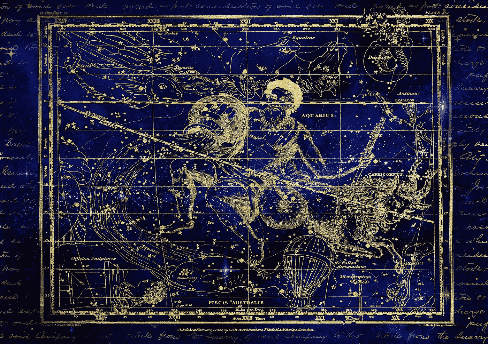

# cryptos——富裕新时代的货币！

> 原文：<https://medium.com/coinmonks/cryptos-the-currency-of-a-new-age-of-abundance-55619ce69e51?source=collection_archive---------20----------------------->

## 密码是*宇宙*自然的*活体*货币——进化*空间*的产物。

Crypto Art courtesy of [Darkmoon_Art](https://pixabay.com/users/darkmoon_art-1664300/?utm_source=link-attribution&utm_medium=referral&utm_campaign=image&utm_content=3596289) (Pixabay)

在人类历史上，人类第一次在技术上发展到可以利用电磁波的力量来创造一种货币。然而，尽管有了这一革命性的飞跃，人类本身仍然…