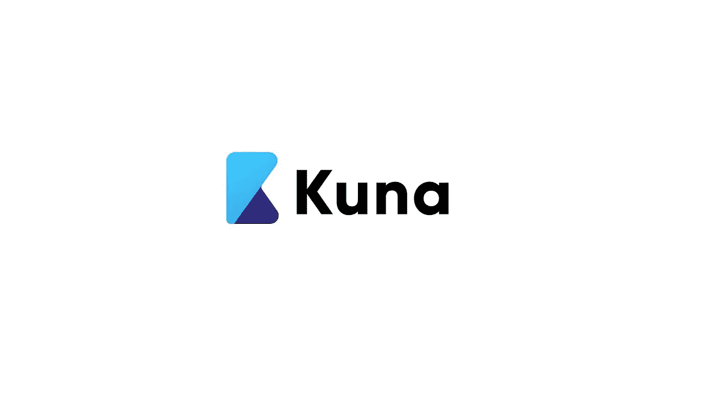

# Cryptoworld 评论#1: KUN 令牌和 KUNA 交换

> 原文：<https://medium.com/coinmonks/cryptoworld-review-1-kun-token-and-kuna-exchange-ac8e4b37acd0?source=collection_archive---------51----------------------->

众所周知，加密世界由成千上万种有趣的加密货币组成。每种加密货币背后都有一家公司，公司背后都有人。我决定开始这个专栏，以突出我认为值得的现实，为您带来有趣的加密货币及其应用的知识。今天我想和你们谈谈 KUN，KUNA 交易所的土著信物。

KUN

我已经在[的文章](/coinmonks/the-role-of-cryptocurrencies-in-the-conflict-of-ukraine-and-how-it-is-possible-to-help-the-b6ff38af803)中提到了这一交换，文章是关于对乌克兰人民的秘密捐赠。 [KUNA](https://kuna.io/?r=kunaid-9r5u6zkxswdy) 是一个公司集团，包括:
- Kuna Fintech Limited，在英格兰和威尔士开展业务；
——UAB·库纳 Pro，在立陶宛维尔纽斯注册；
- FlexyPay 公司，受加拿大管辖。

法定地址位于斯洛伐克布拉迪斯拉发。 [KUNA](https://kuna.io/?r=kunaid-9r5u6zkxswdy) 被乌克兰[福布斯](https://techukraine.org/2021/04/02/techukraine-news-forbes-ukraine-shortlisted-the/)评为“乌克兰 IT 创业公司 30 强”。

Kuna exchange logo

创始人是 Mikhail Chobanian，一位金融科技企业家，自 2011 年以来一直专业从事区块链生态系统的工作。他是伦敦大学城市经济学学士。他还是乌克兰区块链协会的主席，2022 年 6 月，他宣布了乌克兰基于加密货币的人道主义项目。

Mikhail Chobanian

坤在 Coinmarketcap 上市，今天的价格接近 5 美元，2021 年 5 月创下 47 美元的历史新高。髡残将用于支付 PRO 账户和在 T2 库纳交易所上市的新硬币。它很快就可以用于降低报价的佣金。总供应量为 1，000，000 昆，储备的 700，000 枚代币存放在冷库[于 2019 年 10 月被烧毁](https://wavesexplorer.com/transactions/E6vwVxwN2vjNWzu3zPNm4H4WF1QkbJReCDmnevxxUFfq)。

[库纳](https://kuna.io/?r=kunaid-9r5u6zkxswdy)提供多种产品:
-库纳码，库纳交易所用户账户间转移资产的工具；
- Kuna Money，允许使用 Visa / Mastercard UAH 卡购买和出售加密货币
- My Kuna，允许立即发送资金，无需注册和任何费用；
- UAX Cryptohryvna，区块链以太坊上的稳定货币，与乌克兰货币 hryvna 的储备比率为 1:1；
- Kuna XO，一款即使使用 Apple 或 Google Play 也能轻松购买 crypto 的移动应用
- Kuna Pay，一个连接加密货币和法定支付的多种支付服务的平台。

请在下面留下评论，告诉我你是否知道加密空间的其他著名加密货币。把这个空间当成一个没有审查的谈话场所。

胜利者是永不放弃的梦想家。

**免责声明** : *我不知道所用图片的任何第三方权利。如有任何资料来源，我保证予以引用，如有要求，我将调整立场。*

**免责声明** : *交易加密货币具有很高的风险，可能不适合所有投资者。在决定交易加密货币之前，你应该仔细考虑你的投资目标和你的经验水平。自己做研究。此处表达的所有观点归各自作者所有，不应被视为任何形式的财务建议。*

> 交易新手？尝试[加密交易机器人](/coinmonks/crypto-trading-bot-c2ffce8acb2a)或[复制交易](/coinmonks/top-10-crypto-copy-trading-platforms-for-beginners-d0c37c7d698c)