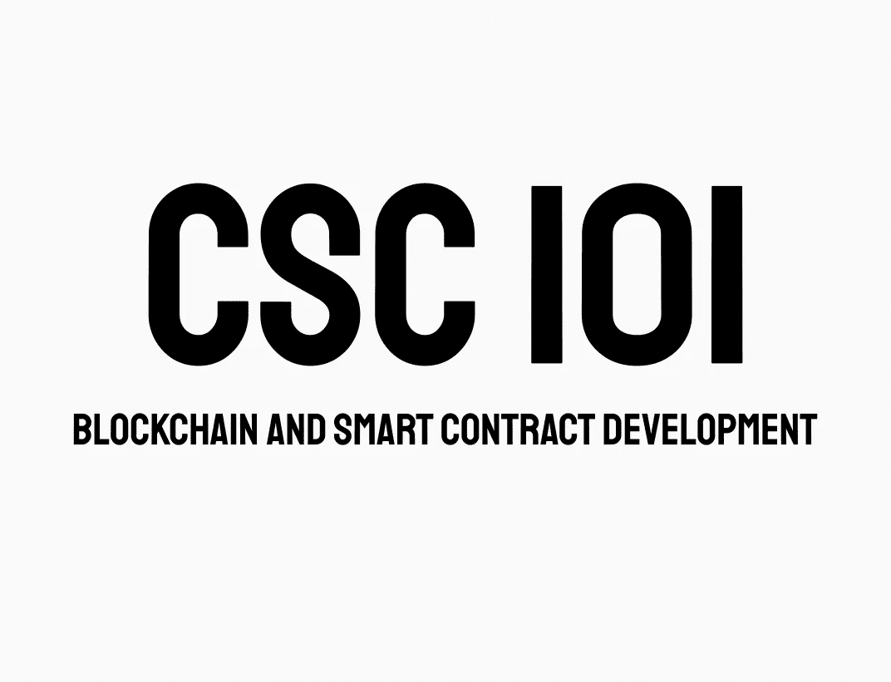

# CSC 101-条件和循环

> 原文：<https://medium.com/coinmonks/csc-101-conditions-and-loops-8134fdbf1892?source=collection_archive---------43----------------------->

嘿嘿嘿！

Zeroxlive 在此为 **Coinex 智能链**

您是否曾经遇到过需要从一组给定的路径中选择一条的情况？在这种情况下，你需要条件语句。在这一部分，我们要去寻找条件和循环。



## 情况

条件语句允许我们的程序做出正确的决定和执行正确的动作。Solidity 支持基于不同条件执行不同动作的条件语句。这里我们将解释一下**如果..else** 语句。

Solidity 支持以下形式的 **if..else** 语句:

## 如果语句

if 语句是基本的控制语句，它允许 Solidity 有条件地做出决策和执行语句。

格式:

```
if (expression) {
   Statement(s) to be executed if expression is true
}
```

示例:

```
if (X == 10) {   // if statement
         return X;
      }
```

## Else if 语句

else if 语句是 if…else 的高级形式，允许 Solidity 在几种情况下做出正确的决定。

格式:

```
if (expression 1) {
   Statement(s) to be executed if expression 1 is true
} else if (expression 2) {
   Statement(s) to be executed if expression 2 is true
} else if (expression 3) {
   Statement(s) to be executed if expression 3 is true
} else {
   Statement(s) to be executed if no expression is true
}
```

示例:

```
if( X > Y && X > Z) {   // if else statement
         result = X;
      } else if( Y > X && Y > Z ){
         result = Y;
      } else {
         result = Z;
      }       
      return integerToString(result); 
   }
```

## Else 语句

else 语句是控制语句的下一种形式，它允许 Solidity 以更可控的方式执行语句。

## 环

程序设计语言中的循环是在满足某些条件时，便于重复执行一组指令/功能的命令。几乎所有的编程语言都提供了一个叫做循环的概念，这有助于执行一个或多个语句达到期望的次数。

Solidity 支持所有必要的循环来减轻编程的压力:

## While 循环

坚固性中最基本的循环是 while 循环，这将在本章中讨论。

格式:

```
while (expression) {
   Statement(s) to be executed if expression is true
}
```

示例:

```
while (X != 0) {
         X- -;
      }
```

## **do-while**

do-while 循环类似于 while 循环，只是条件检查发生在循环的末尾。

格式:

```
do {
   Statement(s) to be executed;
} while (expression);
```

示例:

```
do {
         x += 1;
      }
      while (x > 0);
```

## 为

**for** 循环是最紧凑的循环形式。它包括以下三个重要部分

*   **循环初始化**，我们将计数器初始化为一个初始值。初始化语句在循环开始前执行。
*   **测试语句**将测试给定条件是否为真。如果条件为真，则执行循环中给出的代码，否则控制将退出循环。
*   **迭代语句**，您可以在其中增加或减少计数器。

您可以将这三个部分放在一行中，用分号隔开。

格式:

```
for (initialization; test condition; iteration statement) {
   Statement(s) to be executed if test condition is true
}
```

示例:

```
for (j = 0; j <= 100; j++) {  //for loop example
         flag++;         
      }
```

## break 语句

**break** 语句由 **switch** 语句简单介绍，用于提前退出一个循环，跳出封闭的花括号。

```
while (true) {
         flag++;
         X /= 2;
         if(X==0){
            break;   //using break statement
         }
      }
```

> 交易新手？试试[加密交易机器人](/coinmonks/crypto-trading-bot-c2ffce8acb2a)或者[复制交易](/coinmonks/top-10-crypto-copy-trading-platforms-for-beginners-d0c37c7d698c)