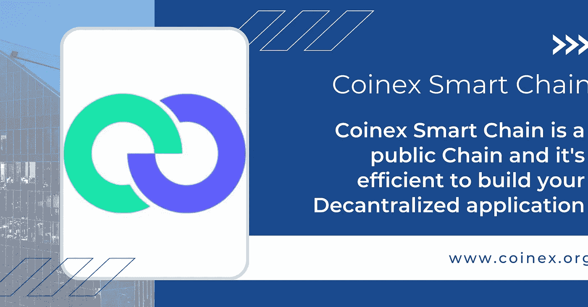

# CSC | 4 种在加密寒冬中生存和发展的方法

> 原文：<https://medium.com/coinmonks/csc-4-ways-of-thriving-and-surviving-the-crypto-winter-22856a2a2936?source=collection_archive---------51----------------------->

加密波动性对双方都不利。

自新冠肺炎疫情以来，当政府投入数万亿美元支持金融市场和拯救经济时，一部分“免费”资金渗透到加密领域，该子行业繁荣到数万亿美元。在高峰时期，比特币在一些交易所的交易价格超过 69000 美元。与此同时，替代硬币的表现好于 BTC 好几倍。

在这种繁荣和蓬勃发展的资产中，Uniswap、Polkadot 和一些 DeFi 项目在短时间内成为独角兽。crypto 的兴起迫使更多的人进入这个领域。当他们有更多的时间时，一个机会在 NFTs 中绽放，并在游戏中找到了完美的契合，然后是元宇宙。

不久前，稀有的非功能性交易价格高达数百万美元，而像 OpenSea 这样的市场交易量高达数十亿美元。DeFi、crypto 和 NFTs 中的 FOMO 导致以太坊拥塞，费用不断攀升。

问题是，在上一次加密牛市中，钱是可以赚到的。

问题是，如前所述，加密是两面的，而且可能很残酷。勇敢的(精明的)在 2021 年 11 月，为了高额利润，在最高点离场。然而，大多数投资者和交易者仍然持有他们的资产，遭受重创，并感受到熊市的全部冲击。现在，市场希望收回它从 2020 年到 2021 年末自由分配的东西。

随着他们的投资组合下跌超过 70%(假设 BTC 是基数)，再加上曾经不可动摇的加密公司面临可怕的危机，继续下去可能会很难。

美联储和其他央行并没有减轻痛苦。如果有什么不同的话，根据主流媒体和一般交易者的情绪，加密市场可能会持续几个月，造成最大的痛苦。

# 度过秘密冬天的 4 种方法

问题是，你会扣吗？

如果没有，你如何做最坏的打算，准备在这个无情的冬季市场生存下来？

在本文中，我们将探索可用的技巧和工具，以帮助您在这个加密的冬天安全地导航和茁壮成长。

# 冷静

交易一部分是技术和研究，很大一部分是情绪。你可以自由地分析加密市场，并通过保持冷静和客观来权衡你的选择。这一点非常重要，因为加密是一种独特的资产类别。与股票投资不同，加密主要是分散的和发展中的，但由一种技术驱动，这种技术将一直存在。此外，加密交易和投资的很大一部分是炒作因素。不管大多数分析师如何倾向于忽视或完全拒绝它，这个因素是重要的，应该作为你研究的一部分。

因此，即使市场动荡，看起来像是世界末日；放松，问自己几个问题。比如，基于经验数据，这是退出的最佳时机吗？您是否需要在交易所或平台之间将资产移动到离线设备？市场上流传的东西站得住脚吗？退出前问自己一些相关的问题可以节省你的时间，让你不至于后悔。

# 避免接住落下的刀

是的，不要计时加密底部！这是难以置信的困难，更糟糕的是，你可以烧伤你的手指！很多人尝试过，结果都一样:失败。

把握底部是令人沮丧的，但也给我们上了宝贵的一课。秘密投资并不完美，但所有关于时机。后者并不意味着准确，通过最薄的利润，预测底部并试图变得聪明。记住，你可以依靠你的直觉，希望市场正在触底反弹。谁知道呢？但是，坏消息是“希望”不是一种交易或投资策略。当情况危急时，你的希望会不可挽回地破灭，导致巨大的损失。所以，这是另一种选择。不要选择触底的时机并寄希望于此，要跟随潮流，只有在有足够的证据支持多头时才投入资金。通常，加密反转会被广泛宣传。那可能是双倍下注的最佳时机。

# 美元成本平均法

相反，如果你相信项目的长期前景，你可以使用美元成本平均法(DCA)作为一种策略。在这种方法中，你必须承诺定期购买你相信的数字资产，如 ETH 或 MATIC，例如 CET，在特定的时间间隔内，不考虑价格。例如，在熊市期间，ETH 的价格在 1000 美元区域交易。你可以投入 1 万美元，选择在接下来的 40 周内每周买入 250 美元的 ETH，而不管 ETH 现货价格如何。如果 ETH 价格在这段时间内回升，你的投资将更有价值

# 利用现有工具，如即时加密贷款

假设 1 万美元的投资过于陡峭，你仍然可以参与。多亏了 DeFi 和现有的分散货币市场，如 PAXO。金融，允许用户访问抵押不足的贷款在飞行中，你可以开始小，并立即开始投资加密。像 Paxo 这样的工具的美妙之处在于它是不可信的和安全的。因为它是在一个公共的区块链上进行的，所以所有的操作都是不需要许可的，而且是透明的。你可以开始用你拥有的任何资本进行投资，并获得高达 5X 的抵押品，而不是焦虑和躲避。更有趣的是，尽管目前的市场条件，获得加密贷款不需要背景信用检查，而且，如前所述，是即时的。为投资 BTC 或瑞士联邦理工学院等受支持的加密资产而发放的加密贷款将在几秒钟内处理完毕。此外，用户可以使他们的资产流动，而无需触发应税交易或根据他们的需要调整贷款。

# 结束语

是的，冬天非常寒冷，在某些情况下，项目被迫中止。成千上万的交易者远离市场，等待奇迹发生，等待像 ETH、BTC 和 MATIC 这样的资产在翻倍之前上涨。你不必等待或像他们一样。

# 关于 Coinex 智能链

CoinEx 智能链(CSC)是由 CoinEx 团队为分散式金融创建的分散式高效公共链。公共链与以太坊生态系统完全兼容，具有高效率、低费用以及无许可验证器的特点。所有开发人员都可以基于 CSC 轻松构建他们自己的分布式应用程序，或者在 CSC 上快速部署他们的 EVM 应用程序。

CSC 提供了 101 个验证器，这些验证器按照每个验证器标记的 CET 数量确定的顺序生成块，从而最大程度地确保了公共链的去中心化和安全性。与此同时，CSC 的低收费也有助于它从众多公共连锁店中脱颖而出。目前，在 CSC 上执行一笔交易只需要 0.01 CET，约合 0.0005 美元。这些特性使 CSC 成为开发人员构建高频应用程序的有利环境。

除了技术上的便利，CSC 还提供满足您需求的全面支持。CoinEx 团队致力于区块链行业六年，已经开发了许多一流的产品，包括 ViaBTC Pool、CoinEx Exchange、CoinEx Smart Chain、ViaBTC Capital、ViaWallet 和 OneSwap。依靠其多年来建立的强大的区块链资源网络，该团队在筹款、代币交易、媒体宣传和社区扩展方面为项目提供强有力的支持。

# 官方资源

关注我们的[推特](https://twitter.com/CoinEx_CSC)
加入我们的[电报](https://t.me/CoinExChain)访问我们的[网站](http://www.coinex.org/)

> 交易新手？尝试[加密交易机器人](/coinmonks/crypto-trading-bot-c2ffce8acb2a)或[复制交易](/coinmonks/top-10-crypto-copy-trading-platforms-for-beginners-d0c37c7d698c)