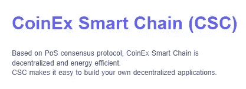

# CSC |智能安全应用的高效区块链技术。

> 原文：<https://medium.com/coinmonks/csc-an-efficient-blockchain-technology-for-smart-and-secure-applications-a944a5d0ce89?source=collection_archive---------22----------------------->

## CoinEx 智能链— CSC

CoinEx 智能链技术旨在用简单的术语阐明和定义区块链背后的技术。

截至目前，我们的首要关注点是区块链和 CSC，了解其背后的基本概念和技术。

***什么是区块链技术？是什么让它如此重要？***

区块链技术是区块链运行背后的概念或协议。区块链是一个不可变的(不可改变的，意味着记录的交易或文件不能被改变)分布式数字分类账(存储在计算机网络上多个地方的交易或数据的数字记录)，有许多超越加密货币的用例(这是它众所周知的)。

并非所有的区块链人生而平等。有一个普遍的误解，即所有区块链都是公开的，这可能解释了一些人不愿意参与加密货币交易。

这三种类型的区块链都与谁有权访问存储在那里的信息有关。从我的[上一篇文章这里](/coinmonks/taxonomy-of-csc-5a9f797dfc45)了解更多关于区块链的类型

## 什么是 CSC

CoinEx Smart Chain — CSC，基于 PoS consensus 协议，是一个高度去中心化和高能效的区块链网络。CSC 使构建您自己的分散式应用程序变得容易。

不可变和分布式是区块链的两个基本属性。账本的不变性意味着你可以永远相信它是准确的。分布式保护区块链免受网络攻击。

CSC 作为高性能事务的支持，每秒超过 600 个事务。它可以为开发者提供一个高效、低成本的链上环境(交易费用更低)，来运行去中心化的智能合约应用(DApps)和存储数字资产。

## CSC 的特点

在这里，我们将仔细看看区块链的各种优势，以及为什么这项技术正在变得广泛和普遍接受

1.  **CSC 区块链技术去中心化**

美元和区块链支持的加密货币之间的主要区别在于中央监管机构。美元由美联储发行和管理。然而，数字货币不受任何政府机构的控制。

因此，外部影响摧毁区块链网络的存在是具有挑战性的。数字货币的去中心化格局降低了总体成本，没有中介机构收取费用。区块链网络也是每天 24 小时、每周 7 天、每年 365 天不间断运行。

**2。准确性和安全性**

CoinEx 智能链网络出错的几率极低。因为每个交易都没有人参与，所以出错的机会就少了。

节点网络确认和验证每个区块链子事务，使整个区块链精确。信息或财务数据被篡改也很棘手，从而消除了伪造活动的机会。

**3。匿名透明**

CSC 技术提供了透明度，因为所有的交易都记录在计算机网络上。每个事件都附有交易历史和电子钱包地址。公众可以通过 CSC explorer 查看每个用户的数字钱包和交易，但个人所有者是完全匿名的。

## CoinEx 智能链的优势——CSC

*   安全性高，欺诈少
*   低成本交易
*   更快的处理时间
*   无摩擦
*   资产由所有者控制
*   验证是独立的
*   更多交易信任
*   它是完全透明的，所以更安全。

## CSC 区块链技术的一些用例

虽然加密货币仍然是区块链技术最常见的应用，但各个行业的领导者都在探索将其用于各种目的的可能性。区块链技术的一些潜在用途包括:

*   安全投票和选举
*   受保护健康信息的存储
*   智能合同的创建
*   建立创造性工作的出处

该技术有可能彻底改变我们生活的许多领域，我们预计，随着行业和组织意识到其潜力，我们将看到它的采用范围不断扩大。

## DApps

***权利大责任大***

有没有办法从基于 web 的应用程序中移除集中的公司利益？这是早期 Web3 开发者希望使用区块链技术解决的问题。由于区块链的创新，如 CoinEx Smart Chain-CSC，开发者现在可以创建完全透明的 dApps(去中心化应用程序),实现新的商业模式。术语“分散”意味着没有中央机构或任何中介的参与。

## 什么是 dApps？

DApps 是像 CSC 一样存在于智能合约区块链上的软件应用程序。DApps 建立在现有的区块链上。DApps 不依赖于集中的计算机服务器，而是采用一旦满足预编程条件就自动执行的代码，称为智能合同，来满足用户的请求。

DApp 底层区块链上的节点操作符通过确保没有不良分子操纵应用程序来帮助提供增强的安全性。CSC 使用利益证明(PoS)等共识机制，激励网络参与者验证交易，以换取令牌奖励。

**共识机制**
它建立在共识算法和协议之上。这是一个利用协议和算法的过程，因此节点将同意区块链的相同状态，而不必相互信任。它是控制整个网络运行和所有核心组件的一系列规则。

CSC 综合了 PoS 和 PoA 的特点，采用 PoS 作为底层的一致机制。点击此处了解更多关于 [CSC 共识的信息。](/coinmonks/csc-approach-to-curb-blockchain-attacks-825fa678f281)

通过使用 CoinEx 智能链技术，企业可以从更高效的商品和服务转移中受益。它创造了有趣的研究领域，尤其是从技术挑战及其局限性的角度来看。

CSC 致力于产品开发和服务改进，并为区块链的基础设施做出贡献。CSC 将不断提高区块链的吞吐量，使区块链客户端更易于使用，增强托管服务的安全性

## 有关 CSC 的更多信息，请访问 CSC

[电报](https://t.me/CoinEx_Announcement) | [推特](https://twitter.com/coinexcom) | [脸书](https://www.facebook.com/TheCoinEx) | [网站](https://www.coinex.org/) | [GITHUB](https://github.com/coinexcom/coinex_exchange_api/wiki) | [下载 APP](https://www.coinex.com/#toapp) | [YOUTUBE](https://www.youtube.com/channel/UCMAuqO8ZqfBwgL51-fY5n4g/)

> 交易新手？试试[加密交易机器人](/coinmonks/crypto-trading-bot-c2ffce8acb2a)或者[复制交易](/coinmonks/top-10-crypto-copy-trading-platforms-for-beginners-d0c37c7d698c)