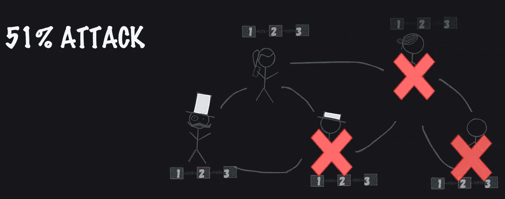

# CSC |遏制区块链攻击的方法

> 原文：<https://medium.com/coinmonks/csc-approach-to-curb-blockchain-attacks-825fa678f281?source=collection_archive---------42----------------------->

## 抗 51%攻击的 CSC 技术

在区块链网络中，有两种类型的节点，如挖掘节点和普通节点。挖掘节点用于认证、审计和验证事务，普通节点用于验证这些事务…

# 什么是 51%攻击？

51%攻击是一群矿工对区块链的攻击，他们控制了网络挖掘散列率的 50%以上。拥有网络上 51%的节点使控制方有能力改变区块链。

区块链技术涉及通过称为挖掘的过程将交易细节添加到数字总账中。挖掘包括为事务块生成散列，这确保了区块链的安全。

# CSC 是什么？

CoinEx 智能链——CSC 是基于 CPoS 共识协议的高效区块链，CoinEx 智能链是去中心化和节能的。

CSC 拥有大规模的技术应用:高交易量、快速、极低的费用、更大的数据容量和强大的技术能力，以实现智能合同。CSC 使构建您自己的分散式应用程序变得容易。

## 理解 51%的攻击

51%攻击是对区块链的攻击，其中一个团体控制了网络超过 50%的哈希能力——解决密码难题的计算能力。然后，该组织在区块链的一个非常特定的点将一个经过修改的区块链引入网络，这在理论上被网络所接受，因为攻击者将拥有它的大部分。

攻击者将能够阻止新交易获得确认，从而允许他们暂停部分或所有用户之间的支付。他们还能够撤销在他们控制下完成的交易。逆转交易可以让他们双倍消费硬币。

51%的成功攻击者还可能实施拒绝服务(DoS)攻击，在他们控制网络期间，他们会阻止其他矿工的地址。这防止了“诚实的”矿工在不诚实的链条变得永久之前重新获得对网络的控制。

## CSC 防止 51%的攻击

CSC 确保没有一个或一组矿工控制超过 50%的散列能力。单个矿工或一个团体不可能通过扩建最久有效的区块链来攻击网络。要实现攻击，这意味着攻击者必须拥有强大的硬件，并需要巨大的能量。

**CSC CPoS 共识机制**

为了避免 51%攻击的风险，区块链使用了利益证明(PoS ),这是比 PoW 更安全的共识。

CSC 综合了 PoS 和 PoA 的特点，采用 PoS 作为底层的一致性机制，并结合了 PoA 的块生成机制。采用的方案如下:

1.  块由有限数量的验证器生成。
2.  验证器依次在 PoA 中生成块。换句话说，它们共享相同的生成块的概率。
3.  验证器的集合由链上治理在没有任何许可的情况下基于标记的令牌来选择和消除。

在网络的起源块阶段，一些可信节点作为初始的验证者集合。为了管理特权和利益，在网络启动后部署了验证器管理系统合同。现在，任何人都可以通过调用系统契约来参与验证器的选举。

在 PoA 的分块生成机制下，网络中的验证者是可靠可信的，保证了网络的安全正常运行。CSC 的可用性依赖于 PoS 共识中的验证器集合中的每个节点，它们可以及时生成块。给定 3 秒的块生成时间，验证器组将每 10 分钟更新一次

**安全策略**

为了保证网络的稳定性，CSC 引入了惩罚机制，并在内部维护了一个惩罚契约来记录每个验证器错过的块。一旦数量超过预定义的阈值，验证器将没收其部分标记令牌。

这种方法防止了 51%攻击的发生。由于恶意验证器的规则被编码到区块链中，因此它还可以有效地避免重复花费。

在继续之前，请确保按下 follow，留个掌声或 49，分享今天的精彩内容，如果您错过了上一篇文章，请单击此处的[。](/coinmonks/taxonomy-of-csc-5a9f797dfc45)

## **欲了解更多关于 CSC 的信息，请访问 CSC**

[电报](https://t.me/CoinEx_Announcement) | [推特](https://twitter.com/coinexcom) | [脸书](https://www.facebook.com/TheCoinEx) | [网站](https://www.coinex.org/) | [GITHUB](https://github.com/coinexcom/coinex_exchange_api/wiki) | [下载 APP](https://www.coinex.com/#toapp) | [YOUTUBE](https://www.youtube.com/channel/UCMAuqO8ZqfBwgL51-fY5n4g/)

> 交易新手？试试[加密交易机器人](/coinmonks/crypto-trading-bot-c2ffce8acb2a)或者[复制交易](/coinmonks/top-10-crypto-copy-trading-platforms-for-beginners-d0c37c7d698c)