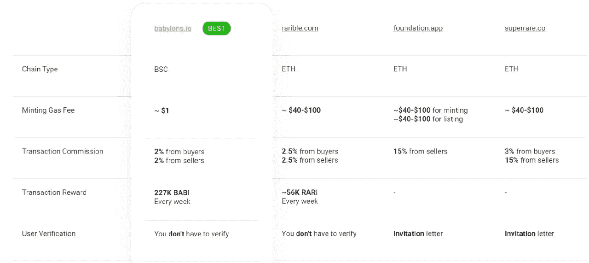

# CSC | BABYLONS ON COINEX 智能链

> 原文：<https://medium.com/coinmonks/csc-babylons-on-coinex-smart-chain-cc18759a7f6a?source=collection_archive---------20----------------------->

Babylons 是一个多链 NFT 发射台和市场。所有 CSC 项目和用户都可以在 Babylons 上享受 NFT 交易。

NFTs 的创立被广泛认为几乎和加密货币本身的出现一样重要。像 crypto 一样，NFT 已经彻底改变了无数的行业和其中产生的数字资产。无论是艺术、音乐还是现场视频游戏体验，NFT 都为收藏家提供了一种拥有独特和不可复制的东西的方式——这在当今侵犯版权和复制的在线世界中是罕见的。

然而，尽管他们的效用和价值，NFT 市场本身存在的缺点，使他们的交易或“模仿”，少于这个空间的许多支持者的期望。首先，NFT 是以太坊区块链上的 ERC-721 代币，任何在以太坊上交易的人都知道，这些费用会让你的钱包付出代价。

NFT 平台的另一个普遍缺点是他们很少回馈他们的社区，当参与的动力很低时，它会对交易者、项目开发者和整个社区产生负面影响。

但是不要害怕！Babylons 打算扰乱 NFT 市场，让交易者有理由对通过一些简单而有效的功能收集这些有价值的数字资产感到兴奋。

# 巴比伦:服务驱动的 NFT 生态系统

我们在 Babylons 的重点是做其他 NFT 平台没有做的事情:为用户提供一种负担得起的方式来收集数字资产，并让他们有更多的理由为成为 NFT 世界的一部分而感到高兴。

Babylons 是为数不多的在 Coinex 智能链上运营的 NFT 市场之一。与 Rarible、Foundation 和 Superrare 等基于以太坊的竞争对手不同，Babylons 的社区拥有一个不仅更便宜、更快，而且更具可扩展性的网络。

# 创作者的 B2B 优势

巴比伦的市场为 NFT 创造者提供了几个超越竞争对手的关键优势。首先，Babylons 适应了 NFT 交易者转向更便宜、更快捷的 CSC 期权的增长趋势。NFT 的创作者可以被认证为艺术家，并有机会在他们自己的个人资料页面上展示他们的作品。

ERC 和 BEP 合同可以很容易地在 Babylons 上实现，也可以选择在二次销售中设置定制的版税，这使创作者能够在他们的创作在二手市场上出售时获得公平的百分比。

Babylons 的市场也可以作为创作者的发射台，通过铸造和销售分层 NFT 从社区筹集资金，我们也可以帮助建立一个量身定制的市场，以满足 NFT 创作者的需求。我们将管理前端和后端开发，区块链，并根据开发人员的需求定制成本和每月维护费。他们所需要的只是给我们提供设计。

# 每周空投

这些并不是 Babylons 平台拥有优势的唯一领域。正如我们前面提到的，NFT 交易者的一个主要痛点是平台很少回馈。我们希望 Babylon 社区知道我们珍惜他们的参与，因此，我们每周奖励用户 22.75 万美元的交易奖励，根据他们在每周交易量中的份额进行分配。本质上，这意味着您与我们的市场互动越多，体验回报就越多。这是所有 NFT 市场中最雄心勃勃的奖励系统。

# 社区拥有和管理

治理是我们计划超越竞争对手的另一个关键领域。Babylons 是业界第一个由社区拥有和管理的 DAO。用户将不仅仅是旁观者，通过持有$BABI 代币，他们将在平台的未来发展中拥有发言权，并成为真正的社区成员。

# 为社区成员建立的 NFT 市场

Babylons 认识到了当前 NFT 市场的缺点，我们没有随大流，而是给了交易者他们应得的东西:一个为他们设计并受他们管理的基于回报的平价 NFT 平台。

在此申请 CSC 资助，随着 CoinEx 智能链基金会发布 CSC 生态支持计划，我们鼓励开发者在 CSC 上创建自己的 DApps，为优质项目提供资金、技术、市场等多维度的资源支持。

# CoinEx 智能链

CoinEx 智能链基于 PoS 共识协议，具有去中心化和节能的特点。

CSC 使构建您自己的分散式应用程序变得容易。

公共链与以太坊生态系统完全兼容，具有高效率、低费用以及无许可验证器的特点。所有开发人员都可以基于 CSC 轻松构建他们自己的分布式应用程序，或者在 CSC 上快速部署他们的 EVM 应用程序。

# 官方资源

[网站](http://www.coinex.org/) | [电报](https://t.me/CoinExChain) | [推特](https://twitter.com/CoinEx_CSC) | [不和](https://discord.gg/5uBGRW9qSp)

> 交易新手？尝试[加密交易机器人](/coinmonks/crypto-trading-bot-c2ffce8acb2a)或[复制交易](/coinmonks/top-10-crypto-copy-trading-platforms-for-beginners-d0c37c7d698c)