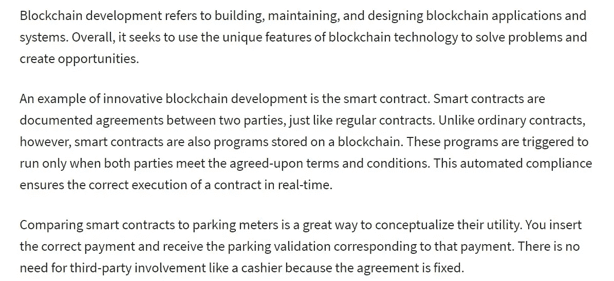
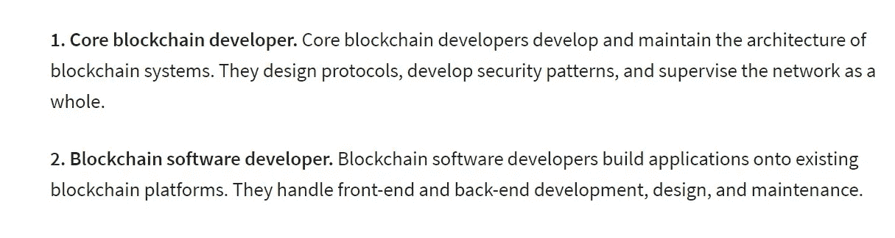
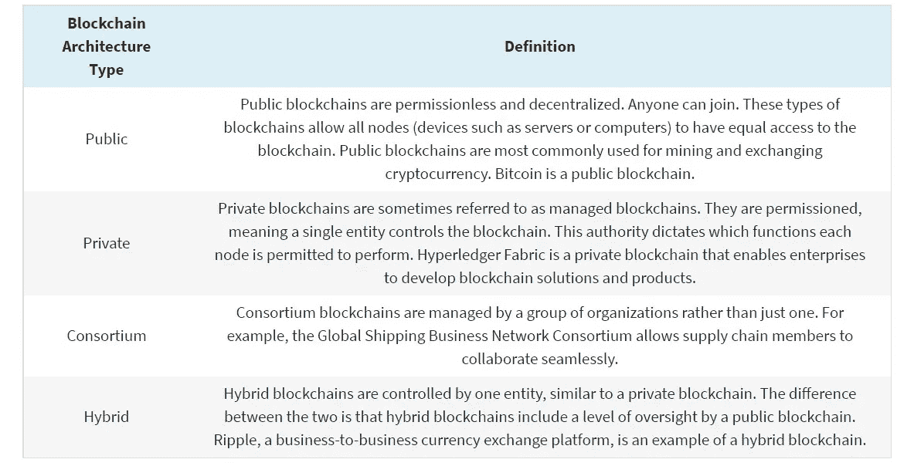
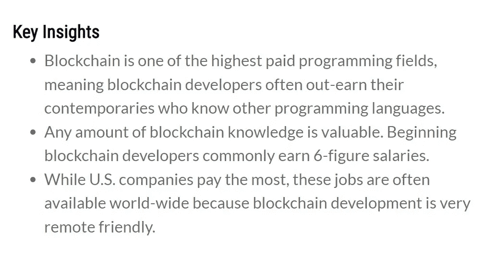
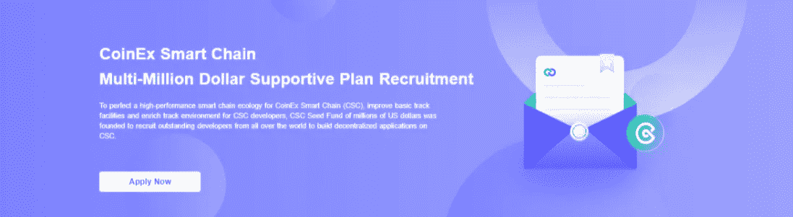
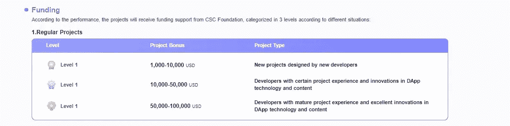
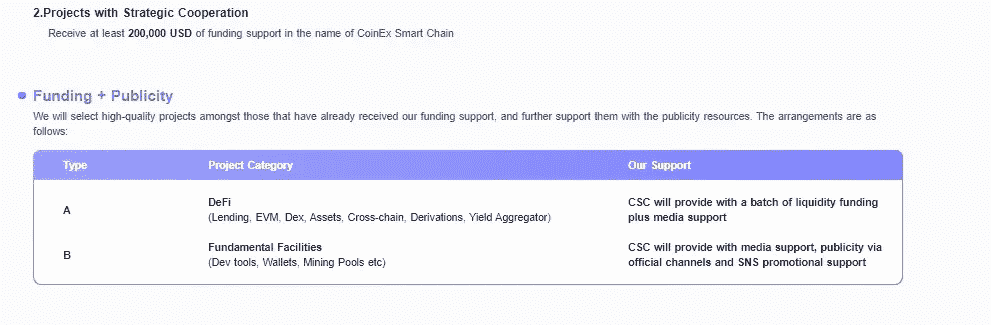
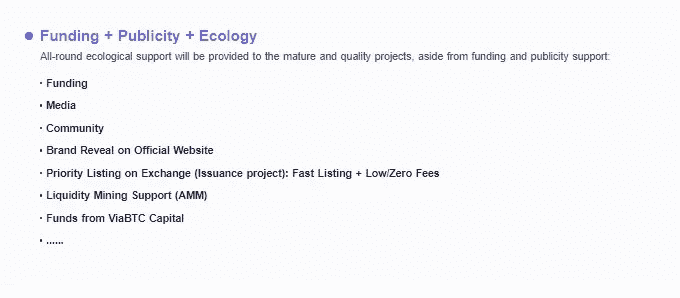

# CSC |区块链开发者

> 原文：<https://medium.com/coinmonks/csc-blockchain-developer-92b2e0267321?source=collection_archive---------50----------------------->

## CSC 上的区块链开发(五)

区块链技术有望彻底改变数字世界处理数据和开展业务的方式。区块链最初是作为支持比特币的平台而创建的，它展示了一定程度的多功能性和安全性，这使得许多企业和政府部门注意到并开始将其投入使用。有道理的是，如果你想投身于一个有很大增长潜力的职业，以刚刚起步的动态新技术为特色，那么你应该考虑成为一名区块链开发者。

在全球市场中，许多 IT 组织需要区块链开发人员。因此，成为一名区块链开发者是一个明智的选择，因为这是一个人在其职业生涯中可以掌握和提升的最新技术。

BLOCK CHAIN DEVELOPMENT

## **谁是区块链开发者？**

区块链开发者是为区块链协议架构开发应用程序的人。他们的日常任务包括开发和优化符合区块链协议并在其上运行的算法，该协议运行在标准互联网协议(IP)之上，为区块链供电的设备充当互联网。**在众多角色中，区块链开发者编写智能合同，这是为区块链开发的程序，运行在区块链节点上。**

## 区块链开发者的角色——区块链开发者实际上是做什么的？

CATEGORIES OF BLOCK CHAIN DEVELOPERS

一名区块链开发商开发了基于区块链技术的分散式应用程序(DApps)和智能合约，并了解该技术的架构和协议。他们负责开发 3D 模型、3D 设计和游戏中使用的 3D 内容。区块链开发者的角色是开发符合去中心化 Web 的 Web3 标准的应用。正如我们所观察到的，就开发人员必须执行的任务而言，有时这些角色会有所不同(或相似),因此，大致分为两类。

## 核心区块链开发者

**资深区块链开发者:**一个核心区块链开发者在根层面与区块链互动。他们直接负责设计和开发区块链架构，包括决定系统协议、共识机制等。本质上，核心区块链开发者创建了基础，其他人将在此基础上进行构建。

**高级开发人员的工作职责:**

*   设计区块链协议
*   设计可用于集中或分散数据的网络架构
*   根据区块链协议进行后端开发
*   根据客户要求开发前端设计
*   开发和监控任何智能合同
*   领导区块链技术的研究、设计和开发。
*   与管理层合作，概述区块链需求
*   通过使用现有技术或创新手段提供高度优化的解决方案。

## 区块链软件开发商

**中级区块链开发者:**区块链软件开发者与区块链保持着相当高层次的互动。他们的角色是使用核心区块链开发者开发的算法，并将其融入到他们的应用中，开发运行在区块链上的去中心化应用。

**中级区块链开发者工作职责:**

*   与团队协作开发和交付区块链解决方案。
*   编写测试驱动的应用程序源代码，使用现有的编程语言和开发工具实现功能和接口。
*   使用不同的加密技术优化和保护区块链应用。

区块链开发人员的责任是开发具有挑战性问题的创新解决方案，包括命令和控制的解决方案，以及高完整性。开发人员还执行复杂的分析、设计、开发、测试和计算机软件调试，特别是针对不同的产品硬件或业务的技术服务线。开发并执行软件设计、操作架构集成和计算机系统选择。最后，他们在多个系统上操作，并应用一个或多个平台和编程语言的知识。

## 成为区块链开发者需要具备哪些条件？

有两种不同类型的区块链开发者，核心和软件区块链开发者。核心的区块链开发者设计协议，维护现有的区块链，而区块链的软件开发者开发新的区块链应用程序、NFT 等等。要成为一名区块链开发人员，必须掌握各种其他计算机科学和数学领域的知识和技能，例如密码学等。

说到技能，您必须注意成为区块链开发人员所需的基本技能:

*   **了解区块链的基础知识—** 要训练自己成为一名区块链开发者，了解区块链领域的基本概念和术语非常重要。这是一项必备技能，没有适当的领域知识，你就无法在区块链行业中继续前进。因此，学习区块链的基本概念，对它们有更深入和更清晰的理解，并了解实时区块链应用，各种共识协议的工作机制。检查区块链技术的最新进展。
*   **数据结构—** 所有区块链开发人员都需要对数据结构有丰富的理解。区块链开发人员必须与数据结构进行交互，以开发和部署应用程序。由于块本质上是一种数据结构，数据结构的知识可以为理解区块链中所有组件的底层行为提供相当大的支持。学习数据结构可以加强你在广泛层面上理解问题的技能，并有助于在约束条件下提供优化的解决方案。
*   **智能合同——**几乎所有区块链开发者课程中的另一个必学内容就是智能合同。智能合约有效地减轻了商品和服务交换中的中介负担。他们可以通过遵循特定条件的可配置合同来实现交易。
*   **密码学—** 虽然你不必成为密码学专家，但你必须专注于密码学的基础知识。了解加密和解密的基础知识以及区块链的加密类型，如对称和非对称密钥加密。在开始成为区块链开发人员之前，尝试探索一些关于散列函数的基础知识。
*   **区块链架构—** 区块链开发者必须根据客户需求为他们的解决方案定义区块链架构类型。不同类型的区块链建筑包括公共建筑、私人建筑和财团建筑。此外，开发人员还需要详细了解区块链架构中的关键组件。区块链体系结构中的一些重要元素包括节点、挖掘器、链和块。了解每种类型的区块链建筑有助于确定职业重点领域。目前，有四种类型的区块链体系结构:公共、私有、联盟和混合。

BLOCK CHAIN ARCHITECTURE

*   **编程技能—** 要成为一名区块链开发人员，首先需要获得编码方面的专业知识，没有任何编程技能，你就不能指望成为一名区块链开发人员。区块链开发者在大多数情况下需要开发 web apps。因此，有抱负的区块链开发人员需要熟悉 web 开发，并熟练掌握区块链编程语言。区块链开发者应该学习的一些著名的编程语言是 Java、Python 和 C++。
*   **学会稳健** —智能合同的目标是简化双方之间的交易过程，限制第三方的参与，并削减其中涉及的额外成本。Solidity 是一种编程语言，用于开发智能合同和执行业务逻辑。类似于哎呀。
*   **数据库和网络—** 区块链网络是一种分布式对等网络，其中的数据在所有节点之间共享。根据区块链的定义，数据库管理和计算机联网是创建和维护区块链网络的重要组成部分。
*   **了解密码经济学—** 在区块链技术中，数据在各种安全协议的帮助下得到加密保护。密码经济学是经济学和密码学的结合。构建强大的加密协议需要强大的数学和计算机科学概念。区块链网络中使用了各种加密标准，例如 RSA 和哈希函数。

**获得一些实践经验—** 除了理论信息，每个区块链开发者都应该获得一些实践经验。通过构建各种区块链应用程序来实现主观的东西。学习 Solidity 等编程语言，通过开发智能合约和 DApps 来练习。随着知识和经验的积累，区块链的开发人员可以尝试在希望在该领域扩大业务的企业中实习。许多在线培训和教育机构免费提供许多实践教程，也有付费的，它们的认证在市场上很有价值。

## 成为区块链开发者的好处

对区块链开发人员的需求很高，因为他们从事颠覆性和令人兴奋的技术工作。因此，这个领域的工作机会很多。美国劳工统计局(BLS)预计，2020 年至 2030 年，软件开发工作将增长 22%。研究表明，到 2025 年，区块链市场将攀升至 390 亿美元以上。

获得与快速发展的技术相关的技能有助于你成为更有竞争力的求职者。此外，许多区块链开发商的工资很高。区块链一直是薪酬最高的编程领域之一，开发者作为受薪员工的平均年薪在 15 万美元至 17.5 万美元之间。虽然决定薪酬的因素很多，但即使是刚开始在区块链工作的开发人员也能拿到高薪。

大约三分之一的区块链开发者年收入超过 18 万美元，这使得平均工资有所上升。大约 80%的区块链开发者年收入超过 115，000 美元，年收入低于 100，000 美元的不到 10%。

作为一名区块链开发商，你显然有机会获得 6 位数的高收入。

所以，这是你和你成为区块链开发者的旅程的大致路线图。仅仅这样是不够的，当然，你需要表现出你自己的主动性，并且永远在人群中。

## CoinEx 智能链支持计划

[To perfect a high-performance smart chain ecology for CoinEx Smart Chain (CSC), improve basic track facilities and enrich track environment for CSC developers, CSC Seed Fund of millions of US dollars was founded to recruit outstanding developers from all over the world to build decentralized applications on CSC.](https://www.coinex.org/million_dollar_plan)

为了促进区块链的发展和鼓励开发者，CSC——一个高性能的智能链引入了数百万美元的支持计划。CSC 支持计划招募全球优秀开发者在 CSC 上构建 DApps，并鼓励更多节点、机构和个人为 CSC 生态系统和社区的建设做出贡献，以吸引更多专注于基本加密类别的项目。

**支持方法**

*   根据项目的重点和质量，项目可以从 CSC 基金会获得 1000-100000 美元。此外，以 CSC 名义开发的项目可以获得至少 20 万美元。

*   CSC 基金会还为接受其资助的优秀项目提供媒体支持。更具体地说，DeFi(贷款、EVM、DEX、资产、交叉链、衍生工具、收益集合工具等。)项目将从 CSC 获得流动资金和媒体支持，以及基础设施(开发工具、钱包、矿池等)。)将享受媒体支持、官方渠道宣传、SNS 推广。

*   CSC 基金会还将提供成熟、优质的项目，包括基于生态系统的全方位支持，包括资金、媒体报道、社区推广、CSC 官网上的品牌曝光、在交易所的优先上市(对于发行项目:快速上市+低/零费用)、产量农业支持(对于 AMM 项目)，以及 ViaBTC Capital 的投资。

**有关 CoinEx 智能链的更多详情，请访问:**

[**网站**](http://www.coinex.org/) **|** [**推特**](https://twitter.com/CoinEx_CSC) **|** [**电报社区**](https://t.me/CoinExChain) **|** [**中**](https://coinexsmartchain.medium.com/) **|** [**不和**](https://discord.gg/5uBGRW9qSp)

> 交易新手？尝试[加密交易机器人](/coinmonks/crypto-trading-bot-c2ffce8acb2a)或[复制交易](/coinmonks/top-10-crypto-copy-trading-platforms-for-beginners-d0c37c7d698c)