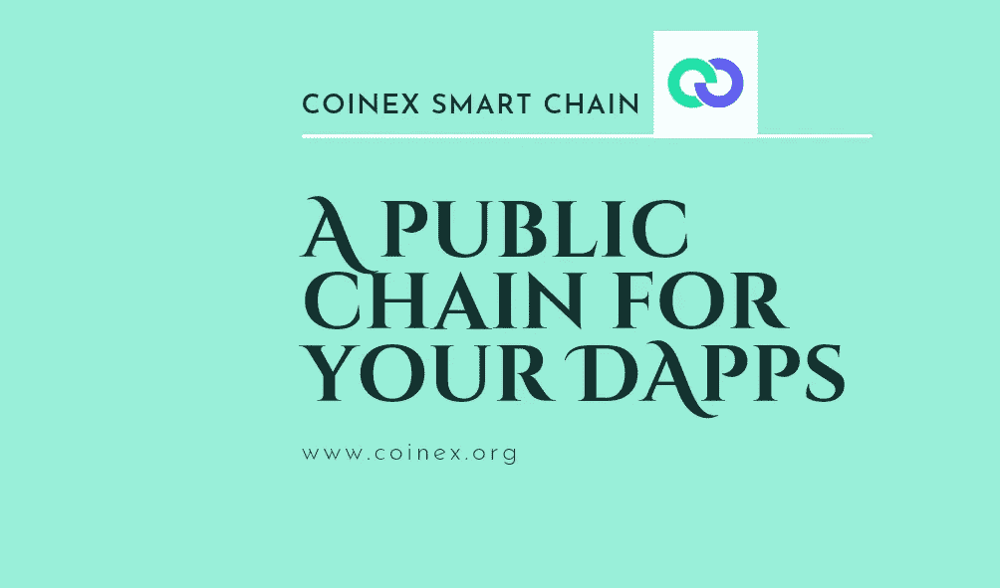

# CSC |区块链分叉——它们是什么，如何工作

> 原文：<https://medium.com/coinmonks/csc-blockchain-forks-what-are-they-and-how-they-work-55c31efec51a?source=collection_archive---------23----------------------->

自 2009 年末出现以来，区块链技术多年来已经为各个行业带来了诸多好处。权力下放的概念很快成为区块链最有吸引力的特征之一，从而加速了它的迅速采用。然而，获得普遍接受很快暴露了区块链技术某些方面的一些缺点，这就是为什么成千上万的区块链工程师不断夜以继日地工作，以确保交易无缝进行。

但是，当某个版本的区块链协议不再受欢迎，或者有可能发生欺诈和恶意行为来取消和逆转交易时，会发生什么呢？例如，关键区块链特征，如区块大小、矿工奖励等。需要不断改进，以帮助随着用户需求的提高而发展。需要改进来解决安全问题，更新旧的软件版本，并增加新的功能，这就是区块链福克斯发挥作用的地方。

区块链福克事件可以被认为是一个罕见的事件，对于爱好者谁已经在加密空间很长一段时间，这些事件并不是一件新鲜事。区块链早期最著名的分叉之一是比特币(BTC)区块链，经历了带来比特币现金(BCH)的“硬分叉”。那么，区块链福克斯到底是什么，为什么他们很重要？这就是我们将在本文中探讨的内容。

# 什么是区块链分叉？

区块链分叉指的是区块链网络中的分裂，或者单个加密货币分裂为两个。此外，分叉可以解释为区块链协议原始设计中的永久分歧，出现分叉有多种原因。通常，当区块链社区成员未能就关键决策和《区块链议定书》的前进方向达成共识时，就会出现这种情况。他们可能会决定启动一个分叉，将区块链分成两个独立的链，共享相同的交易历史，但受新原则的指导，朝着不同的方向前进。

在某些情况下，分叉可能导致加密货币区块链历史的永久分歧。每当这种情况发生时，在达成共识之前，两个独立且不兼容的分类帐将不得不在网络上共存一段时间，并且矿工们不得不选择他们之后将对哪个分类帐进行操作。

# 区块链·福克斯是如何工作的？

当区块链的各种参与者或开发者达成共识，认为加密货币项目的一些基本内容需要改变时，就会出现分叉。虽然这些分叉有时可能是由对区块链提供的现有功能不满意或不同意的开发人员或加密社区成员发起的，但分叉也是为新技术项目或加密货币产品众包资金的一种方式。

事实上，分叉通常发生在特定网络中参与者的共识出现分裂时。为此，一度被认为或被称为单一区块链网络的网络一分为二。为了改变区块链的现有协议，开发者将不得不改变代码，这将导致永久性的改变。无论何时出现分叉，区块链网络的参与者都必须决定他们将使用哪个版本的网络。一般来说，有三种类型的区块链叉子，但最受欢迎的是硬叉子和软叉子(稍后会详细介绍)。

# 区块链分叉的原因

*   添加新的功能:区块链软件代码需要定期更新或升级，因为大多数区块链是开源的，它们是由世界各地的个人开发的。因此，要添加新的功能，需要进行改进，创建和解决问题，并在适当的时间发布软件的新版本。
*   修复安全问题:与传统系统相比，加密货币和区块链技术相对较新，这就是为什么该领域不断受到快速创新和研究的影响。因此，需要新的版本和更新来解决可能影响他们的安全问题。
*   反向交易:如果某个特定时期的任何交易被证明是恶意的，并且网络遭到破坏，加密社区可以决定使该交易无效。

# 区块链分叉的类型

分散化是公共区块链的性质，这表明网络上的参与者可以决定就区块链的共享状态达成协议。区块链网络的节点之间的一致共识产生了包含网络显示为有效的验证数据的单个区块链。然而，如果网络中的节点不能就区块链的未来状态达成一致意见，就会出现分叉。这些是区块链福克斯的一些类型

# 硬叉子

当网络协议发生重大变化，最新版本的区块链的节点与旧版本的区块链不兼容时，就会发生硬分叉；因此与以前版本的区块链产生了永久性的差异。在硬分叉中，在原始区块链中持有令牌的前协议的参与者将在新分叉中被授予令牌，但是矿工将必须决定继续验证哪个区块链。

例如，考虑以太坊区块链中的新更新，其中共识协议将从工作证明更改为利害关系证明。安装更新的完整节点将能够利用新的一致协议，而不安装更新的节点将在区块链中变得不兼容。

# 硬分叉的示例:

以太坊经典(ETC):以太坊叉子属于硬叉子的类别。在这里，以太坊将其区块链拆分为以太坊(ETH)和以太坊经典(ETC)。2016 年 6 月，以太坊网络发生了一起黑客攻击，数百万美元被运走。发生这种情况是因为在以太坊上运行的名为 DAO 的应用程序的智能合约代码中存在缺陷。基于社区的关注，以太坊基金会决定实现一个硬分叉，以便回滚所有与 DAO 相关的交易，并允许 DAO 的原始贡献者收回他们损失的资金。

尽管社区中的大多数人支持以太坊硬分支，但一些人选择继续经营最初的以太坊区块链，也就是我们现在所知的以太坊经典。

比特币现金(BCH):2017 年 8 月 1 日，比特币现金硬分叉发生。在分叉之前，许多开发人员希望改善比特币的可扩展性问题，他们提议增加区块链的块大小，以使每个块中包含更多的交易。然而，大多数人不同意这些更新，因此，导致了比特币社区的分裂，并因此产生了比特币现金。虽然比特币继续运行其旧协议，但比特币现金是以更大的块大小构建的。

比特币黄金(BTG):比特币黄金硬分叉发生在 2017 年 10 月 24 日，为了使用不同于比特币的算法。由于比特币网络的高计算要求，被称为 ASICs 的昂贵和专业的采矿机器迅速主导了采矿业，从而将采矿业务集中到少数大型采矿公司。针对这一点，比特币黄金的创造者开发了一种被称为 Equihash 的算法，这种算法不容易翻译成 ASICs。

BTG 的创建是为了让普通用户更容易进行采矿，其交易速度比比特币快 5 倍。

# 柔软的叉子

软分支与硬分支相反，在硬分支中，新实现的更改与旧版本保持向后兼容，而不会导致任何根本性的结构变化。这意味着不接受改变的网络参与者仍然可以参与确认和验证交易。

实现软分叉要容易得多，因为只有大多数网络参与者需要接受任何升级。已更新或未更新的参与者将继续识别新块并保持与网络的兼容性，尽管未升级的参与者可能在某些区域受到影响。

例如，如果新规则规定块大小已从 1，000 KB 更改为 800KB，则未升级的参与者仍将继续看到有效的交易。然而，当试图挖掘新的块时，它们可能会遇到问题，因为它们将被网络拒绝。

软分叉的一个例子是隔离见证(SegWit)比特币协议更新，该更新发生在 2015 年 12 月，但在 2017 年 8 月上线。在 SegWit 更新之前，比特币协议非常昂贵和耗时。SegWit 更新的创建者认识到签名数据约占事务块的 65%;因此，他们建议将有效块大小从 1MB 增加到 2MB (X2)。

原因是从每个数据块的事务性数据中分离或删除签名数据，这将为每个数据块提供更多空间以实现更高的事务性吞吐量。软叉之后，老比特币区块链同时接受了新的 2MB (X2)块和 1MB 块。这个形成新规则的过程允许旧节点也验证新块。

# 临时分叉/意外分叉

意外或临时分叉是一种罕见的情况，指的是两个或更多矿工几乎同时发现同一个区块时发生的区块链分裂。当两个矿工都找到区块时，他们迅速将获胜的区块传递给网络上的相邻节点，从而将两个区块添加到网络中。当其他块被挖掘并被添加到网络上最长的链中时，这个问题被解决。

# 主要区块链分叉示例

Taproot 是比特币网络的最新升级之一，它可以被认为是比特币网络协议中最重大的变化。升级包括更有效的交易，额外的隐私和匿名。这样，单签名和多签名交易看起来是一样的，从而为网络带来了另一层安全性和匿名性。

主根是对网络进行三次主要升级的组合，这是对该提议达成共识的结果——这对比特币网络来说是罕见的。Taproot 升级最早是由 Greg Maxwell 在 2018 年提出的。后来，由 Pieter Wuille、Tim Ruffing、A.J. Townes 和 Jonas Nick 编写的三个编纂 Taproot 的比特币改进提案(BIPs)于 2020 年 10 月并入比特币核心，并于 2021 年 11 月激活。

在比特币 Taproot 升级之前，有一个成功的软分叉——seg wit 升级，于 2017 年 8 月上线。升级有助于提高交易速度，并通过从主块中删除见证数据来降低交易成本。此外，这些 SegWit 的变化进一步提高了比特币网络的可扩展性和效率。

# 以太坊伦敦叉

以太坊伦敦硬分叉是以太坊网络上最重要的分叉之一，于 2021 年 8 月 5 日上线。此次更新旨在进行两项重大改进。第一，每秒更多的交易，第二，从“工作证明”转移到“利益证明”,以减少天然气费用。与矿工使用电力来解决算法不同，利害关系证明允许通过随机选择的验证者来铸造新的区块。这需要更少的时间和精力，因此，提高了以太坊网络的可扩展性。

迁移到 proof stake 使以太坊网络成为 NFT 和 DeFi 项目的重要网络。这就是为什么对于不同的项目来说，保持网络的相对可持续性以增加网络的采用和需求是很重要的。2021 年 11 月，作为伦敦硬叉子的一部分，超过 100 万个 ETH 被烧毁。开发人员蒂姆·贝科和詹姆斯·汉考克今年早些时候宣布，升级以循序渐进的方式进行，于 2022 年 6 月完成。

# CSC 为什么没有叉子？

虽然协议中没有划分，但 CoinEx 链成为了 CoinEx 智能链，因为它是第一个也是唯一一个经历了这种过程而没有分叉的链。

然而，现在做出这样的假设还为时过早，因为在同一年(2020 年)还计划进行第二次但不太受欢迎的升级。

CSC 上没有叉子的一个可能原因可能是因为它是在以太坊 go 中内置的。

另一个可能是因为要回答这个问题。实际原因还不清楚，但可以假设亚特兰蒂斯和耶路撒冷的升级是硬分叉，因为它没有削弱协议的操作系统，而是使它更好。

# 总结想法

我们可以看到区块链分叉已经对各种网络产生了影响，由于区块链技术的性质，我们可能会在未来看到更多的硬分叉、软分叉和(不可避免的)时间/意外分叉。仅比特币就分叉了三次，导致了不同比特币的产生，如比特币现金、比特币和比特币黄金，而 SegWit 升级显著帮助比特币网络变得更加先进，从而为 Taproot 升级奠定了基础。

除了安全更新和新产品创建之外，forks 还可用于在欺诈或违反协议的情况下撤销交易。由此可见，区块链福克斯已经并将继续在帮助区块链网络的可扩展性和采用方面发挥重要作用。

# 官方资源

[网站](http://www.coinex.org/) | [推特](https://twitter.com/CoinEx_CSC) | [电报](https://t.me/CoinExChain) | [不和](https://discord.gg/5uBGRW9qSp)

> 交易新手？尝试[加密交易机器人](/coinmonks/crypto-trading-bot-c2ffce8acb2a)或[复制交易](/coinmonks/top-10-crypto-copy-trading-platforms-for-beginners-d0c37c7d698c)