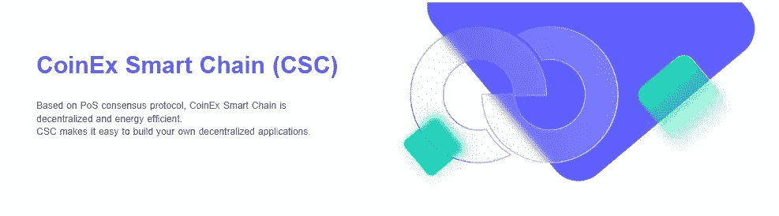

# CSC|区块链重新定义营销

> 原文：<https://medium.com/coinmonks/csc-blockchain-redefining-marketing-5b69d100e972?source=collection_archive---------59----------------------->

## CSC 对数字营销的影响

除了加密货币，区块链还提供了一个充满机遇的世界。它可以极大地影响数字营销行业。其中之一是在数字营销中消除对中间人或中介的依赖，如社交媒体网站或谷歌。这可以为公司的广告活动增加更多的价值。数字营销和广告是凭借区块链的实力成功转型的最成功领域之一。

考虑到这一点，公司正在考虑使用区块链技术作为工具来改造数字营销和广告的性质。许多公司正在花费巨资雇佣一名区块链的开发者，他可以设计专门用于支持广告行业的工具，作为一名区块链的开发者，你将需要最基本的工具随时可供你使用，以产生最佳效果。

## 区块链技术:CoinEx 智能链简介

区块链只是一个计算机系统网络，它在整个网络中复制和分发交易的数字分类账。区块链本质上是维护一个存储在互联数字块中的交易公共账本。由于区块链围绕着分散的生态系统，没有一个中央政府有权力控制它的运作。

CoinEx 智能链——CSC 是一个去中心化的高效公共链，它为开发者提供了一个高效、低成本的链上环境来运行去中心化的智能合约应用(DApps)和存储数字资产。CSC 支持极高的每秒交易量(TPS ),同时保持较低的交易费用。CoinEx 智能链技术为开发者提供了一个优秀的生态系统和各种开发工具，以提供最佳的项目结果。

## 关于区块链营销

简而言之，区块链营销是一种尖端的在线广告策略，运用了区块链的技术力量。区块链是一个分布式数据库，可以实现安全、开放和不可更改的交易。由于其允许公司监控数据迁移并保证其准确性的能力，区块链营销已将自己定位为一个理想的营销工具。

随着数字资源和分散技术的扩散，数字营销的未来看起来很有希望。技术已经成功地对商业运作方式产生了持久的影响。数字营销和广告一直站在体验区块链技术引发变革的最前沿。营销范式正在向更加自由、开源和以用户为中心的生态系统转变。这就是为什么区块链营销正在营销和广告中心获得急需的人气。这个概念证明了建立一个高效、先进和盈利的市场营销所需的所有参数。

## 使 CSC 适合区块链营销的功能

*   **不变性 CoinEx 智能链最令人兴奋的特性之一就是不变性。**存储在区块链上的事务对所有参与节点都是可访问的，并且不局限于单个系统的控制。这使得入侵者很难在网络上组织单点攻击。
*   **透明度—** 以前，广告商对出版商使用广告的细节知之甚少，这导致发布广告的费用高昂，有时还会出现广告欺诈。但是，有了区块链，这个过程变得更加透明——他们也可以知道谁在看他们的广告，并且知道它是否被营销给了正确的受众。
*   **安全性—** CSC 是在加密机制的基础上发展起来的，以确保安全性。关于区块链营销策略的讨论将集中在对营销活动和系统构成巨大风险的环境、条件或事件的安全威胁上。

CoinEx 智能链技术为商业生态系统的去中心化和自组织提供了一种新方法，可在网络成员之间有效同步和整合营销相关信息。这些信息可以包括产品列表、营销计划、定价政策、市场研究和分析结果、折扣和促销优惠以及广告。

## 使用区块链营销的优势

## 增强的安全标准

对于那些经常参与网上购物或销售的人来说，数据安全是最关心的问题之一。电子商务部门严重依赖数字营销，对数据安全构成威胁。买家和卖家都关心他们的个人和财务数据的安全性。

区块链的去中心化环境确保了关键的数据安全，因为后者使用加密作为安全资源。参与节点在区块链上验证交易。每个额外的交易对所有参与者都是公开的。区块链确保了不变性，这意味着不能对存储的数据进行任何更改。参与者也是匿名的，因为区块链努力为其用户提供充分的隐私。

## 不干涉购买广告

这是区块链对在线广告的另一个重要好处。企业希望确保他们购买和发布的广告位于针对其特定目标市场的可靠网站上。然而，这样做需要向网站所有者和企业所重视的声誉的外部方进行一次性支付。这也是一个建立信任的过程。

区块链允许企业避开广告网络，节省大量资金，同时仍能最大限度地利用数字广告。该技术将自动进行个人用户验证，因此不需要第三方。对于投放广告的企业和发布广告的网站来说，很容易合作和共事是可能的。

## 客户提供质量信息

营销人员喜欢控制他们的个人信息。然而，当他们在一家公司注册并看到来自其他组织的广告时，问题就出现了。

区块链技术的使用将帮助用户对他们的联系数据收费。此外，该技术还可以保证用户只从他们感兴趣的组织那里接收数据。这一特征将使得能够从专属的和可信的客户那里仅获取精确的和集中的信息。

## 通过建立信任来建立形象

对于小公司来说，与众不同从来都不是一件容易的事情，尤其是对于市场上已经存在的公司。由于规模小，许多值得信赖的企业未能吸引可疑和不安的客户的注意。

区块链技术将帮助这些公司更快、更省力地建立信任，无论它们在市场上的规模有多大、时间有多长。借助区块链科技的透明度，企业将能够展示供应链的每一个阶段以及商品的来源。关于该公司的全面信息的可用性可以吸引潜在的客户，并鼓励他们选择该品牌而不是竞争对手。当公司赢得顾客的信任时，他们必然会扩大市场份额。

## 多重支付支持

通过区块链技术，接受比特币和其他加密货币形式的替代支付已经成为可能。很快，加密支付将成为营销界的主流。零售商将不必担心信用卡欺诈、伪造支票或其他退款困难，因为加密支付将完全透明。

取消银行等中介机构将扩大储蓄，同时确保资金的完全透明和安全。

## 尾注

区块链技术对数字营销生态系统产生了积极的、渐进的影响。像谷歌这样的科技巨头正在使用分散的资源来增强他们解决方案的功能。对营销部门采用区块链技术的潜在改进的概述表明，这是一个有效的赌注。区块链的设计本身就是营销的理想技术，它实现了去中心化、安全性和隐私性。区块链营销机构的工作将主要集中在将这些好处纳入您现有的营销策略中，并留有改进的余地。

CSC 的目标是随着区块链吞吐量的不断提高，不断完善区块链生态系统，使区块链客户端更易于使用，增强托管服务的安全性。同时，丰富分散应用将是其主要发展方向之一。

> 交易新手？试试[加密交易机器人](/coinmonks/crypto-trading-bot-c2ffce8acb2a)或者[复制交易](/coinmonks/top-10-crypto-copy-trading-platforms-for-beginners-d0c37c7d698c)