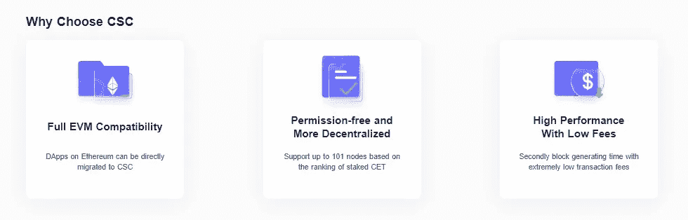

# CSC |区块链解决方案

> 原文：<https://medium.com/coinmonks/csc-blockchain-solution-685c4f83d45b?source=collection_archive---------33----------------------->

## CoinEx 智能链——为区块链构建基础设施

*为了全面了解 CoinEx 智能链的工作原理，我们需要对基础知识有一个清晰的了解。*

## 区块链热潮

不管准备好了没有，区块链的技术正在颠覆这个世界——以可能的最好和最令人费解的方式。区块链技术——及其在过去十年迅速崛起背后的策划者——正在颠覆、拆解、重新想象和重新配置我们所知道的关于互联网的一切，以及一切。那么，区块链是什么？简而言之，区块链是一个不断增长的数字数据记录列表

在其核心，区块链可以简化为一个数字平台，维护一个分散网络共享的交易分类账。这个分类账保存着不可改变的数字交易历史——这些交易被点对点共识合法化。区块链建立在开源软件的基础上，这使得开发者可以通过避免第三方监管和中央机构的干预来确保交易的安全性。区块链在计算机网络上运行，包含向所有用户显示的通用数据集，使所有活动，尤其是数字资产的交易历史透明且不可更改。

## 智能合同

自 2013 年 Vitalik Buterin 首次提出以太坊以来，智能合约进入了聚光灯下，引起了很多关注。以太坊是当前社会最成功、应用最广泛的智能合约平台。智能合约只是存储在区块链上的程序，在满足预定条件时运行。它们通常用于自动执行协议，以便所有参与者可以立即确定结果，而无需任何中介的参与或时间损失。他们还可以自动化工作流，在满足条件时触发下一个操作。随着智能合约的成功，DApps 应运而生。

DApps 是去中心化的应用。它们就像普通的应用程序，并提供类似的功能，但关键的区别是它们是在点对点网络上运行的，如区块链，使用智能合约。Dapps 的后端代码(智能合约)运行在分散的网络上，而不是集中的服务器上。他们将区块链用于数据存储，将智能合约用于应用程序逻辑。

## 缺点

在各种 DApps 的快速发展中，特别是 DeFi 应用，以太坊的缺点变得很明显，例如低吞吐量——少量的交易，以及高交易费用。总的来说就是“高成本低效率”。许多平台提出了确保高吞吐量和加速交易的建议，但或多或少地牺牲了去中心化。

## 解决办法

作为一个高效的智能链，CSC 致力于为区块链建设基础设施，并遵循去中心化和无许可区块生成的原则。作为对高性能交易的支持，CSC 与 EVM 完全兼容，并应用 PoS 模型，以便所有用户都可以在没有任何许可的情况下通过标记令牌成为节点。

## 介绍

CoinEx 智能链——CSC 是一个去中心化的高效公共链，它可以为开发者提供一个高效、低成本的链上环境来运行去中心化的智能合约应用(DApps)和存储数字资产。

# CoinEx 智能链

CSC 作为开发人员开发、测试和部署 DApps 的平台，具有更短的块生成时间和更低的交易费用，CSC 还完全兼容以太坊虚拟机(EVM)和协议，同时支持高性能交易。同时，CSC 坚持去中心化和免许可的原则，这样任何人都可以下注硬币并成为验证者。CSC 致力于产品开发和服务改进，从而简化了开发人员的 DApp 开发过程。

## CSC 功能

*   **高性能** — CSC 效率极高，交易费用低。通过 POS consensus 协议，CSC 可以在几秒钟内生成一个阻塞(3s 阻塞时间)，支持极高的 TPS (600+ TPS)，同时将交易费用保持在较低的水平。
*   **EVM 兼容性** — CSC 与以太坊生态系统完美兼容。CSC 与以太坊的兼容意味着以太坊上几乎所有的 DApps、生态系统组件和工具都可以直接迁移到 CSC 上，或者只做很小的改动。开发者可以方便地将 DApp 迁移到 CSC，CSC 基于以太坊虚拟机(EVM)，使用成熟的开发工具，用户也可以快速访问 CSC 网络。
*   **无权限区块生成** —区块提议者无需权限。CSC 最多支持 101 个区块提议者，按照 **CET** 赌注的数量排序确定。它不需要集中机构的审查，使网络更加分散。

## 大学英语四六级考试

CET 是 CoinEx 智能链的原生令牌— CSC。CSC 上的 CET 与以太坊上的 ETH 运行方式相同。其主要职能是:

1.  作为对验证者的整体奖励
2.  向 CSC 支付传输和合同调用的天然气费用
3.  支付在 CSC 上部署智能合同的交易费用
4.  委托给选定的验证者

## 共识；一致

CoinEx 智能链采用 CPoS 共识协议。CSC 坚持去中心化的原则，结合 PoS 和 PoA 的特点实现 CPoS，又不失网络的稳定性和安全性。基于利益证明(PoS)的共识更加环保，并且在性能方面超过基于 PoW 的共识(具有更少的块生成时间和更高的事务处理能力)。基于 PoS 的共识可以由社区灵活管理，而不会影响分散化。

## CPoS

虽然工作证明(PoW)已被证明是一种实用的分布式网络解决方案，但它不是环境友好的，并且需要大量的参与者来维护网络安全。

另一方面，以太坊和其他一些网络使用授权证明(PoA)。PoA 提供了对 51%攻击的防御，并且更有效地防止一些拜占庭节点的恶行。然而，PoA 协议不够分散，因为验证者拥有极大的权力，容易受到腐败和安全攻击。其他区块链引入了不同类型的授权利益证明(dpo ),允许令牌持有者投票选举验证者，这使得网络更加分散，有利于社区管理。

CSC 综合了 PoS 和 PoA 的特点，采用 CPoS 作为底层的一致性机制，并结合了 PoA 的块生成机制。采用的方案的特点是:

1.  块由有限数量的验证器生成。
2.  验证器依次在 PoA 中生成块。换句话说，它们共享相同的生成块概率，类似于以太坊的 Clique 共识引擎。
3.  验证器的集合由链上治理在没有任何许可的情况下基于标记的令牌来选择和消除。
4.  任何人都可以向他或她信任的节点委派令牌。

***CSC 的一致性协议旨在实现以下目标:***

1.**更短的块生成时间**——与以太坊相比，块生成时间每块缩短约 3 秒。

2.**更高的 EVM 兼容性** —尽可能兼容以太坊生态系统

3.**去中心化**——基于跑马圈地的链上治理机制。

## 安全性

在 PoA 的分块生成机制下，网络中的验证者是可靠可信的，保证了网络的安全正常运行。CSC 的可用性依赖于 PoS 共识中的验证器集合中的每个节点，它们可以及时生成块。

## **CSC 利润**

**CSC 上的开发者和验证者获得在 CSC 上获得被动收入的机会**

**开发者奖励**

作为一名开发者，你可以从部署在 CSC 上的基于网络上应用的功能的 DApps 上赚取利润，用户也可以从中受益，主要是通过某些“交易费”。此外，为了完善 CoinEx 智能链(CSC)的高性能智能链生态，改善基础赛道设施，丰富 CSC 开发者的赛道环境，**成立了数百万美元的 CSC 种子基金**，招募全球优秀开发者在 CSC 上构建去中心化应用。根据表现，项目将获得 CSC 基金会的资助

**验证收益**

验证器的产量一般来自两个方面:

*   采矿奖励
*   每个区块的交易费用。

收益根据验证者下注的令牌在总赌注中所占的百分比进行分配。因为验证器以相同的概率依次生成块，所以它们的产量由它们的 CET 赌注的比例决定。

## 结论

CSC 致力于产品开发和服务改进，并为区块链世界的基础设施贡献自己的一份力量。中信建投将不断提高区块链的吞吐量，使区块链客户端更易于使用，增强托管服务的安全性，同时丰富去中心化应用将是 CoinEx 智能链的主要发展方向之一。

**CSC 资源**

[电报](https://t.me/CoinEx_Announcement) | [推特](https://twitter.com/coinexcom) | [脸书](https://www.facebook.com/TheCoinEx) | [网站](https://www.coinex.org/) | [GITHUB](https://github.com/coinexcom/coinex_exchange_api/wiki) | [下载 APP](https://www.coinex.com/#toapp) | [YOUTUBE](https://www.youtube.com/channel/UCMAuqO8ZqfBwgL51-fY5n4g/)

> 交易新手？试试[加密交易机器人](/coinmonks/crypto-trading-bot-c2ffce8acb2a)或者[复制交易](/coinmonks/top-10-crypto-copy-trading-platforms-for-beginners-d0c37c7d698c)