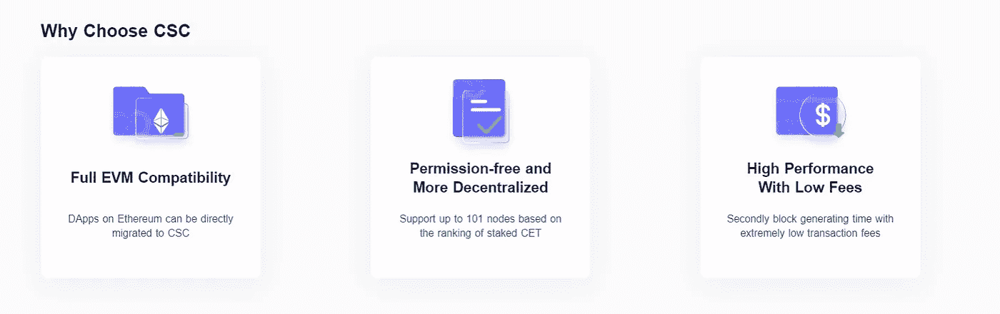
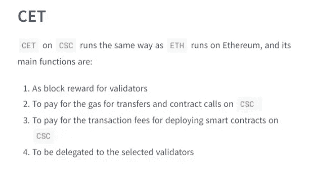
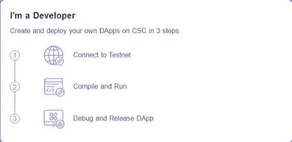
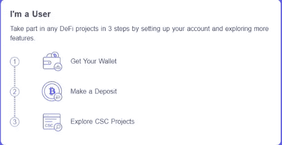

# CSC 和区块链术语

> 原文：<https://medium.com/coinmonks/csc-blockchain-terminologies-ab6e75c2b396?source=collection_archive---------42----------------------->

## CSC 上的区块链开发(六)

在 CSC 上的区块链开发这一部分，我们将看看区块链开发中使用的各种单词。这篇文章是一个简单而全面的区块链术语表，让区块链人耳目一新。

# CoinEx 智能链— CSC

基于 CPoS 共识协议，CoinEx 智能链(CSC)是一个智能契约链，支持多达 101 个验证器。除了更短的块生成时间和更低的交易费用，CSC 还完全兼容以太坊虚拟机(EVM)和协议，同时支持高性能交易。同时，CSC 坚持去中心化和免许可的原则，这样任何人都可以下注硬币并成为验证者。

## **学习 CSC 技术的基本术语**

**对于技术领域内外的几乎所有人来说，区块链都是一个新手概念，因此，随着对它的了解越来越多，人们意识到有许多不熟悉的术语，学习它们的最佳方式是理解每个术语所包含的内容。以下是你在使用 CoinEx 智能链**时会遇到的一些常见术语

*   **Account —** 包含地址、余额、随机数、可选存储和代码的对象。账户可以是合约账户或 EOA(外部拥有的账户)。
*   **地址—** 与 URL 非常相似，区块链地址是区块链上交易发生的位置。

最常见的是，这代表一个可以在区块链上接收(目的地址)或发送(源地址)交易的 EOA 或合同。更具体地说，它是 ECDSA 公钥的 Keccak 散列的最右边的 160 位。

*   **协议分类账—** 这些是由两方或多方用于交易和达成协议的分布式分类账。
*   **Altcoin —** 这是“比特币另类”的缩写。目前，大部分替代硬币是比特币的分支，对劳动证明(POW)算法进行了一些小的改变
*   **ASIC —** 这是“专用集成电路”的标志。ASICs 是专为完成一项任务而设计的基本芯片。在比特币的例子中，它们被设计成通过 SHA-256 哈希问题挖掘新的比特币。
*   **Assert —** 在 Solidity 中，assert (false)编译为`0xfe`，这是一个无效的操作码，它用尽所有剩余的 gas 并恢复所有的更改。当 assert()语句失败时，应该会发生一些非常错误和意想不到的事情，您需要修复您的代码。您应该使用 assert 来避免不应该发生的情况。
*   **数据块—** 数据块是一个数据包，包含零个或多个事务、前一个数据块(“父数据块”)的哈希，以及可选的其他数据。
*   **街区高度—** 指区块链内连接的街区数量。例如，高度为 0 的块将是初始块，也称为起源块
*   **Genesis 块—** 区块链中的第一个块，用于初始化特定的网络。
*   **区块奖励—** 这是给成功散列一个交易区块的矿工的奖励。块奖励是硬币和交易费的组合。
*   **区块链—** 由共识规则验证的区块序列。因为每个块(除了最初的“起源块”)指向前一个块，所以它们形成的数据结构被称为“区块链”。
*   **字节码—** 为软件解释器或虚拟机高效执行而设计的抽象指令集。与人类可读的源代码不同，字节码以数字格式表示。
*   **CSC** — CoinEx 智能链
*   **CET —** CET 是 CSC 生态系统使用的本地加密货币。

*   **链链接—** 这是将两个区块链相互连接的方法，因此允许链之间的交易发生。
*   **编译—** 将以高级编程语言(如 Solidity)编写的代码转换成低级语言(如 EVM 字节码)。
*   **一致—** 完整节点为了与其他节点保持一致而遵循的块验证规则。
*   **合约账户—** 包含代码的账户，每当从另一个账户(EOA 或合约)接收交易时执行。
*   **合同创建交易—** 一种特殊交易，以“零地址”作为目的地址，用于在 CSC 上创建合同
*   **共识过程—** 这种方法涉及一群对等体，这些对等体做出维护分布式分类帐的决策，该分类帐用于通过共识达成分类帐内容的一致。
*   **财团区块链—** 这是一个区块链，其中 accord 方法由预先选择的一组节点控制。
*   **密码—** 这是一种算法规则，用于数据的秘密写入和/或解码。
*   **加密货币—** 这种类型的数字货币支持算术，其中使用秘密写入技术来规范货币单位的生成并验证资金转移。
*   **加密—** 这是指加密和解密数据的方法。
*   **DApp —** “去中心化应用”的缩写，这些应用必须完全是 ASCII 文本文件，它应该自主运行，并且没有实体控制它的大部分令牌。
*   **道(去中心化的自治组织)——**这可以理解为在一套廉洁的商业规则的管理下，没有副学士而非人类参与的组织。
*   **DEFI —** 分散金融的缩写，指的是建立在区块链上的金融智能合同、协议和分散应用。
*   **DEX —** 分散式交易所，即 CoinEx 交易所
*   **数字商品—** 这些商品可能是稀缺的、可电子转让的、无形的，具有价值。
*   **数字身份—** 这是私人、组织或设备在互联网上采用或主张的互联网或网络身份。
*   **数字签名—** 用于验证数字消息或文档的数学方案满足两个要求—它们具有真实性(来自已知的发送者)和完整性(在传输过程中未被更改)。
*   **解密** —这是将密文转换成明文的方法。
*   **ECDSA —** 椭圆曲线数字签名算法，简称 ECDSA，是 CSC 使用的一种加密算法，用于确保资金只能由其所有者使用。
*   **加密—** 这是一种将明文消息(plaintext)转化为看似无意义的随机比特序列的信息流(cypher-text)的方法。
*   **EOA —** 外部拥有的账户。由外部用户创建的具有公钥和私钥的帐户。
*   **EVM —** 以太坊虚拟机，一个基于堆栈的虚拟机，执行字节码，用于运行智能合约代码。
*   **EVM 汇编语言—** 人类可读形式的 EVM 字节码。
*   **EVM 代码—** 这是一种编程语言，以太坊区块链上的账户将包含代码。
*   **事件—** 允许使用 EVM 测井设施的事件。DApps 可以监听事件，并使用它们来触发用户界面中的 JavaScript 回调。更多信息请见[http://solidity . readthe docs . io/en/develop/contracts . html # events](http://solidity.readthedocs.io/en/develop/contracts.html#events)。
*   **回退函数—** 在没有数据或声明的函数名的情况下调用的默认函数。
*   **水龙头—** 在 testnet 上免费发放 testnet CET 的服务。
*   **法定货币—** 法定货币是指由政府宣布可有效偿还债务的任何现金，如美元或欧元。
*   **分叉—** 该术语有两个主要含义:导致链分叉的协议变化，或者在块生成过程中两个潜在块路径的时间差异。
*   **Ganache —** 可以运行个人以太坊区块链的软件，用于运行测试、执行命令和检查状态。
*   **Gas—**CSC 中用于执行智能合同的虚拟燃料。以太坊虚拟机使用一种记账机制来衡量气体的消耗，并限制计算资源的消耗。
*   **天然气限额—** 交易或区块可消耗的最大天然气量。
*   **已用天然气—** 交易或区块实际消耗的天然气量。
*   **气价—** 交易的气价。
*   **气费—** 交易的气价乘以用气量等于气费。
*   **硬分叉—** 硬分叉是区块链的永久分叉。一种常见的情况是，未升级的节点无法验证由遵循较新共识规则的升级节点创建的块。
*   **哈希—** 可变大小输入的固定长度指纹，由哈希函数生成。
*   **Hashrate —** 一个比特币矿场工人在给定时间内(通常是一秒钟)可能执行的散列范围。
*   **IDE—**Integrated Development Environment 的缩写，是一个集成的用户界面，通常结合了代码编辑器、编译器、运行时和调试器。
*   **不可变的已部署代码问题—** 一旦合同(或库)的代码被部署，它就变得不可变。标准的软件开发实践依赖于修复可能的错误和添加新功能的能力，因此这对于智能合约开发来说是一个挑战。
*   **内部交易—** 从一个合约账户发送到另一个合约账户或 EOA 的交易。
*   **初始硬币发行(ICO)** —有一种情况，一种全新的加密货币出售其整体硬币库中的代币，以换取直接资本。ico 经常被一种全新加密货币的开发者用来筹集资金。
*   **密钥库文件—** 一个 JSON 编码的文件，包含一个(随机生成的)私钥，使用密码进行加密以获得额外的安全性。
*   **了解你的客户(KYC)——**企业识别和核实客户身份的法律程序。KYC 要求因司法管辖区而异。
*   **ke ccak 256—**CSC 中使用的加密哈希函数。Keccak256 被标准化为 SHA-3。
*   **库—** 库是一种特殊类型的合同，它没有支付功能、回退功能和数据存储。因此，它不能接收或保存 CET，也不能存储数据。一个库充当以前部署的代码，其他契约可以调用它进行只读计算。
*   **流动性—** 将资产(或者，在这种情况下，加密货币)转换为现金(法定货币)的容易程度。
*   **Mainnet —** 区块链的生产版本。
*   **Merkle Patricia Tree—**CSC 中用于高效存储键值对的数据结构。
*   **挖掘—** 在公共区块链中，验证交易并将其写入区块链的过程，成功的矿工将获得区块链加密货币的奖励。
*   **网络—** 指 CSC 网络，这是一种对等网络，将事务和数据块传播到每个 CSC 节点。
*   **NFT —** 不可替代的代币。这是由 ERC721 提案引入的令牌标准。NFT 可以被跟踪和交易，但是每个令牌都是独一无二的；它们不像 ERC20 令牌那样可以互换。NFT 可以代表数字或物理资产的所有权。
*   **节点—** 加入网络的软件客户端。
*   **Nonce —** 在密码学中，只能使用一次的值。每个帐户都有一个随机数，作为事务计数器来防止重放攻击。
*   **点对点(P2P)——**系统中两个参与者之间的直接连接——可以是计算机对计算机，也可以是人对人。
*   **利益证明(PoS)共识—** 利益证明是 CSC 使用的分布式共识机制。利益证明共识要求用户证明一定数量的加密货币的所有权(他们在网络中的“利益”)，以便能够参与交易的验证。
*   **私钥—** 允许 CSC 用户通过生成数字签名来证明帐户或合同所有权的秘密号码。
*   **公钥—** 一个数字，通过一个单向函数从一个私钥中导出，可以公开共享，任何人都可以使用它来验证用相应私钥制作的数字签名。
*   **收据—**CSC 客户端返回的代表特定交易结果的数据，包括交易的哈希、区块号、用气量，以及在部署智能合同的情况下，合同的地址。
*   **再入攻击—** 一种攻击，由攻击者契约调用受害者契约函数组成，在执行过程中受害者再次递归调用攻击者契约。例如，通过跳过受害者合同中更新余额或计算取款金额的部分，这可能导致资金被盗。
*   **奖励—** 每个新区块的总交易费加上固定的区块奖励就是网络对验证者的奖励。
*   **SHA —** 安全哈希算法(SHA)是由美国国家标准与技术研究院(NIST)发布的一系列加密哈希函数。
*   **智能合约—** 部署在区块链上的一段代码。一种计算机协议，旨在通过数字方式执行、验证或管理合同来简化合同流程。鉴于区块链的性质，所有这些交易都可以通过代码本身看到和验证。
*   **Solidity —** 一种程序编程语言，语法类似于 JavaScript、C++或 Java。智能合约最流行、最常用的语言。
*   **Swarm —** 一个分散式(P2P)存储网络，与 Web3 和 Whisper 一起用于构建 DApps。
*   **Testnet —** CSC 测试网络。“测试网络”的简称。
*   **交易—** 由发起账户签署的提交至区块链的数据，目标为特定地址。交易包含元数据，例如交易的气体限制。
*   **每秒事务数(TPS)——**对区块链速度的测量。大多数区块链的低 TPS 是将区块链用于商业应用，尤其是金融应用的一个重大障碍。
*   **事务池—** 事务池是指节点中由用户创建的、等待确认者确认的待处理事务的集合。
*   **Truffle —** 最常用的 Dapp 开发框架之一。
*   **验证者—**CSC 网络中的参与者，负责验证交易和生成块。验证者需要提交保证金(stake)才能被包含在验证者集合中。
*   **Vyper —** 一种高级编程语言，类似于 Serpent，具有类似 Python 的语法，旨在更接近纯函数式语言。它也是智能合约的语言。
*   **钱包—** 管理账户的软件。用于访问和控制 CSC 帐户并与智能合同交互。密钥不需要存储在钱包中，而是可以从离线存储器(例如，纸张)中检索，以提高安全性。
*   **钱包(冷)——**与互联网断开连接的钱包。
*   **钱包(热门)——**连接互联网的钱包。
*   **钱包(多签名)——**需要多个数字签名来执行交易的钱包
*   **web 3—**web 的第三个版本。由 Gavin Wood 首先提出的 Web3 代表了 Web 应用程序的一个新的愿景和焦点:从集中拥有和管理的应用程序到基于分散协议的应用程序。
*   **魏—**CET 的最小面额。魏= 1 CET
*   **Whisper —** 一种分散式(P2P)消息服务。它与 Web3 和 Swarm 一起用于构建 DApps
*   **零地址—** 完全由零组成的特殊地址，被指定为合同创建交易的目的地址。

## CSC 功能

*   去中心化:无需许可，任何人都可以通过 CET 成为验证者。
*   EVM 兼容性:完全兼容以太坊虚拟机(EVM)，这意味着以太坊上几乎所有的 DApps、生态系统组件和工具都可以直接迁移到 CSC 上，或者只需做很小的改动。
*   高性能:600+ TPS，3s 块时间

## 轻松访问 CSC

**开发商**

**用户**

# 结论

在这篇信息丰富的文章中，我们回顾了一些最常用的区块链术语，您在使用 CSC 时会很熟悉这些术语。我们用最简单的语言理解他们的意思，以便更好地理解区块链的概念。这可能看起来很多，但当你习惯 CSC 时，你会更好地理解它们。

> 交易新手？试试[加密交易机器人](/coinmonks/crypto-trading-bot-c2ffce8acb2a)或者[复制交易](/coinmonks/top-10-crypto-copy-trading-platforms-for-beginners-d0c37c7d698c)