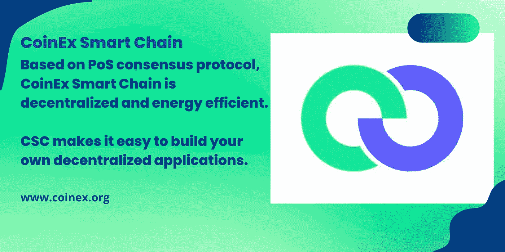

# CSC |您应该知道的交叉链桥的类别

> 原文：<https://medium.com/coinmonks/csc-categories-of-cross-chain-bridges-you-should-know-e5d7c8825ba6?source=collection_archive---------33----------------------->

加密空间的扩展无疑是当今技术世界中讨论最多的主题之一，因为它继续随着数以千计的不同加密货币和网络而发展，每个加密货币和网络都有自己的社区和经济，并由区块链技术提供动力。

然而，随着空间的发展，最具挑战性的限制之一成为这些不同的区块链无法一起工作，因为它们都在不同的底层规则和协议下运行。对促进网络间令牌和数据交换的解决方案的需求变得明显；因此，出现了区块链桥。

随着区块链桥(也称为跨链桥)的出现，孤立的区块链网络现在可以协同工作，为开发者和用户创建一个可互操作的生态系统。在这篇文章中，我们将关注各种类别的跨链桥，一些最好的跨链桥，以及 Teleport 的互操作解决方案。

# 什么是跨链桥？

跨链网桥是一种协议，它连接独立的区块链，使用户能够将资产和信息从一个区块链传输到另一个，从而使用户更容易访问其他协议。开发跨链桥是为了解决区块链无法相互通信的问题，从而将资产和应用程序限制在一个链上。另一个关键原因是以太坊网络高昂的燃气费。

假设你在以太坊网络上有以太(ETH)，需要使用二层网络(比如 Coinex 智能链)进行交易。最初，如果没有跨链网桥，您必须通过集中交换将您的 ETH 转换为 CET，然后转移到 CSC 链钱包以使用网络。网桥通过以更低的成本、更高的网络吞吐量和获取收益的活动，使不同网络之间的交易更容易，从而为您省去这一麻烦。

# 跨链桥有哪些类别？

跨链网桥根据其功能、机制和集中化程度进行分类。

# 监管(集中)与非监管(分散)桥梁

*   保管区块链桥是在中央实体控制下操作的，用户必须信任各个实体能够正确安全地操作系统。在使用这些类型的桥梁之前，建议用户对该实体进行广泛的研究，以避免交易对手风险
*   非拘禁区块链桥以分散的方式运作。他们依靠智能合约来管理加密和锁定，从而消除了必须信任单一运营商的整个要点。对于非托管桥，系统的安全性和完整性由底层智能合约代码维护。

# 区块链通过功能桥接

在这种分类下，流行的例子包括包装资产桥和侧链桥。

*   包装资产桥为加密互操作性提供了空间。例如，您可以将比特币转移到以太坊网络，只需将 BTC 包装到包装 BTC(WBTC)——一种与以太坊网络兼容的 ERC20 令牌。
*   另一方面，侧链桥采用双向父/子链关系；从而使信息能够在它们之间自由流动。一个明显的例子是 xDai 桥，它将以太坊主网连接到 Gnosis Chain(以前称为 xDai 区块链)，这是一个基于以太坊的稳定支付侧链。灵知链由一组不同于以太坊网络维护者的验证者来保护。这个桥允许在两个链之间容易地转移价值。

# 通过机制建立区块链桥梁

包括单向网桥和双向网桥。

*   单向网桥只考虑事务的方向。用户只能将其资产桥接至一个目的地区块链，但不能将其桥接回本土区块链。一旦桥接，资产就变得不可逆转。
*   双向网桥通过确保两个网络之间的资产和信息的无缝传输来帮助用户。显然，我们可以说双向网桥是使用两个单独的单向网桥的一个有利的替代方案。

# 一些最好的交叉链桥的例子

# CoinEx 智能链桥

CSC 桥可用于将 ERC 令牌和 NFT 快速传输到 CSC 侧链。该桥使用双共识架构来优化速度和分散性。它支持侧链上的任意状态转换，并且与以太坊虚拟机(EVM)兼容。没有任何市场流动性壁垒，也没有第三方，跨链代币转账可以瞬间实现。

# 总结想法

区块链行业不是一个停滞不前的行业，因为随着技术变得越来越受欢迎，将会有不断的创新。这一切都始于开创性的协议，如比特币和以太网，然后出现了无数的第 1 层和第 2 层区块链，还会有更多的出现。

跨链桥的引入带来了更具凝聚力和互操作性的操作，以及更好的可伸缩性和效率的机会。这就是为什么我们确信随着时间的推移，跨链通信和跨链架构的未来会变得更好。

如果您需要支持或想要向我们发送反馈，请加入 Teleport 社区。

[网站](http://www.coinex.org/) | [推特](https://twitter.com/CoinEx_CSC) | [电报](https://t.me/CoinExChain) | [不和](https://discord.gg/5uBGRW9qSp)

> 交易新手？试试[加密交易机器人](/coinmonks/crypto-trading-bot-c2ffce8acb2a)或者[复制交易](/coinmonks/top-10-crypto-copy-trading-platforms-for-beginners-d0c37c7d698c)