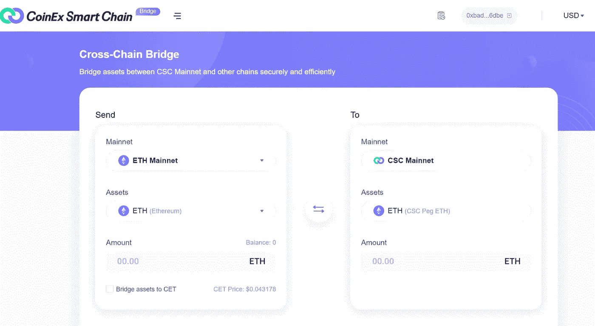

# CSC 跨链桥

> 原文：<https://medium.com/coinmonks/csc-cross-chain-bridge-9f8714c46942?source=collection_archive---------38----------------------->

## 交叉链技术

交叉链是一种通过允许信息和价值交换来增强区块链网络之间互联的技术。

## 内容

*   什么是跨链
*   什么是 CSC
*   为什么要使用跨链技术
*   什么是跨链桥
*   CSC 跨链桥
*   跨链桥如何工作
*   CSC 跨链桥的优势

*当区块链刚建立时，他们被设想为能够提供一个“一刀切”的解决方案，这意味着所有交易、智能合同或任何其他东西都在一个链上执行。然而，现在很明显，这样的系统并不实用，尤其是当存在可伸缩性限制和创新约束时。*

有了交叉链，就可以避免单链的局限性。今天，我们将探讨 CoinEx 智能链——CSC 跨链协议，这是最有前途的跨链平台之一。

**什么是跨链？**

交叉链是一种通过允许信息和价值交换来增强区块链网络之间的互连的技术。这样做，它打破了区块链的孤岛性质，创造了一个相互交织的分布式生态系统。

交叉链是两个相对独立的区块链之间的互操作性。换句话说，它允许区块链人互相交谈，因为他们是以标准化的方式建造的。跨链实施主要表现为资产互换和资产转移，这两者都是区块链世界的重要组成部分。

**什么是 CSC？**

CoinEx 智能链(CSC)基于 CPoS 共识协议&作为高性能交易的支持，是一个去中心化、高效率的公共智能契约链。CSC 为开发人员提供了一个高效、低成本的链上环境来运行分散式智能合约应用(DApps)和存储数字资产，CSC 还完全兼容以太坊虚拟机(EVM)和协议，同时支持高性能交易。

CSC 具有以下特点:

*   与以太坊生态系统完美兼容。开发者可以方便地将 Dapp 迁移到 CSC，CSC 基于以太坊虚拟机(EVM)，使用成熟的开发工具，用户也可以快速访问 CSC 网络。
*   效率极高，交易费用低。借助 POS 共识协议，CSC 秒生成一个 block，支持极高的 TPS，同时保持交易费用在较低水平(高性能:600+ TPS，3s block time)。
*   去中心化:无需许可，任何人都可以通过 CET 成为验证者。

**为什么要使用跨链技术？**

一些需要跨链技术的行业包括分散金融(DeFi)和医疗保健。

在 DeFi 场景中，区块链内部的连接支持不同网络之间的令牌交换，促进互操作性，这对金融生态系统的繁荣至关重要。

跨链技术还允许用户克服分布式平台之间的常见权衡，并利用各种共识机制的好处，以便他们可以获得最佳的结果。

在医疗保健领域，跨链系统通过加密、效率和透明度促进了数据所有权和安全性。

**什么是跨链桥？**

跨链桥，也称为区块链桥，是一种连接两个区块链的协议**，允许用户将数字资产和信息从一个区块链传输到另一个**。

它或多或少是一个“中间人”，连接不同的区块链，促进令牌转移，智能合约和数据交换，以及两个独立链之间的通信。

[CSC 跨链桥 ](https://bridge.coinex.net/)

CSC 跨链桥连接 CSC 主网和其他单个区块链，实现它们之间的资产和信息传输。

通过 CSC 跨链桥接，您可以安全有效地桥接 CSC 主网络和其他链之间的资产。

**跨链桥是如何工作的？**

虽然跨链桥可以用于其他很酷的东西，如转换智能合同和发送数据，但最常见的实用工具是令牌传输。

在区块链桥之前，如果你想在另一个区块链上使用特定的资产，你必须依赖于比特币基地这样的集中交易所(CEXs)的服务。

让我们假设您在以太坊区块链上有一些以太网，并希望将这些令牌移动到 CSC 区块链，它有一个本地 CET 令牌。要做到这一点，你需要将你的 ETH 发送到一个跨链桥，它将保存你的硬币并创建 CET 中的等价物供你使用。

现实中，你的 ETH 并没有从以太坊转移到 CoinEx 智能链网。相反，它被锁定在一个智能合约中，该合约允许您访问可在 CSC 区块链上使用的等量包装 ETH (wETH)。如果您决定将 wETH 转换回 ETH，包装令牌的任何剩余部分都将被销毁(烧掉),同时您将获得等量的 ETH。

**CSC 跨链桥的好处**

为了理解跨链桥在加密领域的重要性，有必要理解互操作性如何推动传统金融中的无缝交易。你可能没有注意到，但是你可以用你的信用卡来支付你的万事达信用卡账单。同样，你可以使用 PayPal 支付几乎所有的网上购物，无论你在哪里购物。

不同区块链之间缺乏互操作性被认为是阻止加密货币大规模采用的障碍之一。因此，像交叉链桥这样的解决方案是朝着更广泛采用区块链技术迈出的一大步。

*   区块链桥有助于降低交易成本，同时提供更好的用户体验。想象一下，每次您需要交换代币时，都必须经历不同的交换过程。除了每次都要支付较高的费用之外，这个过程相当繁琐。
*   交叉链桥已经成为一种可用的解决方案，用于连接加密空间内的不同区块链和生态系统
*   这允许跨区块链的互操作性——允许用户以多链方式访问协议和分散式应用程序(DApps)。
*   通过单个网络访问多个区块链增强了用户体验，增加了 DApps 的流动性，并提高了资产效率。
*   一般来说，跨链桥允许用户享受两种不同区块链的最佳功能，例如较低的燃气费和较高的交易吞吐量，以及以 DApps 形式的更好的效用。

**CSC 生态系统**

CSC 生态系统提供了各种 DApps，允许跨链交易也很容易。

*   [**Eywa Fi—Eywa**](https://eywa.fi/)**是所有区块链的中间层，它解决了互操作性问题，并为不同链之间的操作打开了无限的机会。跨链 dApps 开发、资产管理等。**
*   **[**COSO 金融— COSOSWAP**](https://www.coso.finance/Newswap) 集智能聚合交易、多链交易 NFT 交易、智能合约担保订单簿交易于一体的一站式交易 DEX。**
*   **[**green dex—green dex**](https://greendex.exchange/#/)是基于智能合约的全去中心化交易协议，支持订单簿模式和掉期令牌。**
*   **[**NABOX: Nabox**](https://nabox.io/) 是一个为 Web3 构建的跨链 DID 应用。**
*   **[**Smash Cash:Smash Cash**](https://smashcash.io/#home)是一个支持多链多币种匿名转账、私人元宇宙、NFT 交易市场的平台。**

****总结****

**跨链网桥将允许您在 CSC 网络上转换和使用您的 BTC，而无需在 CEX 上经历繁琐的过程。它的工作原理是将令牌包装在智能合约中，然后发行可以在另一个选择的区块链上使用的本地资产。**

## **有关 CSC 的更多信息**

**[电报](https://t.me/CoinEx_Announcement) | [推特](https://twitter.com/coinexcom) | [脸书](https://www.facebook.com/TheCoinEx) | [网站](https://www.coinex.org/) | [GITHUB](https://github.com/coinexcom/coinex_exchange_api/wiki) | [下载 APP](https://www.coinex.com/#toapp) | [YOUTUBE](https://www.youtube.com/channel/UCMAuqO8ZqfBwgL51-fY5n4g/)**

> **交易新手？尝试[加密交易机器人](/coinmonks/crypto-trading-bot-c2ffce8acb2a)或[复制交易](/coinmonks/top-10-crypto-copy-trading-platforms-for-beginners-d0c37c7d698c)**
> 
> **加入 Coinmonks [电报频道](https://t.me/coincodecap)和 [Youtube 频道](https://www.youtube.com/c/coinmonks/videos)获取每日[加密新闻](http://coincodecap.com/)**

## **另外，阅读**

*   **[复制交易](/coinmonks/top-10-crypto-copy-trading-platforms-for-beginners-d0c37c7d698c) | [加密税务软件](/coinmonks/crypto-tax-software-ed4b4810e338)**
*   **[网格交易](https://coincodecap.com/grid-trading) | [加密硬件钱包](/coinmonks/the-best-cryptocurrency-hardware-wallets-of-2020-e28b1c124069)**
*   **[密码电报信号](/coinmonks/top-3-telegram-channels-for-crypto-traders-in-2021-8385f4411ff4) | [密码交易机器人](/coinmonks/crypto-trading-bot-c2ffce8acb2a)**
*   **[最佳加密交易所](/coinmonks/crypto-exchange-dd2f9d6f3769) | [印度最佳加密交易所](/coinmonks/bitcoin-exchange-in-india-7f1fe79715c9)**
*   **[开发人员的最佳加密 API](/coinmonks/best-crypto-apis-for-developers-5efe3a597a9f)**
*   **最佳[密码借贷平台](/coinmonks/top-5-crypto-lending-platforms-in-2020-that-you-need-to-know-a1b675cec3fa)**
*   **[免费加密信号](/coinmonks/free-crypto-signals-48b25e61a8da) | [加密交易机器人](/coinmonks/crypto-trading-bot-c2ffce8acb2a)**
*   **杠杆代币的终极指南**