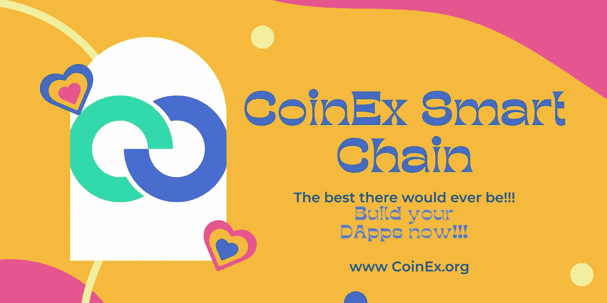

# CSC |要避免的加密骗局—骗子使用的 10 个技巧

> 原文：<https://medium.com/coinmonks/csc-crypto-scams-to-avoid-10-tricks-scammers-use-7a1b6235a835?source=collection_archive---------26----------------------->

# 介绍

虽然加密空间随着区块链技术教育的快速发展而不断增长，但许多人在经历学习阶段时已经加入，因为有些人在开始他们的旅程时还没有关于该空间的少量经验。这些经历给这几套新人留下了伤疤。

由于区块链互操作性的性质，加密货币已经逐渐发展成为一个自己的世界，可以应用深度学习来完全理解，因为即使是加密货币的早期采用者和比特币的支持者在面对潜在的骗局时也可能无法幸免，因为新的骗局模式会在不同的时间间隔出现，保持警惕的必要性怎么强调都不为过。

许多人在这些骗局中损失了一生的积蓄和投资，损失金额高达 5000 美元甚至更多。虽然这可能有点难以置信，但为加密货币提供动力的区块链技术是以这样一种方式构建的，即在空间中执行的活动无法隐藏，因为其应用是分散的。突出的原因和更多的需要揭示骗子使用的 10 个技巧和避免它们的方法。

# 快速拍摄

*   2020 年与密码相关的经常性犯罪上升至约 79%。
*   2021 年，全球各地的骗子带着创纪录的 140 亿美元加密货币潜逃。
*   根据美国联邦贸易委员会的数据，在 2018 年至 2022 年期间，超过一万名美国人因加密欺诈损失了大约 11.8 亿美元。
*   在坚实的监管结构得到完全实施和建立之前，加密诈骗目前可能不会停止。与此同时，保持警惕仍然是一个可行的选择。
*   在对加密项目进行投资之前，善于通过跟踪最新趋势、查找项目等方式进行深入研究。
*   加密货币盗窃在 2020 年增长了 516%，达到 32 亿美元等值的加密货币。其中，72%的被盗资金来自 Defi 协议。

# 要避免的十大骗局

# 任何要求私钥的网站

要开始学习 crypto，为了有一个良好的开端，有相当多的活动要做。其中一项活动是设置你的加密钱包，如 Metamask、比特币基地、Exodus、Trust Wallet、Bitgo 等。加密钱包是一种应用程序，其功能相当于您的加密货币的钱包，用于存储和保存数字资产。

最近一段时间，骗子利用了新手所拥有的知识不足来剥削他们。他们开始的伎俩是询问非常敏感的信息，如姓名、电子邮件地址、私人密钥等。在骗子要求的这几组信息中，最敏感的是私钥。

一旦获得种子短语，他们就可以访问钱包中的所有加密资金。大多数骗子使用棘手的陈述，如“嘿，你的种子短语是什么，我想给你寄点钱”或“嘿，你刚刚赢得了一个完整的以太坊。告诉我们您的种子短语，以便我们将资金存入您的帐户”。对于新手来说，获取知识和了解空间中发生的一切的习惯有助于保持一个人的面子。

例如，每个用户都有一个私钥和一个公钥。私钥是非常私人的。这更像是在你外出旅行的时候，或者你只是穿过马路去拿东西的时候，把你家的钥匙给了一个陌生人。你不能放心地满足你的财产和资产完好无损。另一方面，与私钥相比，公钥更像个人的电子邮件地址，它可以被共享以可能接收资金转移而没有太大的损害。要了解有关公钥和私钥的更多信息，您可以阅读有关非对称加密概念的更多信息。

# 作为一个值得信赖的创造者，要求代表你投资

在其成立后不久，crypto 和 web3 空间遇到了对一些创新技能的需求激增，这使该空间保持蓬勃发展。这种劳动力可能不经常被提及，但相当多的人知道它是加密工作。对于熟悉这些工作的个人来说，为了高效地工作，需要某些应用程序，这已经成为骗子匿名操作的一个巢穴。

这些活动发生的平台大多涉及 Discord、Reddit 和 Telegram。骗子首先创建一个看起来非常官方的机器人，试图冒充一个项目。他们表现得像项目的团队成员，要求大约 100 美元，承诺投资并在规定的期限内返回 2000 美元。为了在游戏中保持新鲜感，他们经常更改自己的用户名和个人资料图片，只是为了显得令人信服和真实。

对于使用 discord 的个人来说，可以通过检查他们的用户名和每个名字后面的四个数字来控制伤害。例如，如果您检查 PracticalPsychology#9608，没有两个用户可以使用该名称，如果该名称属于您正在工作的项目的成员，将很容易进行有效的验证。对于 Youtube 来说，查看他们的账户就像查看关注者的数量一样简单，在某些情况下，关注者的数量可能是 1 或 0。在其他一些情况下，他们将有零视频上传，这些指数可以把你放在正确的轨道上，以保持安全。

# 燃烧一定比例的令牌或将其发送到开发者的钱包

在这种骗局技术中，令牌开发者实现了他们称之为“烧录功能”的东西。他们对他们的猎物使用的令人信服的话是，每次交易一个代币，交易的一部分就被永远烧掉了。在实时分析中，每当潜在代币供应不足时，当需求超过供应时，其价值可能会大幅增加。

目睹了加密市场的这一趋势后，骗子们倾向于聪明地利用这一趋势，当令牌被交易且一部分令牌也被烧毁时，他们会向诈骗者保证潜在的收益。在大多数情况下，资金会丢失，因为交易无法撤销。对于具有通缩特征的代币，请记住这一点，尤其是当它们只能提供通缩特征时。

# 向您发送一个种子短语或包含资金的私钥

这种工作方式非常诱人。例如，有人联系你，说“嘿，crypto 刚刚在美国被禁止，我想扔掉我的钱包，这样我就不会惹上麻烦。这是我的种子短语。你可以把你的资金捐给它，或者把一些资金留给你自己。这里的技巧是，他们实际上会将一个真正的种子短语发送到一个活动帐户，其中有一些资金，比如说价值 3000 美元的系绳。

为了摆脱束缚，接收者需要在账户中有一些以太币来进行交易。因此，为了完成交易，一些交易可能需要大约 50 美元的费用，而 10 美元将是以太坊中的实际汽油费。这就是它的工作原理——一旦以太坊被发送到骗子的账户，一个植入的机器人会自动检测到新的资金被发送，并立即从账户中取出 40 美元的允许资金到另一个账户，而 10 美元已经花在汽油费上，这样当个人检测到欺诈行为时，就不可能将资金转移回来。

# 智能合同 BUG

在这种骗局技术中，创建了一个 bug，这样某人可以购买令牌，但无法出售它。这些骗子通过 3 种不同的方式来达到目的。在第一种情况下，当开发人员创建令牌时，他们只需禁用 Erc20 合同中的批准功能，这意味着分散式交易所无法获得您对出售令牌的批准。第二种方法是在代币合约中添加一个 rebase 函数，这样当你试图出售代币时，你就失去了 99%的代币。

第三，开发人员编写几行代码来防止令牌被出售给 DEX，相反，它只能被购买或提供，这总是意味着大量资金进入项目而没有任何产出。这为骗子带着大量的钱逃跑提供了一个绝佳的机会。

# 虚假网站上的网络钓鱼

这种工作方式很简单，但同时也很专业。一些骗子复制加密网站，看起来就像你可能打算投资的网站，这是非常冒险的。他们在原网站上使用相同的界面和信息。然而，有一种方法可以嗅出这种犯规。

有两种方法可以做到。第一是检查使用的域名，因为它不能与真实网站相同，即两个网站不能有相同的域名。如果真的有，仔细看看，就会发现不同之处。例如，域名可以从比如说 crypto.com 切换到 crypto.org 或 crypto.net 等。在一些其他方式中，它可以是在域名的拼写中，例如，将它从 crypto.com 更改为 crypt.org，如果这一点点变化没有被注意到，就像这个案例一样，用户可以很容易地被欺骗。

第二种方法是更改智能合同。骗子可以更改智能合同代码，这样，如果你与它进行交互，他们就可以访问你钱包中的资金，这将导致突然的损失。他们可以让合同变成任何东西，这就是为什么只需要可信的应用程序。Coingecko、Coinmarketcap 和 Twitter 是相关的网站，可以在面临疑问时帮助检查项目的真实性。

# 假 ICO

ICO 的概念在密码学中并不新鲜。加密经济中的一些初创公司通常有很好的用例，但可能缺乏资金来运行项目，以创建他们的硬币、应用程序或服务，因此，感兴趣的投资者将资金集中起来，购买初始硬币产品，以接收新的加密货币令牌，该令牌可能具有与产品或服务相关的一些效用。

对于骗子来说，虚假 ico 是一种非常容易的方式，他们可以向投资者展示一个项目，而他们创建这个项目的目的完全是为了拿走投资者的钱。这种技术是伪装的。由于 crypto 中缺乏标准的监管框架，骗子向投资者展示了一个很好的表面价值项目，有时可能会要求 100%或更少的资金。

在投资一个加密项目之前，一件很好的事情是寻找真正的白皮书，甚至是 DAO、项目时间表或好的令牌组学来支持您的投资。

# 隐藏的鲸鱼

在 Crypto 中，低流动性和市值的项目构成红色警报。这是一个完全关闭，因为鲸鱼可能在下面游泳。鲸鱼只是持有大部分项目令牌的实体。他们可以被比作拥有否决权的决策委员会。由于这一点，他们有能力出售他们持有的所有代币，这可能导致崩溃。

久而久之。骗子注意到这种方法广为人知的事实，因此，他们设计了一种新的模式来隐藏他们持有大部分代币的事实。他们不是把所有的钱都放在一个钱包里，而是把钱分在多个钱包里。这里有一个例子:如果一个项目的总流动性是 50 万美元(500，000 美元)，也许团队持有 50，000 美元，这是整个项目的 10%。然后他们会把钱分成 10 个不同的钱包，每个钱包里有 5000 美元。这样，他们使它看起来像一个更安全和真正的项目。

一个简单的方法是在 Etherscan 上查找该项目的交易。此外，花几个小时看看它所建立的区块链上的交易。注意它从哪里被转移，以及它被送到哪个钱包。更进一步，确保开发人员不持有大部分代币的简单方法是查看他们的第一笔交易以及资金最初分配到哪里。如果第一笔交易是向多个地址发送大量资金，这不是一个好兆头。

# 10 倍心理游戏

这可能不完全被视为一个骗局，但它非常棘手，因为骗子让它看起来像是小价格很容易达到更高的价格。当项目启动时，令牌组学由项目团队建立，开发人员需要回答诸如令牌的最大供应量或令牌的初始价格以及谁获得早期令牌等问题。

诈骗者通过印刷大量代币来实现这种诈骗技术，这样价格保持较低，并且许多投资者通常被他们拥有的代币的数量所左右，代币的数量可能是数千个，而代币的实际价格可能是 0.001 美元，这与实际挂钩 1 美元的代币有相当大的距离。

例如，持有 100 个面值 1 美元的代币与持有 10 万个带有一便士色彩的代币是一样的。投资者的误解是，他们觉得当他们持有如此大量的代币时，代币将会升值 10 倍、20 倍甚至 100 倍。

# 用你的信任赌博

就在最近，关于乌贼游戏的新闻在网络上流行开来。这部电影的名气给了一些开发者利用它创造一个标志的机会。他们通过使用相同的名字乘坐被炒作的火车，这样他们可以获得很多关注。

展望未来，骗子们把一切都搞得像抢劫一样。要智胜这些骗子，你必须在游戏开始前就想好，并且跳出框框。骗子们继续用计算机生成的人类图片创建了 10 个虚假的个人资料和简历，这样潜在的投资者可能会觉得如果他们不早点投资，他们就会错过机会，因为其他一些模仿者正在出现。他们不知道的是，骗子们也创建了其他的假个人资料。历史上其他的密码骗局还有 One Coin，Bitconnect，PlexCoin 等。

# 关于 Coinex 智能链

CoinEx 智能链(CSC)是由 CoinEx 团队为分散式金融创建的分散式高效公共链。公共链与以太坊生态系统完全兼容，具有高效率、低费用以及无许可验证器的特点。所有开发人员都可以基于 CSC 轻松构建他们自己的分布式应用程序，或者在 CSC 上快速部署他们的 EVM 应用程序。

# 官方资源

[网站](http://www.coinex.org/) | [推特](https://twitter.com/CoinEx_CSC) | [电报](https://t.me/CoinExChain) | [不和](https://discord.gg/5uBGRW9qSp)

> 交易新手？尝试[加密交易机器人](/coinmonks/crypto-trading-bot-c2ffce8acb2a)或[复制交易](/coinmonks/top-10-crypto-copy-trading-platforms-for-beginners-d0c37c7d698c)