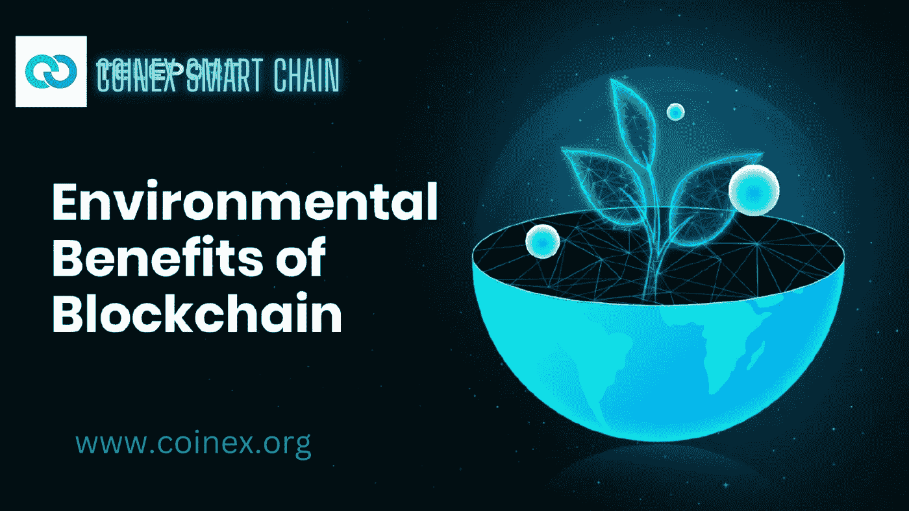

# CSC |区块链技术的环境效益

> 原文：<https://medium.com/coinmonks/csc-environmental-benefits-of-blockchain-technology-48af1d9d4f58?source=collection_archive---------20----------------------->

区块链如何拯救环境？

在实现更大的可持续性和减轻气候灾难方面，区块链技术的潜在影响是难以夸大的。作为“绿色技术律师”，我们知道比特币网络每年产生大约 7300 万吨二氧化碳。尽管如此，要评估区块链技术对社会、经济和环境的潜在巨大和变革性影响，有必要牢牢把握其 it 基础。

世界各地的政府和组织最近采用技术来应对气候变化和生物多样性的丧失。区块链是一种有潜力显著帮助应对气候问题的工具。为什么可能，怎么可能？对区块链的可能用途有一个更全面的看法，比如环境保护，可以为它的广泛采用铺平道路。

在这篇文章中，我们将讨论以下话题:

*   区块链与环境有什么联系？
*   为什么区块链对环境很重要？
*   区块链的绿色技术机会。

—供应链
—回收利用&环境条约
—环境保护
—能源
—碳税解决方案
—绿色数字资产
—智能电网管理

请继续阅读，深入了解区块链技术为我们的环境带来的优势！

# 区块链与环境有什么联系？

从技术角度来看，区块链有潜力在许多方面帮助解决环境危机和提高可持续性。为什么

专家预测，到 2030 年，全球密码行业的价值将达到 49.4 亿美元。根据最近的 IPCC 报告，迫切需要在 2030 年前实现全球能源转型，实现净零碳排放，并将升温控制在 1.5 摄氏度以下。为了实现这一目标，我们必须大幅减少对化石燃料的依赖，实施大范围电气化，提高能源效率，并使用可再生能源。

区块链技术在环境保护方面提供了巨大的潜力，包括保护规划和野生动物保护计划的实施。环境保护项目可以在合同绩效验证和有效补偿分配的帮助下实现其总的社会投资回报潜力。绿色科技领域的初创公司对这场运动至关重要。他们创造了区块链驱动的平台，将企业、政府和其他行业联合起来。

加强数字基础设施对于加速像区块链这样的创新技术的传播是必要的。然而，以太坊之类的区块链因其共识机制对上述能源问题有重大影响而受到批评。目标是提高安全性，但在不损害环境友好性的情况下做到这一点可能具有挑战性。

尽管以太坊最近的事件表明广泛使用的区块链在环保方面取得了重大突破，但请记住，绿色区块链技术仍处于早期阶段。

# 为什么区块链对环境很重要？

联合国环境规划署(UNEP)认为区块链和分布式账本技术可以显著改善可再生能源行业。如何实现？将投资者、可再生能源项目开发商和购买者聚集在一个平台上，该平台遵循既定的合规尽职调查全球标准

*   作为一个重要的工具，区块链有潜力显著提高温室气体排放的公开性、责任性和可追溯性。它帮助企业提供更加精确、可靠、标准化和易于获取的碳排放信息。
*   为了更准确地计算、跟踪和报告在降低整个价值链的碳足迹方面取得的进展，可以通过智能合同使用区块链技术。它有潜力提供即时认证、实时数据验证和透明的数据记录。
*   在比以往任何时候都更大的程度上，区块链技术有潜力联合以前孤立的公司业务。此外，它可以精确地识别在降低碳排放中的各种角色。在良性竞争和基于市场的激励下，每个人都会受益。
*   区块链的去中心化方法在很多方面都有优势。它让每个人都参与进来，并允许他们为整体做出贡献。从生产商到批发商、零售商到最终用户，可以在供应链的每个阶段监测和报告温室气体减排情况。

最终，区块链技术的进步为协调应对气候危机提供了强有力的催化剂。承认从事清洁技术工作的企业家在这一过程中可能发挥的独特作用以及公共和私营部门投资者的作用至关重要。

# 区块链的绿色技术机遇

实施可持续发展、政府改革和个人赋权的公司可以在许多方面受益于区块链技术。该技术可以帮助个人摆脱繁重合同的束缚，保护滥用权力的受害者，并解决现代数字世界的复杂性带来的问责问题。让我们来看看新的绿色技术解决方案，它们可以增强供应链、回收、环境保护、能源解决方案、碳税问题、绿色数字资产和智能电网管理

# 供应链

在全球食品供应链中存在严重的可持续性问题，区块链技术被提出作为解决方案。目前在世界各地运输商品的方法效率低下，对地球有害。由于工业 4.0 及其互联网连接设备的激增，我们正处于一场革命的风口浪尖，3D 打印的出现使得以小得多的分布式批次生产商品成为可能。

区块链如何帮助促进可持续发展？一项技术可以应用到生态友好和可持续的供应链程序中，并通过使供应网络透明来帮助防止低效和浪费。消费者将受益于区块链提供产品制造和交付过程细节的能力。现在，行业领导者将被追究责任，为地球做出更好的决策。

此外，区块链正被用来加强鱼类的可追踪性，以打击非法和不可持续的捕捞做法。一个典型的例子是，为了建立一个更加开放、透明和负责任的海鲜行业，Fishcoin 是一个总部位于区块链的海鲜可追溯性项目，旨在激励供应链参与者提供从收获时刻到消费点的数据。

鉴于它们对运输路线、运输量和防止空载运输的改善，将需要更少的船只和卡车。如果区块链技术用于太阳能飞艇和无人机，我们可能会见证无污染的长距离太阳能运输单个包裹。

另一种可能性是通过区块链保护、记录和货币化公共 3D 打印机。在这里，食品工业在追踪其销售食品的来源和路线方面取得了进展。

# 回收利用

当今最紧迫的环境问题之一是塑料垃圾。当前的回收方法通常不方便，并且不能为用户参与提供足够的激励。考虑到人类的本性，即使是最好的计划也经常失败。

尽管如此，2022 年，联合国环境大会投票决定结束塑料污染，并在 2024 年前达成一项具有法律约束力的国际协议，从而创造了历史。

作为一种解决方案，未来的回收系统可能已经存在，激励人们在指定的回收点简单地处理他们的塑料废物，并使用智能手机上下载的电子钱包进行无缝识别和验证。扫描存款后，电子钱包会自动更新。如果实施得当，这种方法可能会创造一个公平的竞争环境，使没有当地回收企业的国家的消费者能够得到与有大量回收企业的地方的用户类似的补偿。

建立回收工厂将允许企业从任何地方收集垃圾。监控参与该计划的每个站点、企业或个人的数量、成本、运输信息和利润，并评估他们各自的贡献是很简单的。

硅藻道就是一个很好的例子——这是一项旨在通过引入象征性的塑料清除信用系统来解决塑料污染问题的倡议。它试图利用分散融资(DeFi)的潜力来构建一个值得信赖的、可验证的、有效的塑料去除供应链，以促进更大的回收利用、降低消费、资助高杠杆去除项目、创造新的循环途径并刺激新材料的开发。

# 环境保护

从整体上加强环境保护是废物管理和运输的合理发展。说到记录交易和奖励，区块链大放异彩。环境保护战略、协议甚至国际条约都难以衡量其结果。

由于区块链将实现关键环境数据的可信记录，它可能会阻止缔约方违背承诺，夸大进展，或屈服于肆无忌惮的行为者的压力。

任何人都可以查看记录在区块链公共账本上的信息，并对其进行无限期跟踪。环境保护问题可以归结为一个合同法问题。类似于区块链将如何转变法律记录管理，它将大幅减少环境计划欺诈。

# 活力

区块链技术在能源领域的影响将是最明显的。今天的电网通常是垄断的、集中的网络，只能从有限范围的发电机(即少数由石油和天然气扩充的核电站)获取电力。这导致电力管理效率低下，配电线路过长，以及在地震或其他自然灾害面前可能会停电。

引入基于区块链的、分散的、点对点的能源系统将降低输电成本。例如，使用更少的电池——这种电池成本高，需要大量原材料，而且由于提取过程中会产生大量污染——将最大限度地减少低效储存能量的需求。如果每个家庭都配备了太阳能电池板、风力涡轮机或为家庭发电的新型智能材料，我们的世界将会变得多么不同。

将所有现有的基础设施建设到位，包括核反应堆、石油或煤炭，并增加能够产生动能或太阳能的路面。这种能源是未来的潮流。现在想象一个自动化的计算机系统处理这一切，所有交易的记录都在区块链，不可伪造。因为他们的努力，人们在他们的虚拟钱包里收到钱。

此外，自工业革命开始以来，由于二氧化碳的积累，海洋的酸性增加了 30%。《巨嘴鸟协议》正在开发一个碳市场框架，为世界级的气候解决方案提供资金，而 Captura 正在开发太阳能漂浮工厂，以清除海洋中的二氧化碳，努力按照《巴黎协定》加快向零碳排放的过渡。基于区块链的新项目和现有的非区块链项目的合作努力可以进一步加强对抗碳排放的斗争

# 碳税解决方案

现有的系统使得评估任何产品的环境影响变得很困难，并且产品的价格没有考虑其碳足迹。因此，无论是消费者还是企业都没有多少理由去寻找和推销对环境影响小的商品。

使用区块链跟踪产品的碳足迹将防止任何篡改数据的行为，并可用于计算登记时应缴纳的碳税。如果碳足迹较大的商品的购买价格提高，消费者就会被激励转向碳足迹较小的商品。这将促使企业调整供应链，以满足这一需求。

每个企业和产品都可以通过这个位于区块链的信誉系统进行评级。这将导致透明的生产，阻止浪费和不利于环境的生产方法

产品条形码可能会被扫描，以显示它们是在清洁、低碳的工厂生产的，还是在有污染的工厂生产的。

# 绿色数字资产

尽管这是一个错误的描述，但数字资产行业被指责为极其浪费能源。高能效的加密货币和区块链平台是气候变化计划的支柱。因此，区分这两者至关重要。

在气候变化项目中使用加密货币并不常见。平台正在转向更环保的能源和共识流程，竞赛已经开始。例如，阿尔格兰德已经宣布其区块链完全碳中和。Kickstarter 正在碳负区块链平台 Celo 上建立一个众筹平台。SavePlanetEarth 正在 Phantasma 上建立经认证的碳信用智能不可替代令牌(NFT ),这是一个绿色区块链，供开发人员构建去中心化的应用程序，以太坊最近的转型预计将使能耗降低 99%以上。

# 智能电网管理

可靠而透明的点对点电力交易已经由区块链技术公司实现，该公司还帮助开发和管理分散能源市场中的智能电网。例如，Powerledger 促进了过剩可再生能源的点对点交易，允许客户直接购买、出售和交换电力。Solstroem 的离网太阳能和地理标记、时间戳微碳信用旨在加速欠发达国家和新兴国家的能源转型。电子是英国的另一个项目，它利用以太坊区块链的智能合同来创建一个可靠供电的智能电网。Grid Singularity 是一个交换能源相关数据的平台，并作为一个分散的能源市场运行

凭借所有这些基于区块链的能源相关解决方案，太阳能电池板现在可以作为一个单一的枢纽连接到区块链，让用户享受分布式电源的好处，这要归功于大幅降低制造成本的新技术。

# 什么是 Coinex 智能链？

CoinEx 智能链(CSC)是 CoinEx 生态系统内的公共链，旨在建立一个高性能、去中心化的金融生态系统。CSC 致力于与 CoinEx 相同的愿景，通过“简单”的核心价值，努力实现其生态系统的高速增长。

与链上项目不同，CSC 是一个区块链基础设施，这意味着它不仅需要带来令人满意的用户体验，还需要为开发人员创建一个简单易用的平台。因此，对于 CSC 来说，建立品牌优势的关键是创建易于使用的底层协议和完善的底层基础设施，为开发人员提供舒适的工作环境，并为优秀项目提供资金支持。

# 结论

近年来，投资大型国际可持续发展项目的复杂性增加了。然而，消费者的选择、公司的决策或政府的政策所带来的明显的环境后果是无法回避的。因此，投资者希望将资金投入到有助于环境和气候的项目中..利用区块链启用的程序和基础设施，将更容易协调多种类型的利益攸关方的工作。因此，生产率会提高，浪费会减少。

在区块链的帮助下，可以透明地跟踪每种产品的碳足迹、设施的温室气体或废物排放，或者组织对环境要求的全面合规历史。人们只能希望信息系统、为从事特定活动而授予的象征性信用以及建立在区块链基础上的信誉系统都能激励企业和个人以生态可持续的方式行事。

# 官方资源

[推特](https://twitter.com/CoinEx_CSC) | [电报](https://t.me/CoinExChain) | [网站](http://www.coinex.org/) | [不和](https://discord.gg/5uBGRW9qSp)

> 交易新手？尝试[加密交易机器人](/coinmonks/crypto-trading-bot-c2ffce8acb2a)或[复制交易](/coinmonks/top-10-crypto-copy-trading-platforms-for-beginners-d0c37c7d698c)