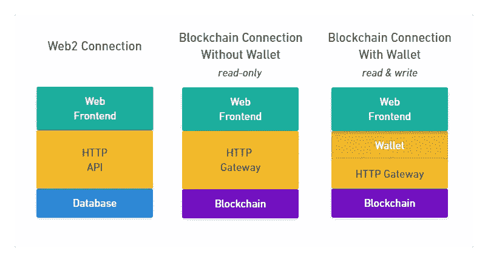
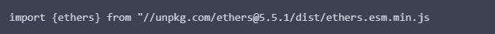
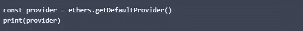
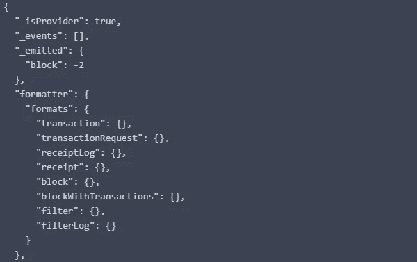
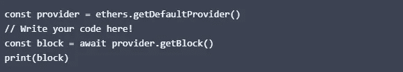
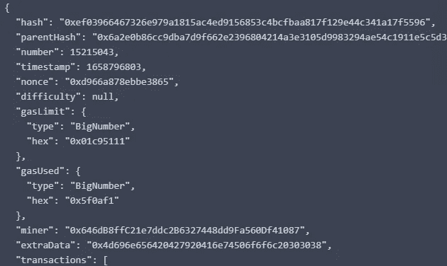

# CSC 从 A 到 Z —第 1 部分

> 原文：<https://medium.com/coinmonks/csc-from-a-to-z-part1-71f20e48c64c?source=collection_archive---------43----------------------->

Web 3 及其概念的一般介绍。本教程的受众是前端开发人员，他们对 JavaScript 和 Web 2 有着一般的了解

如果你不太懂 web 开发或者刚进入编程领域，我推荐你去网站[https://www.w3schools.com/](https://www.w3schools.com/)去加入你对编程感兴趣的分支，开始学习吧

这个循序渐进的课程从 Web 应用的角度涵盖了 Web3 的概念，所以前两部分不需要任何实体或者开发工具
你只需要在浏览器上写 JavaScript 就可以了。

即使有一个小编辑器，你也可以浏览这个教程。在每一章的结尾都有一个例子，这样你可以更深入地学习这些概念。

**第一章**

从区块链读取数据，至于最基本的，它连接到区块链网络，读取数据等。

**连接 network‌区块链**
本课程将从头开始，因此第一课不需要安装任何软件。你只需要一个浏览器和适度的 JavaScript 知识。

**连接区块链网络的方法**
在 Web 2 中，你知道如何从服务器向前端发送数据。你用一个 api http 你连接到一个后端从数据库获取数据，
对于 Web 3 和 Web 2 是一样的，如果你没有加密钱包，要连接到一个区块链网络你需要 api HTTP，因为这些
网络使用一个你的浏览器不理解的协议，这个 API 的名字是 gateway。这个网关通过 http 接受来自浏览器的请求，并将它们发送到区块链网络。使用这种连接方法，您只能从区块链读取数据。

如果你有一个加密钱包，你可以通过浏览器扩展在 JavaScript 中使用它，在 csc 的情况下，扩展将一个全局 csc
对象添加到前端。通过使用这个对象你可以在前端使用你的钱包，你可以使用这个连接方法像发送交易一样在区块链中读写数据
。

如果您安装了加密钱包并设置了浏览器扩展。它使用网关连接到区块链网络，所以我们的浏览器没有
来直接使用网关。

在下图中，您可以看到没有加密钱包的不同类型的 web2 和 web3 连接

Web2 and Web3 backends

在本课程中，您将从只读连接方法开始，对于接下来的几个部分，您不需要安装任何程序。

您将使用 Ethers.js:

Ethers.js([https://docs.ethers.io/v5/](https://docs.ethers.io/v5/))这是一个帮助我们连接到 csc 网络的软件，当使用 ethers . js 时，你不必关心
是通过网关直接连接还是使用浏览器扩展。在启动每个连接后，你调用的功能是相同的。

下图显示了 Ethers.js，它与前端本身和 cscnetwork 成比例。

Blockchain connection with Ethers.js

ethers . js NPM 软件包注册表上的一个模块 ECMAScript。这意味着您可以使用 unpkg CDN 在浏览器中直接导入它。

# 连接到 CSC 网络。

在本节中，我们将讨论如何连接以太坊网络，要连接以太坊网络，您需要创建一个提供者对象，
提供者是 Ethers.js 用来规范网关与钱包和 HTTP 网关的使用的抽象。

您可以通过调用(getDefaultProvider)object(ethers)创建您之前输入的提供程序来获得这样的提供程序。

已经编写了第一个示例，向您展示编辑器是如何工作的:

## **结果:**

要从 csc 网络中读取数据，你可以使用方法(getBlock) Get object ethers 它返回一个 promise，解析到一个包含
块数据的对象，所以你必须等待它，在你得到块后，你可以用 print 函数查看它的数据。

## **结果:**

如果它工作，您将在输出中看到块数据，这些数据都与区块链相关，但仍然没有告诉我们任何有用的信息，
至少您可以看到连接正在工作，并且可以从中读取数据。

Ethers.js 预配置了一个共享网关，你可以免费使用它从区块链读取数据，这个网关有一个请求限制，
所以如果你发送太多请求，它不会得到响应。

这一课的结果是什么:在这一课中，你学习了为什么 Web 2 和 Web 3 的后端是不同的，而它们使用的 API 都是 HTTP。
我们在 Web3 中将这些 API 称为网关，因为它们是进入区块链网络的网关。

您还在 Ethers.js 的帮助下学习了如何使用区块链网络，在这一部分您不需要安装任何东西。

祝贺🥳

我们将在下一个教程中讨论读取地址信息。

> 交易新手？尝试[加密交易机器人](/coinmonks/crypto-trading-bot-c2ffce8acb2a)或[复制交易](/coinmonks/top-10-crypto-copy-trading-platforms-for-beginners-d0c37c7d698c)