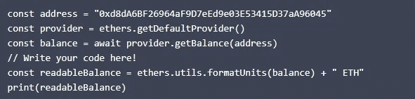

# CSC 从 A 到 Z—第二部分

> 原文：<https://medium.com/coinmonks/csc-from-a-to-z-part2-ca65821b7edc?source=collection_archive---------51----------------------->

在本教程中，我们将讨论使用 Ethers.js 从 coinex 智能链网络读取地址信息

## 读取地址信息

地址是区块链的心脏，就像 IP 对于互联网一样，地址是区块链的。
地址是指智能合同和外部拥有的账户(eoa)。

公钥中的地址号有 20 个字节长，通常用 40 个十六进制数字表示，如下所示:

注意:发送和接收数据或金钱的地址它被用作一个标志当你发送错误的令牌到一个错误的地址
你的钱将会丢失。你应该经常检查，以确保地址是正确的，如果你输入了错误的地址和
钱丢失了，没有什么可以归还。

由 CSC 网络外部的私有/公共密钥对的所有者控制的地址，因此称为外部拥有的帐户，通常使用加密钱包来管理密钥和地址。

智能合约是一种在构成区块链网络的节点(计算机)上运行的软件，智能合约的所有者可以是另一个智能合约的
或 EOA，这就是为什么智能合约不属于外部。

这些地址既是智能合同也是 eoa，有与之相关的数据，CSC 区块链存储这些数据，如果您有适当的权限，
您可以读取和写入它们。在本课中，只有您阅读数据。正如您在图 1 中看到的，如果没有加密钱包，您就不能在区块链上书写。

Blockchain connection with Ethers.js

## 读取地址的事务计数

为了向提供者 Ethers.js 读取数据，我们还需要一个地址。跟着交易数一起来(TX)我们开始吧。这是一个简单的数字，存储在区块链上，代表属于此类 TX 的每个地址。它存放在区块链上。
如果出现另一个具有该地址的 TX，csc 会在号码上加 1。

Ethers.js 提供者提供了一个 getTransactionCount Ethers.js 提供者提供了一个返回解析为 TX 计数的承诺的方法，所以您必须等待它。

在编辑器中测试它，调用该方法并打印其输出，该方法需要一个地址作为字符串参数。

**结果:**

## 读取某个地址的库存

读取地址的余额比读取 TX 计数要困难一些。

智能合同和 eoa 有以太网余额，本地令牌或本地货币是 csc 网络这是你在 csc 以太网上做 TX 所支付的费用。

要读取地址的余额，可以使用 getBalance 方法获得余额。同样，这个方法返回一个承诺，所以您必须等待它。

在编辑器中尝试一下，调用方法并打印出来。该方法需要一个地址作为字符串参数，您可以使用以下几项:

## **结果:**

## 大数类型

Ethers.js 将余额包装在自己的 BigNumber typem 中，因为这个数字可能太大，无法存储 JavaScript 数字类型，需要改成带小数的字符串才能清晰显示。

csc 与 JavaScript 的最大区别之一是数字类型，很长一段时间以来，JavaScript 中的每个数字都是 number 类型，这是一种双精度(64 位)浮点，所有数字都以相同的方式存储，因为不久前它获得了一种新的数字类型，称为 BigInt，用于非常大的整数。

Solidity 中的一切都是整数，用于为 csc 制定智能合同的语言，Solidity 与金钱有关，当然，有一些问题会让你花钱，所以他们只选择整数，Solidity 总是将数字存储为整数，使用最多的类型是 uint256(也称为 uint)，它可以存储 78 个十进制数字。JavaScript 的数字类型只能存储 16 位数字。

令牌可以超过 16 位，因此它们非常适合数字，地址也存储为整数，长度为 20 字节(40 个十六进制数字)。20 字节是 160 位，因此它们也不适合 64 位数字类型，为此，我们使用字符串来存储地址。

由于 Ethers.js 希望继续与不支持 BigInt 的旧浏览器一起工作，他们创建了自己的整数类型 BigNumber，它带有([基本算法的方法](https://docs.ethers.io/v5/api/utils/bignumber/#BigNumber--methods))但如果需要，它也可以转换为 String 或 BigInt。

## 转换成可读格式

上一个练习给了你一个不容易理解的大数字对象。虽然在我们的代码中使用这个值就足够了，但是在向用户显示之前，您应该将它更改为一个字符串。

formatUnits 函数自动将一个大数字转换成带有适当小数的字符串，这对于向用户显示余额非常有用。

尝试将大数字转换成字符串并打印出来。

可以在 ethers.utils 对象中找到 formatUnits 函数。这次它立即返回输出，所以不需要等待。

## **结果:**

## 结论:

在本课中，您学习了 csc 区块链的核心是地址，它们指的是智能合同和外国帐户。

> 交易新手？试试[密码交易机器人](/coinmonks/crypto-trading-bot-c2ffce8acb2a)或[复制交易](/coinmonks/top-10-crypto-copy-trading-platforms-for-beginners-d0c37c7d698c)