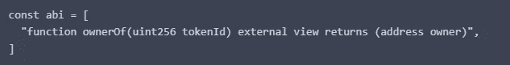
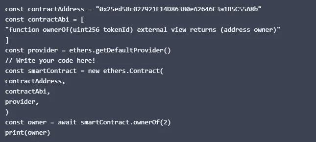
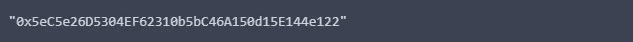

# CSC 从 A 到 Z —第 3 部分

> 原文：<https://medium.com/coinmonks/csc-from-a-to-z-part3-98d1ecf0154?source=collection_archive---------23----------------------->

smart contract

## 连接到智能合同

以太坊与比特币的主要区别在于智能合约，在以太坊网络中，智能合约是一个被执行的程序，可以访问区块链数据。

智能合约是用名为 Solidity 的编程语言编写的，像 Java 一样，Solidity 被编译成在虚拟机上运行的字节码，这被称为以太坊虚拟机。

## 与智能合同的交互

要使用 JavaScript 与智能合约交互，您需要三样东西:

1.  指向智能协定的地址。
2.  全部或部分合同程序二进制接口。
3.  连接到 csc 网络的提供商。

在本课结束时，你已经学会，每个 EOA 和智能合同有一个地址，这是你如何找到智能合同在区块链。

为了理解契约做什么，你需要一个应用程序二进制接口，或简称为 ABI，一个你以后要调用的函数的函数签名列表，Ethers.js 使用 ABI 来指定函数期望什么参数以及当它完成时返回什么值。

使用 Ethers.js 时，可以将 ABI 定义为字符串数组，其中字符串是 Solidity 函数签名，就像用 Solidity 编程语言编写一样。

下面是一个函数的 ABI 的例子:

函数用 function 关键字定义，后面跟一个名字，圆括号里是参数，Solidity 是静态类型的，不支持浮点，但是支持不同大小的整数类型。

在上面的例子中，该函数接受一个类型为 uint256 的参数，名为 **tokenId** 。

foreign 关键字是一个访问修饰符，它将函数标记为可从契约外部调用。

关键字 view 也非常重要，因为它告诉 EVM 这个函数不会改变链上的任何状态，只会读取它。

查看允许您在没有钱包的情况下调用该功能，因为您使用的 csc 网关可以从区块链的本地版本中读取所有数据。

关键字会告诉你，你通过调用函数得到了什么，地址是一个令牌的所有者。

下一步是创建一个新的契约实例，并调用由 ABI 定义的 ownerOf 函数

请注意下面的例子:

**结果:**

像区块链的所有东西一样，它位于一个地址，这正是函数返回的内容。她的地址可以引用创建我们的合同的另一个合同，即所谓的工厂合同，该地址也可以引用一个 EOA，它也存在于此示例中。

## 结论

在本课中，您将学习智能合约交互，如何在区块链提供程序的帮助下查找地址，以及如何通过 ABI 调用其函数。

> 交易新手？试试[加密交易机器人](/coinmonks/crypto-trading-bot-c2ffce8acb2a)或者[复制交易](/coinmonks/top-10-crypto-copy-trading-platforms-for-beginners-d0c37c7d698c)