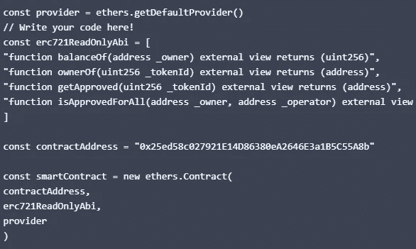

# CSC 从 A 到 Z —第 4 部分

> 原文：<https://medium.com/coinmonks/csc-from-a-to-z-part5-59af2838852e?source=collection_archive---------24----------------------->


## 征求意见

当构建去中心化的系统时，最重要的部分之一是如何与它们交互，你知道一个智能契约有一般的功能，但是你需要一个 ABI 来调用它们。

也许你可以以某种方式对 ABI 进行逆向工程，例如，通过阅读源代码，但不幸的是，并不是所有的智能合同都是开源的，这个原因使得这项工作有点困难。

## CRC-20 和 CRC-721 令牌标准


ERC-721

最著名的 ERCs ERC-20 针对可替代代币，通常称为加密货币或简称代币，ERC-721 针对不可替代代币，称为 NFTs。


NFT

如果智能合约的重要功能通常被限制在特定的地址，那么它们大多数都是外部的，没有任何权限，所以你可以通过 Ethers.js 调用它们。

您可以从我以前的文章中了解这个主题:

[https://medium . com/coin monks/NFT-collection-deployment-on-CSC-6d 41 ce 988 a 40](/coinmonks/nft-collection-deployment-on-csc-6d41ce988a40)

## 创建一个 CRC-721 只读 ABI

如果你知道 NFT 制造的智能合约的地址，你可以去搜索一个 ERC-721 ABI，用它和地址一起调用它。

ERC-721 合同的可靠性用户界面如下:

```
interface ERC721 {
    event Transfer(address indexed _from, address indexed _to, uint256 indexed _tokenId);
    event Approval(address indexed _owner, address indexed _approved, uint256 indexed _ tokenId );
    event ApprovalForAll(address indexed _owner, address indexed _operator, bool _approved);

    function balanceOf(address _owner) external view returns (uint256);
    function ownerOf(uint256 _tokenId) external view returns (address);
    function safeTransferFrom(address _from, address _to, uint256 _tokenId, bytes data) external payable;
    function safeTransferFrom(address _from, address _to, uint256 _tokenId) external payable;
    function transferFrom(address _from, address _to, uint256 _tokenId) external payable;
    function approve(address _approved, uint256 _tokenId) external payable;
    function setApprovalForAll(address _operator, bool _approved) external;
    function getApproved(uint256 _tokenId) external view returns (address);
    function isApprovedForAll(address _owner, address _operator) external view returns (bool);
}
```

在前面的课程中，我们了解到，通过将字符串形式的函数签名复制到 JavaScript 表示中，可以将其转换为 Ethers.js 的 ABI。

```
const crc721Abi = [
  "function balanceOf(address _owner) external view returns (uint256)",
  "function ownerOf(uint256 _tokenId) external view returns (address)",
  "function safeTransferFrom(address _from, address _to, uint256 _tokenId, bytes data) external payable",
  "function safeTransferFrom(address _from, address _to, uint256 _tokenId) external payable",
  "function transferFrom(address _from, address _to, uint256 _tokenId) external payable",
  "function approve(address _approved, uint256 _tokenId) external payable",
  "function setApprovalForAll(address _operator, bool _approved) external",
  "function getApproved(uint256 _tokenId) external view returns (address)",
  "function isApprovedForAll(address _owner, address _operator) external view returns (bool)",
]
```

现在由于我们还没有封闭的钱包，我们只能调用视图函数，所以让我们绕过其余的。

```
const crc721ReadOnlyAbi = [
  "function balanceOf(address _owner) external view returns (uint256)",
  "function ownerOf(uint256 _tokenId) external view returns (address)",
  "function getApproved(uint256 _tokenId) external view returns (address)",
  "function isApprovedForAll(address _owner, address _operator) external view returns (bool)",
]
```

尝试获取其所在的 NFT 合同的所有者令牌 Id 5666


使用我们上面定义的 ABI 并打印结果。



## 结论:

在这一课中，我们了解了 ERC，他们如何标准化接口和行为，以帮助您使用这些契约，并允许其他契约与之交互。

我们还将 CRC-721 中定义的一个独立接口转换成了一个 ABI，您可以在 Ethers.js 中使用它

> 交易新手？试试[密码交易机器人](/coinmonks/crypto-trading-bot-c2ffce8acb2a)或者[复制交易](/coinmonks/top-10-crypto-copy-trading-platforms-for-beginners-d0c37c7d698c)