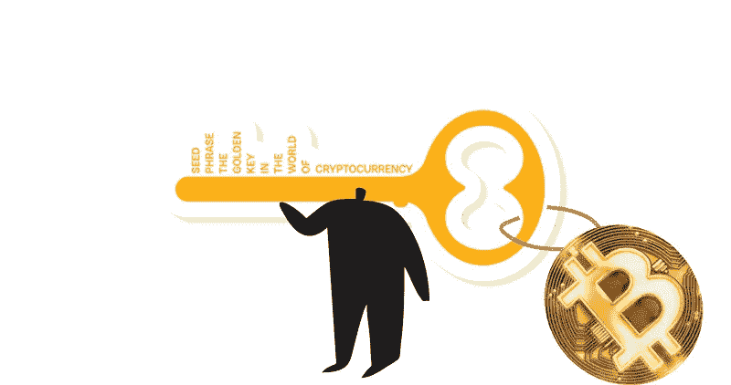
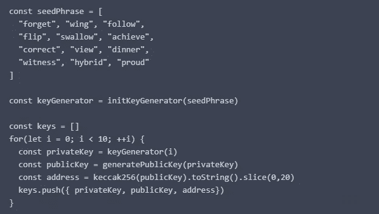
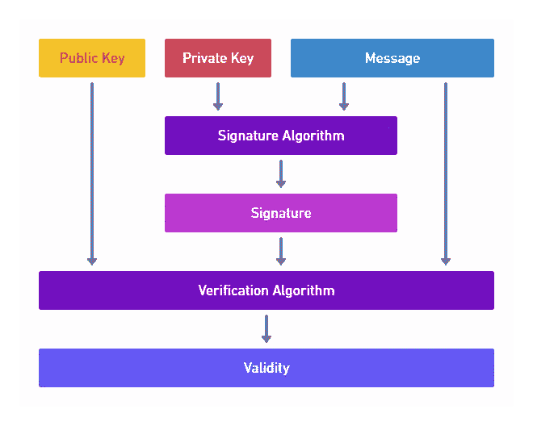
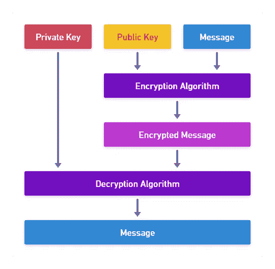

# CSC 从 A 到 Z —第 7 部分

> 原文：<https://medium.com/coinmonks/csc-from-a-to-z-part7-1f14a6d8a304?source=collection_archive---------30----------------------->

# 种子短语

种子短语也称为秘密恢复短语，是 12 到 24 个短随机单词的列表，用于生成一个或多个私钥，并最终生成公钥和地址。

种子语句可能类似于以下示例:

虽然您可以直接生成一个私钥，但许多加密钱包程序使用一个密钥短语来为您生成它们，许多人使用多个地址。

种子表达式的概念是它是一个随机的单词列表，但从该表达式创建几个私钥的算法是确定的，这允许您从一个表达式中生成几个密钥，从种子语句中检索所有这些密钥，否则您必须单独记下每个私钥。

消极的一点是，如果你的种子短语被盗，所有生成的私钥也将被盗，这意味着无论什么对你的私钥是真的，对你的初始表达式也是十倍真的，因为它与多个私钥是一样的。

永远不要在电脑或智能手机上的加密钱包应用程序之外写你的初始短语，永远不要把它存储在 S3 桶或 GitHub 中，等等。如果您的智能手机或笔记本电脑丢失或损坏，要找回您的密钥，您可以将种子短语写在一张纸上，并将其保存在安全的地方。

## 钥匙是用来做什么的？

到目前为止，你已经知道了键是什么，以及应该如何使用它们，但是它们到底是用来做什么的呢？

私钥和公钥用于不同的任务。它们的有用性来自于这样一个事实:每个人都可以拥有你的公钥，而任何人都不应该拥有你的私钥。

## 用私钥签署消息

他们使用私钥对数据进行签名，签名意味着在数据上附加一个签名。签名是使用签名算法创建的，该算法使用您的私钥和要签名的数据。

关键是没有私钥就不能生成签名数据。

在 Base64 版本中，签名可能是这样的:

公钥是用来验证签名的，如果你用私钥签名的话，相关的公钥结合签名算法，签名和被签名的数据会产生是或否的结果，这个来自私钥的签名是正确的。

当您是唯一拥有您的私钥的人时，您是唯一可以创建这些签名的人，如果您的密钥被盗，其他人可以声称他们是原始所有者，如果您丢失了您的私钥，您将不再能够创建签名，并且您的公钥系统不会相信您是您所说的那个人。

在图 2 中，您可以看到这三部分是如何相互作用的。

Signing and verification

## 用公钥加密消息

您了解了可以使用公钥来验证签名，但这并不是使用公钥所能做的唯一事情，公钥能够加密只有相应的私钥才能打开的消息。

如果你想使用非对称加密进行私人通信，你必须交换公钥，任何人只要有你的公钥，就可以给你发送只有你能阅读的信息。

下图显示了简化的流程。出于性能原因，该映像中的消息通常不是您想要发送的实际数据，而是与私钥持有者交换的对称加密密钥，然后用于加密/解密双方之间的所有当前消息。

Encryption and decryption

> 交易新手？试试[加密交易机器人](/coinmonks/crypto-trading-bot-c2ffce8acb2a)或者[复制交易](/coinmonks/top-10-crypto-copy-trading-platforms-for-beginners-d0c37c7d698c)