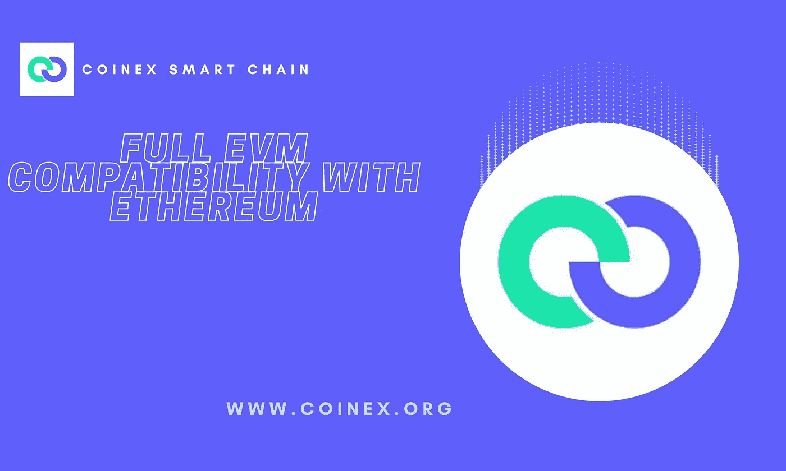

# CSC | BaaS 解决方案概述(区块链即服务)

> 原文：<https://medium.com/coinmonks/csc-general-overview-on-baas-solutions-blockchain-as-a-service-fef11d80c959?source=collection_archive---------67----------------------->

对许多人来说，自 2009 年比特币诞生以来，区块链技术已经被广泛采用。区块链技术已经远远超出了最初在比特币交易中的应用，可以解决所有类型的可信金融交易。这允许开发更可伸缩、安全和透明的业务解决方案。

现在，像微软和 IBM 这样的领先公司正在提供区块链即服务，旨在使外包区块链功能变得更容易，而不是构建自己的定制平台。为了帮助他们的客户组织保持竞争力并采用这种改变游戏规则的技术，科技行业的主要参与者开始探索提供区块链技术即服务。鉴于区块链有颠覆所有行业的潜力，这个新兴的 BaaS 将是一个值得关注的群体。

虽然 BaaS 概念不是一个灵丹妙药，但它帮助主要业务不在 it 部门的企业降低了与 IT 流程相关的复杂性和风险。在本文中，我们将涵盖以下内容，详细介绍 BaaS 的主要领域:

*   什么是区块链即服务(BaaS)？
*   BaaS 是如何工作的？
*   BaaS 为什么重要？
*   顶级 BaaS 解决方案(微软 Azure、IBM Cloud、亚马逊、甲骨文)
*   BaaS 的未来

# 什么是区块链即服务(BaaS)？

区块链即服务通过让第三方负责必要的基础设施和支持服务，降低了使用区块链技术的难度。这些类型的中介服务是快速发展的区块链产业中的一个新发明。

对于企业来说，从零开始创建自己的区块链是不切实际和昂贵的，因此他们转向了“区块链即服务”，即通过开发满足特定业务需求的定制应用程序(BaaS)来促进区块链技术集成到现有运营中的预建平台。

正如我们今天所知，有了区块链即服务，公司可能会在不了解底层技术细节的情况下利用分布式账本技术。这些服务允许用户创建、托管和运行区块链应用程序和相关服务，而无需深入了解区块链架构。在大多数情况下，用于存储和管理公司所有区块链数据的云托管解决方案也包含在这些服务中。

因此，BaaS 模式可与软件即服务(SaaS)模式相媲美，后者是另一种基于云的服务模式，在这种模式下，第三方开发者创建定制的基于网络的程序供企业客户使用。类似于 SaaS 是公司建立 web 应用程序的最快方法，BaaS 是公司开发适合其特定业务需求的基于区块链的应用程序的最快方法。

# BaaS 解决方案是如何工作的？

首先，区块链即服务模式说明了企业如何通过第三方建立和管理区块链网络。该公司将收取你建立你的区块链基础设施和软件。

如前所述，BaaS 反映了 SaaS 的概念，并以类似的方式运作。使用基于云的解决方案，客户可以创建、托管和运行自己的区块链应用程序和相关功能。同时，云服务提供商确保基础设施的灵活性和可用性。

与 SaaS(即软件即服务)帮助组织以很少甚至没有开销的方式部署软件应用程序一样，区块链即服务也通过区块链技术做到了这一点。因此，可以更快、更灵活地使用区块链。因此，随着区块链应用程序越来越受欢迎，企业(尤其是初创企业)不需要承担人员和基础设施的管理费用。

最后，将区块链作为服务提供给企业类似于托管网站。通过这项服务，用户能够利用提供商管理的生态系统在云中创建和存储区块链应用程序和智能合同。

# 为什么 BaaS 解决方案很重要？

*   区块链即服务是面向区块链应用开发者的基于云的基础设施和管理。借助 BaaS，企业可以使用基于云的解决方案来构建、托管和采用他们自己的区块链应用程序、智能合同和其他相关的基于区块链的功能，同时让他们的 IT 合作伙伴或服务提供商处理所有必要的任务和活动，以保持底层基础架构平稳运行。
*   BaaS 在基于区块链的软件或平台的后端运行基础设施，很像一个 web 主机。
*   BaaS 有潜力成为促使区块链技术被广泛采用的引爆点。

# 顶级 BaaS 解决方案

如今，区块链应用横跨各种活动，如数字投票、供应链跟踪、房产交易、商店忠诚度奖励等。尽管在区块链市场还很年轻，BaaS 市场已经迅速扩大。全球区块链即服务市场规模在 2019 年为 19.0 亿美元，预计到 2027 年将达到 249.4 亿美元，在预测期内 CAGR 将增长 39.5%。

区块链即服务帮助企业节省时间，并利用区块链技术来创建更加用户友好、安全和先进的解决方案。许多最大的云提供商也提供托管 BaaS 解决方案，这简化了组织的区块链集成。科技领域的两大品牌微软和亚马逊都涉足了这个市场。

让我们看看 BaaS 领域的主要参与者，看看他们如何帮助您的组织适应和集成区块链技术。

# 微软 Azure

2015 年，微软和 ConsenSys 通过 Azure 云平台在微软 Azure 上推出了以太坊区块链作为服务。微软提供 BaaS 平台作为其 Azure 云服务的一部分，它与其他微软产品兼容，如 Logic Apps 和 Flow。使用区块链技术，Azure SQL 数据库的新分类账功能提高了记录的完整性，并使用户能够证明数据没有被篡改。

企业可以利用 Azure 强大的云基础设施及其区块链服务来创建、操作和部署企业级区块链应用和网络。

# IBM 云

作为 IBM 广泛的云产品的一部分，IBM 区块链平台提供了一个区块链即服务平台。当谈到托管区块链时，IBM Cloud 是云行业中早期和有影响力的参与者。正因为如此，它拥有最发达的产品线之一。

因此，IBM 为一些世界上最大的公司提供区块链托管服务，包括沃尔玛和航运集团马士基。此外，支持 IBM 品牌区块链产品的软件基于 Hyperledger Fabric，这是一个著名的开源区块链技术框架。

# 亚马逊管理的区块链

为了帮助企业快速开发和部署高效和可扩展的区块链解决方案，亚马逊提供了一个名为亚马逊管理的区块链的用户友好平台。这项服务使得利用以太坊等流行的开源区块链平台构建和运营可扩展的区块链网络变得更加容易。

# 神谕

甲骨文的区块链云也提供基于 Hyperledger Fabric 框架的区块链服务。通过利用 Oracle 的 BaaS 平台，企业可以提高网络的开放性、业务的完整性和交易的灵活性。

# BaaS 的未来

企业和消费者都在采用区块链技术。然而，与基础设施创建、配置、运营和维护相关的技术挑战和运营管理费用证明是一个重大障碍。

对于初创公司和中小型企业来说，区块链即服务对严重依赖大数据孤岛的公司有着巨大的影响。除了不再需要第三方代表之外，BaaS 的其他优势还包括提高数据安全性和竞争优势。这有积极的增值效应。

作为一流的工具，BaaS 帮助市场参与者制定创新的投资战略，以重振不同领域的增长:

# 汽车工业

在防止和管理假冒零部件和供应链方面，汽车行业面临着巨大的挑战。区块链使得从头到尾追踪车辆部件的运动成为可能。这有助于汽车制造商监控正品零件并识别假货。

# 卫生保健

BaaS 在医疗保健行业有着巨大的潜力。在这项技术的帮助下，可以保存一个人的医疗记录的透明和全局副本。此外，区块链技术可以帮助验证药品的合法性。追踪任何药物的来源是可能的，也可以帮助工厂召回产品。

# 金融科技

金融科技领域是由中介推动的。谢天谢地，对于普通客户来说，区块链让大多数金融活动无缝衔接。区块链的不变性和透明性对于友好地解决分歧特别有用。无需任何中央机构进行耗时的验证，其智能合同功能可以促进更快的现金结算。

# 娱乐

当谈到版税，创作者社区现在可以比以往任何时候都更容易地跟踪他们的收入，这要归功于区块链技术，因为每一笔转售交易都被记录下来。在娱乐业中，也可以使用 BaaS 解决方案来监控受版权保护的材料的使用情况。智能合同有助于确保原创者在与版权所有者相关的所有交易中获得适当的补偿。

然而，尽管区块链对中小企业的潜在好处看起来很有希望，但该技术对能源和资源的高要求仍然是其广泛采用的一个重大障碍。此外，当公司利用 BaaS 平台时，他们可能需要学习必要的技能来管理系统。此外，服务协议可以在短时间内轻松扩展或终止，从而减少执行服务所需的投资。

换句话说，它允许公司保持尖端技术的存在，而不会产生任何不必要的成本。

# 总结想法

区块链在这个时候出现并不奇怪，但许多企业和科技初创公司已经准备好提供区块链即服务(BaaS)，以帮助那些仍在努力解决如何利用分布式账本的问题的人简化采用过程。

像 IBM 和 Microsoft Azure 这样的大型云提供商已经看到了 BaaS 为关键优势不在 IT 领域的企业简化区块链安装的潜力。组织能够将更多的资源投入到他们的核心能力上，而不必担心软件开发基础设施。

无需在 R&D、规划、资源或基础设施方面进行大量前期投资，区块链即服务为企业提供了一个获得竞争优势并为未来定位的大好机会。这是一个让你脱颖而出成为你所在领域的先锋和领导者的机会。虽然存在与区块链技术相关的合理担忧，但 BaaS 是一个里程碑，有望推动分布式账本技术的商业应用。

# CSC 是什么？它提供什么？

CoinEx 智能链(CSC)是由 CoinEx 团队为分散式金融创建的分散式高效公共链。公共链与以太坊生态系统完全兼容，具有高效率、低费用以及无许可验证器的特点。所有开发人员都可以基于 CSC 轻松构建他们自己的分布式应用程序，或者在 CSC 上快速部署他们的 EVM 应用程序。

# 官方资源

访问我们的[网站](http://www.coinex.org/)

加入我们的[电报](https://t.me/CoinExChain)

在[推特](https://twitter.com/CoinEx_CSC)上关注我们

> 交易新手？尝试[加密交易机器人](/coinmonks/crypto-trading-bot-c2ffce8acb2a)或[复制交易](/coinmonks/top-10-crypto-copy-trading-platforms-for-beginners-d0c37c7d698c)