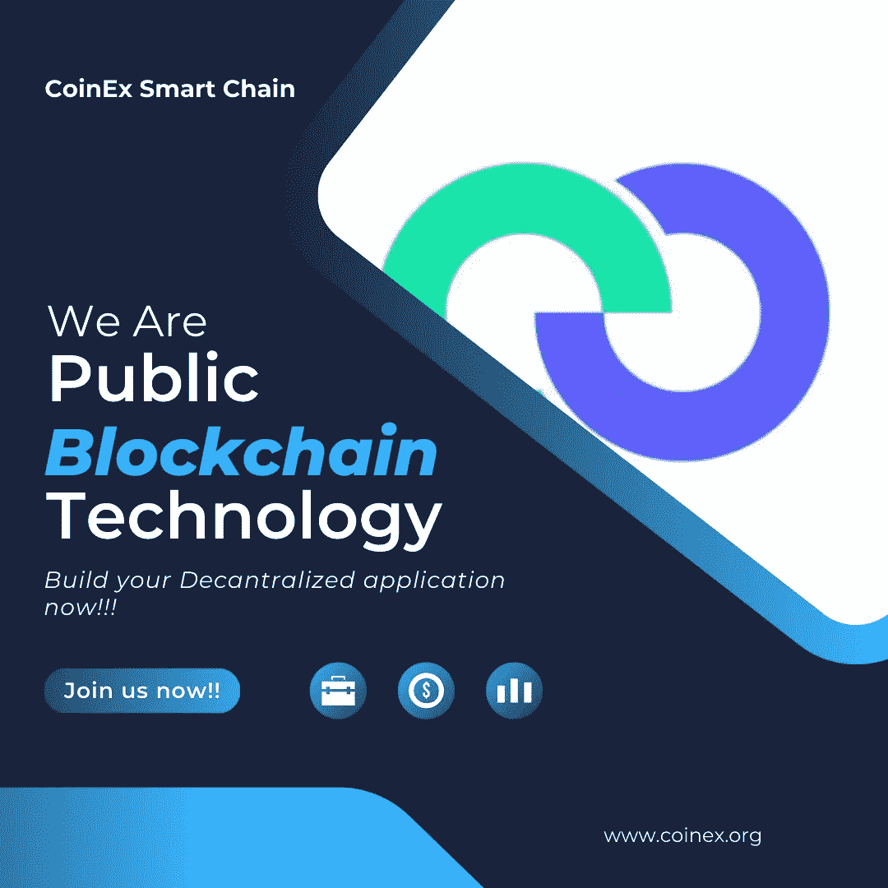

# CSC |初始游戏产品(IGOs 全面的概述

> 原文：<https://medium.com/coinmonks/csc-initial-game-offerings-igos-a-comprehensive-overview-e3f17b2a3339?source=collection_archive---------34----------------------->

随着许多令人兴奋的 NFT、DeFi、MetaFi、GameFi 等项目的快速发展，区块链产业也在不断发展。随着正在进行的元宇宙、NFTs 和 GameFi 革命，游戏行业尤其开始利用区块链的优势。与任何初创企业一样，区块链项目需要巨额资金，游戏世界中出现的项目也不例外。虽然有很多方法可以为这些项目筹集资金，但随着投资者看到 GameFi 在过去一年的快速增长，首次游戏发行(IGO)越来越受欢迎。

在开发的初始阶段，IGO 可用于在区块链游戏通过 launchpads 发布之前购买 NFT 或代币。在这里，根据项目的不同，参与 launchpads 的参与者必须锁定平台的本机令牌一段特定的时间，以换取在游戏启动时提前访问游戏令牌或 NFT。有时，IGO 期间获得的代币和 NFT 可以在游戏之外的分散交易所和 NFT 市场交易，这也完全取决于项目。

IGOs 背后的想法首先在 GameFi.org 平台上推出，然后才是其他启动平台，如 Enjinstarter、Gamestarter(游戏)、Seedify.fund(种子)，并紧随其后，让用户有机会在早期阶段参与游戏项目，并在发布时赚取巨额回报。在这篇文章中，我们将深入了解你需要知道的关于 IGO 的一切

# 什么是初始游戏提供(IGO)？

首次游戏发行(IGO)是一项筹款活动，允许参与者在众筹期间投资初创公司区块链游戏 NFT 公司的资产，尤其是在他们的发展阶段。IGO 让参与者提前接触游戏 NFT，因为他们帮助开发者为游戏项目筹集资金。此外，他们还可以获得特殊的游戏内物品，如免费通行证，并获得游戏发行折扣和项目令牌。

开展 IGO 的原因是帮助区块链的新兴游戏项目筹集开发产品所需的资金，这就是为什么一旦项目上线，早期采用者会带来诸多好处。

# 最初的游戏如何运作？

在 IGO 中，感兴趣的参与者可以在游戏项目的早期开发阶段对其进行投资。主要目的是获得足够的资金，将项目从开发阶段推进到竣工阶段。为了在开发阶段支持这些游戏项目，参与者可以提前获得各种游戏内资产，如神秘盒子、武器、角色等，这些通常是在游戏启动时用于访问游戏的不可替换的令牌。注意 IGO 和 ICO 不一样。ICO 主要处理加密货币，而 IGO 专注于 NFT 等游戏资产。

然而，如果该项目长期表现良好，IGO 早期参与者收到的 NFT 代币将为早期投资者带来可观的收益。同样重要的是要注意，早期阶段的投资也伴随着一定程度的风险，因为无法保证项目会做得很好或发挥作用。正如有真实的项目一样，也有为了欺骗不知情的投资者而建造的项目。

# 以下是在投资任何 IGO 平台之前需要考虑的一些提示:

*   研究一下谁是项目持有人，作为代币持有人有什么好处
*   检查 IGO launchpad 是否能够在事件中保证一定级别的插槽
*   评估 ROI(投资回报)并确定它是否值得你花费时间、金钱和精力。
*   检查平台上 IGO launchpad 令牌创建事件的数量

# 在投资 IGO 之前，注意以下事项也很重要:

*   投资 IGO 并不保证你会像其他投资一样获得有益的回报。
*   在做出承诺之前，一定要做好自己的研究，并考虑投资任何潜在 IGO 的风险。
*   查看游戏项目的网站或社交媒体平台，看看它是否提出了明确的目标或扩张策略。
*   最后，查看游戏项目背后是否有值得尊敬的投资人或合作伙伴。

# 关于 Coinex 智能链

CoinEx 智能链(CSC)是由 CoinEx 团队为分散式金融创建的分散式高效公共链。公共链与以太坊生态系统完全兼容，具有高效率、低费用以及无许可验证器的特点。所有开发人员都可以基于 CSC 轻松构建他们自己的分布式应用程序，或者在 CSC 上快速部署他们的 EVM 应用程序。

简单易用是 CSC 愿景的核心。CSC 旨在通过建立一个性能良好、安全、稳定的公共链环境来创建一个繁荣的生态系统，该环境具有数百万美元的支持计划和特别元宇宙基金，以及对生态系统增长和用户教育的强有力支持。

# 总结想法

随着区块链游戏产业自繁荣以来的发展速度，我们希望看到更多的机会来惠及游戏开发商和游戏爱好者。IGO 现象仍然是一个相当新的现象，可以作为早期采用者参与许多有前途的项目。然而，要确保不仅分析项目的收益，还要分析项目的风险。一如既往的建议，DYOR！

如果您需要支持或想要向我们发送反馈，请加入 Coinex 智能链社区

[网站](http://www.coinex.org/) | [推特](https://twitter.com/CoinEx_CSC) | [电报](https://t.me/CoinExChain) | [不和](https://discord.gg/5uBGRW9qSp)

> 交易新手？尝试[加密交易机器人](/coinmonks/crypto-trading-bot-c2ffce8acb2a)或[复制交易](/coinmonks/top-10-crypto-copy-trading-platforms-for-beginners-d0c37c7d698c)