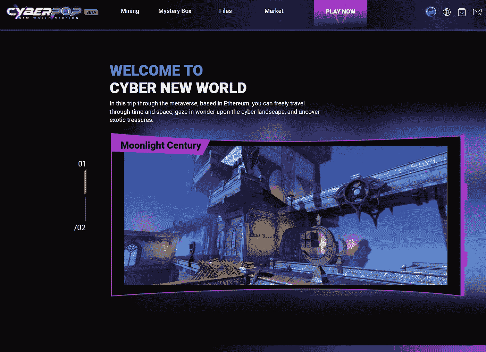
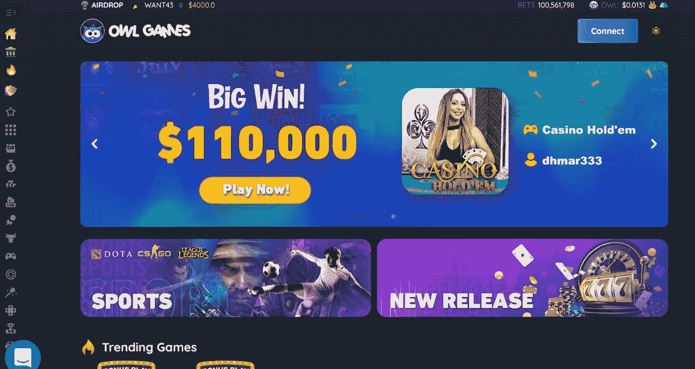
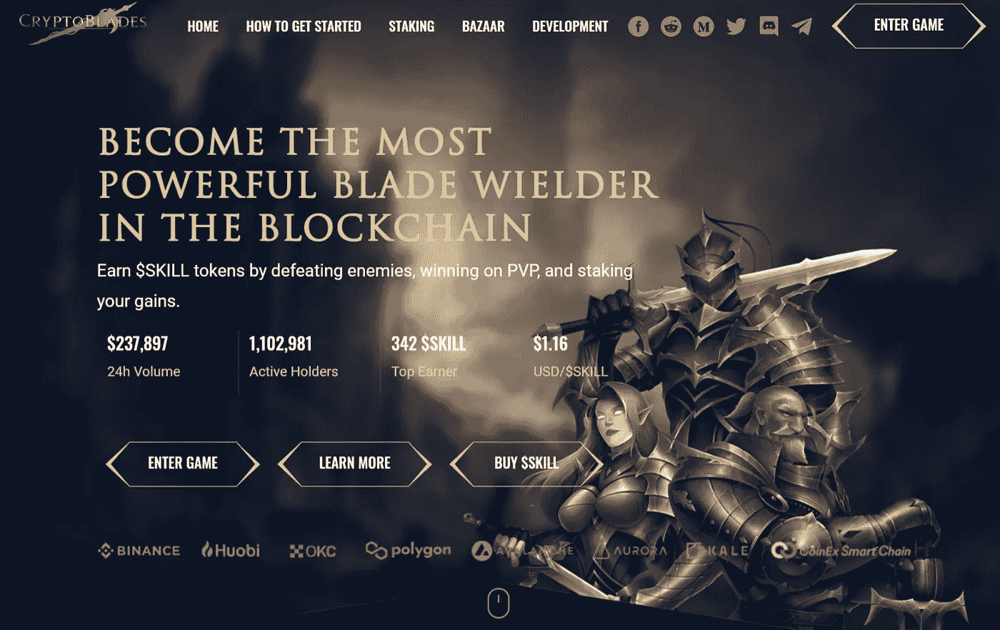
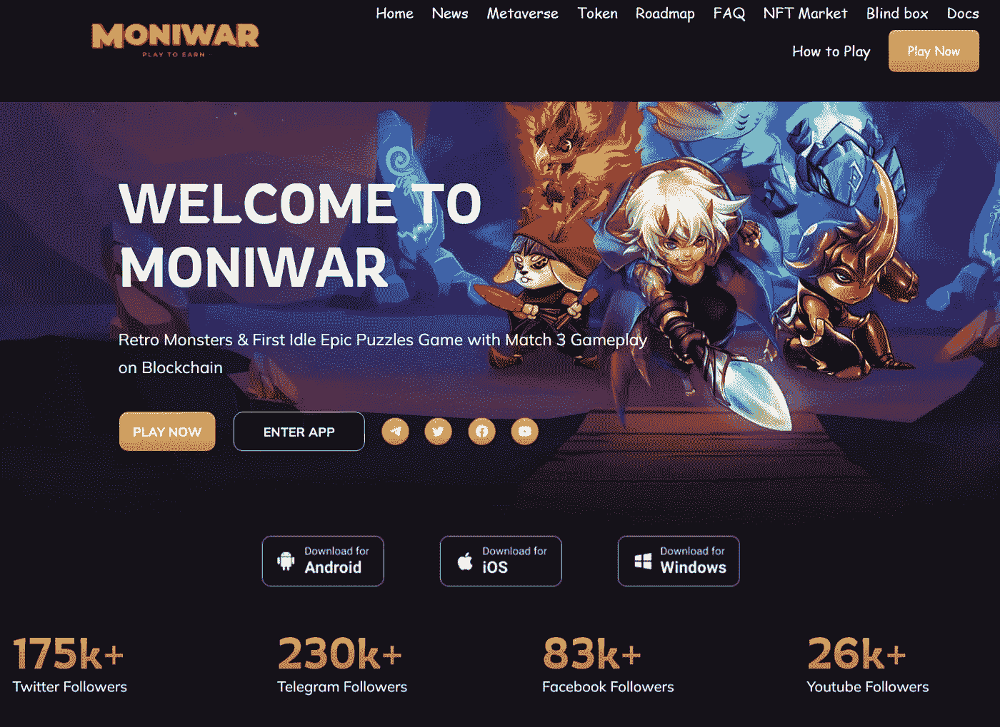
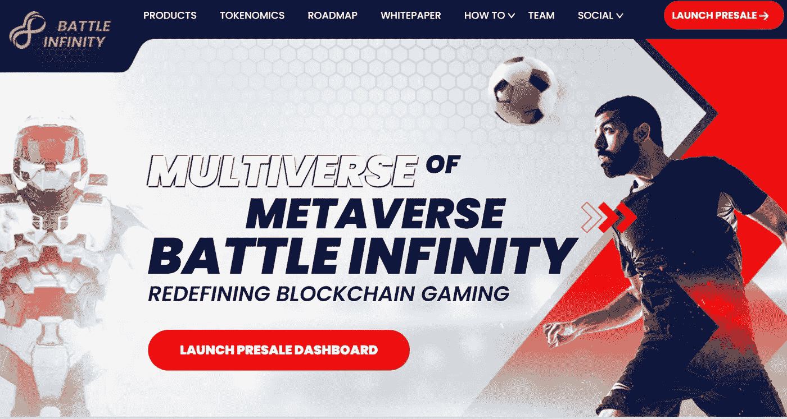

# CSC P2E |改变游戏

> 原文：<https://medium.com/coinmonks/csc-p2e-changing-the-game-797ef6b5d790?source=collection_archive---------27----------------------->

## 在 CSC 上成功玩赚取游戏

## 游戏的演变——玩即赚

玩赚游戏，也称为 P2E 游戏，甚至只是加密游戏，是将加密货币和 NFTs 作为游戏的一个组成部分的游戏。通常，你不是买游戏，而是买里面的东西，比如角色或武器，或者，嗯，任何东西。

这并不完全是独一无二的，许多游戏都使用类似的模式，尤其是所谓的免费游戏(F2P)。这些游戏让你免费玩，甚至让你通过游戏赚取物品，但好东西通常被锁在付费墙后面——或者可能是非常耗时的工作。

然而，区别于免费游戏的是，你可以交易和出售你的资产给其他玩家。这是因为这些资产中有许多是非功能性资产，或者可以转化为功能性资产。

# 文职人员委员会

CoinEx 智能链——CSC 是一个去中心化的高效公共链，具有很高的效率。CSC 致力于为区块链建设基础设施，并以分权原则支持高性能交易，与 EVM 完全兼容。

CSC 为开发人员提供了一个高效、低成本的链上环境来运行分散式智能合约应用程序(DApps)和存储数字资产。

## CSC P2E

像 CSC 这样的平台让开发者可以轻松创建和铸造 NFT，构建 NFT 交易界面，以及开发 NFT 游戏。有了 CSC API，创建一个拥有所有您想要的特性的强大的 dApp 是很容易的。此外，连接到 Web3 和访问区块链数据的能力非常简单。CSC 本身是跨链的，允许您默认构建跨链的 dApp，因此您永远不必担心兼容性问题，因为对多区块链的支持使开发人员的工作更容易，允许您在创纪录的时间内启动 dApp！

## GameFi

GameFi 是一个混合术语，由“游戏”和“金融”两个词组合而成。今天，人们已经直接把它和“为挣钱而玩”(P2E)联系在一起了。因此，他们经常同时提到这两者，并且同时问:“什么是 GameFi 和玩赚(P2E)？”。

这个行业已经从起点走了很长一段路。因此，当有人问“什么是 GameFi？”时，会出现不同的答案。蓬勃发展的 dApp、Web3 和区块链游戏产业展示了众多去中心化游戏应用如何帮助用户赚钱的模型。今天，在游戏类型以及创收机制方面有很大的多样性。

目前对 GameFi 的看法很大程度上与“玩即赚”(P2E)游戏有关。这是因为这些激励措施对用户颇具吸引力，从而催生了大型 P2E 社区。

## 改变世界的加密游戏:P2E 游戏对发展中国家的影响

在 Axie Infinity(运行时间最长的 P2E 游戏之一)被黑掉 6 亿多美元之前，菲律宾公民玩这个游戏是为了谋生和摆脱贫困。超过 10%的人玩这个游戏来谋生，因为他们在网上的平均收入是当时当地平均收入的三倍多。

P2E 是改变生活的科技！

现在，来自其他发展中国家的公民正在抓住这个机会，快速寻找现金，因为各种区块链项目至今仍在开发中。

## 一些有前途的 P2E 游戏

有了边玩边赚钱的可能性，P2E 游戏让你在 NFT 最有趣的冒险活动中获得乐趣的同时也赚了一笔不多的钱。在这里，我们将分析市场上最有前途的 P2E 游戏。

当搜索最有前途的 P2E 游戏时，在投资之前确保你会喜欢游戏本身总是一个好主意。之后，您可以检查游戏的奖励和您可以获得的令牌类型。

*   [CyberPop — **在 CyberPop 的新世界中寻找真实的自己。这款新的元宇宙游戏集探索、战斗、赚钱和 UGC 于一体。**](https://www.cyberpop.online/)

网络流行元宇宙是第一个网络风格的 NFT 元宇宙结合了探索，战斗和 X-to-earn。在 PC、VR、手机等多平台上运行良好，渲染水平不亚于 PS4，提供 AAA 级游戏品质和体验。

*   [owl games——领先的加密赌场解决方案 Web 3.0](https://owl.games/)

Owl Game 的目标是在大多数 EVM 兼容网络上提供无缝、有趣、有利可图的游戏体验。

*   真实密码赚取者——真实密码赚取者代币是给用户的真实游戏奖励代币。
*   [隐剑——成为区块链最强大的剑刃使用者](http://BECOME THE MOST POWERFUL BLADE WIELDER IN THE BLOCKCHAIN)

CryptoBlades 是一款革命性的基于网络的 NFT 角色扮演游戏。游戏的核心是在击败敌人和参与突袭后，用技能令牌奖励玩家，玩家还可以在公开市场上交易他们的角色和武器。

*   [MoniWar —复古怪兽&首款区块链上带有 Match 3 玩法的闲置史诗解谜游戏。](https://moniwar.io/)

MONIWAR 游戏是一个在 NFT 世界等待的史诗冒险。我们带来了一个新的体验:用内置的区块链技术复活一个传奇的猎龙游戏。

*   战斗无限

战斗无限是一个游戏平台，包括几个 P2E 战斗游戏在元宇宙现实中的“战斗竞技场”。游戏玩家不仅可以参与和战斗，还可以享受和体验身临其境的元宇宙宇宙，在那里他们可以同时参与、表演、观察和探索战斗竞技场的虚拟世界。

## 摘要

我的研究范围涵盖了 P2E 奥运会的方方面面。它还涵盖了 P2E 加密游戏可能提供的众多好处，重点是游戏中的数字货币和独特的 NFT。

GameFi 和 P2E 是一个激动人心的空间，吸引了开发者和游戏玩家的想象力。如果你是一个区块链和 Web3 的开发者，你将受益于使用终极区块链，CSC。

CSC 帮助你创建新的 dApps，分散的游戏，和 P2E 社区，你应该能够无缝地建立在你最喜爱的区块链上。此外，您可以在本地跨链架构中无缝集成其他组件。去探索“什么是 GameFi？”以及作为一个游戏和 dApp 开发者，它能给你带来什么好处，你现在需要做的就是[访问 CSC。](https://www.coinex.org/?lang=en_US)

> 交易新手？试试[密码交易机器人](/coinmonks/crypto-trading-bot-c2ffce8acb2a)或者[复制交易](/coinmonks/top-10-crypto-copy-trading-platforms-for-beginners-d0c37c7d698c)