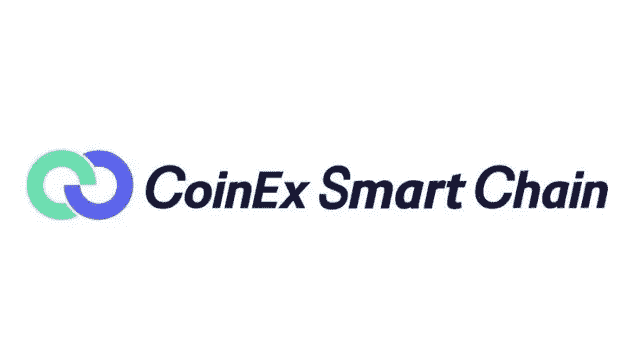

# 革新智能链框架。

> 原文：<https://medium.com/coinmonks/csc-revolutionizing-smart-chain-framework-5c598dbb6d55?source=collection_archive---------39----------------------->

## 评估 CoinEx 智能链

区块链和在其上运行的程序，称为智能合同，越来越多地应用于所有需要信任和强有力认证的领域

“在选择区块链之前，有必要调查区块链实施的质量要求和解决方案，并分析区块链系统的各种质量”

在这里，我们将讨论确定区块链适用性的各种框架，其中包括使其适合 DApp 系统的特征。

# DApps 和 Coinex 智能链

使用区块链的软件程序被称为“分散应用程序”或“DApps ”,是软件开发的主要新趋势之一。DApps 建立在区块链网络上，因此确保了去中心化。DApps 不仅包括实际运行在区块链上的智能链，还包括管理区块链外部数据的软件以及与之交互的用户界面。

CoinEx 智能链 CSC 是一个 PoS 网络，允许开发人员创建他们的分散应用程序。它具有高能效和可扩展性，降低了用户的交易成本。

DApps 和 CSC 可以用于自动执行合同义务，而不必信任中央机构，也没有空间和时间的限制。

## 评估框架

有各种各样的属性被认为是一个基于区块链的系统的独特性。让我们来讨论其中的一些属性

*   **分发:**信息存储在多台计算机上，赋予系统弹性和安全性。
*   **可追溯性:**所有的交易在每一个环节都是可追溯的，并且可以确定地知道它们的原始地址。
*   **信任:**一个给定地址的所有权由非对称加密来保证，资产可以存储在这个地址中。
*   匿名:地址的所有者不需要公布他们的名字来发送交易，而只需要证明相关私钥的所有权。
*   **去中心化:**交易的管理没有一个中心机构。
*   **透明:**区块链的内容易于访问和验证。
*   **不变性:**已接受的数据不能再以任何方式修改。
*   **可编程性:**复杂的动作(智能契约)可以被编程，其代码和执行也是完全可验证的。
*   **低成本**:系统由开源软件管理，维护成本低，运行成本可能也低(不过取决于交易费用)。

# 评估 CSC

本文的主要目标是，一旦选择使用 DApp 来实现给定的应用程序，就可以方便地决定选择哪种特定的区块链体系结构。

为此目的，已经有各种各样的品质，其中最相关的已在上面陈述。我们决定使用这个框架作为研究 CoinEx 智能链的起点。该框架侧重于评估 CSC 区块链技术对于给定应用的适用性，而不是在不同的区块链架构中进行选择。

CSC 展示了这些特性，这使其成为一个优秀的智能链。DApp 系统也需要这些功能，CSC 也支持它们。这里我们将讨论这些特性

1.  **不变性** —区块链是一种仅附加系统，一旦写入，信息就不能更改或删除。在区块链上运行的数据和程序必须是可验证的、不可改变的和伪造的证据。CSC 是不可变的，这确保了高度的安全性。

***‘所有节点的平等性和开放性使 CSC 网络去中心化’***

**2。透明度** —在 CSC 区块链上执行的数据和活动是完全可追溯的。任何人，可能有适当的访问权限，都可以探索区块链，以验证这一点。

***‘CSC 的透明性和不变性使信任成为可能’***

**3。信任** —参与者之间的信任程度如何？CoinEx 智能链即使在没有值得信任的参与者的情况下也能确保信任。即使参与者在 DPoS 共识机制的支持下彼此不信任，它也能很好地工作。

***‘用于将新交易添加到区块链(股权证明)担保中以防止大规模攻击的共识机制’***

**4。身份** —在 CSC 上执行的所有写作活动都有一定的来源。基于私钥所有权；所有者可以公开地将他们的身份与他们的地址相关联。

**5。历史记录** —包括区块链在内的 CSC 系统存储库和应用程序必须保持运行一段适当的时间，通常在几年或几十年的范围内，在此之前被中断或终止的风险可以忽略不计。基于矿工的奖励，网络总是平稳运行，没有中断。

**6。生态系统 — CSC 架构支持合作伙伴之间的互操作性，与单个公司系统相反，与其他 CS 交换数据完全可以通过 CSC 实现。**

*****‘CSC 具有完全的 EVM 兼容性，可以轻松地将 dApps 从以太坊和其他兼容网络迁移到 CSC，而无需进行任何重大改动’*****

**7 .**。效率** — CSC 是高效的智能链。即使在单位时间内有许多用户和许多事务的情况下，CSC 系统也能够以适当的响应时间提供所需的吞吐量。**

*****‘CSC 作为高性能交易的支撑，支持 600+ TPS，块生成时间 3s’*****

****8。可扩展性—** CSC 具有极强的可扩展性。如果需要，该系统能够扩展。**

****9。成本**—CSC 系统是开源的，易于部署，并且需要有限的硬件和网络带宽资源，与 DApp 的规模相兼容。CSC 为开发人员提供了一个高效、低成本的链上环境来运行分散式智能合约应用程序(DApps)。**

*****‘CSC 效率极高，交易费用低。通过 POS 共识协议，CSC 在几秒钟内生成一个块，支持极高的 TPS，同时将交易费用保持在较低水平'*****

****10。开发&部署成本**—CSC 上的系统开发和部署成本较低。**

## ****结束注释****

**区块链必须展现的主要特征是，它是一个本质上分布式的系统，没有中央权威。CSC 最多支持 101 个 block proposers，按照 CET 赌注的多少排序确定。它不需要集中机构的审查，使得网络完全去中心化。**

**为了证明选择区块链平台的合理性，可以使用上述功能来定义一个框架，以确定特定应用程序的最佳架构。这些标准根据重要性进行主观加权，权重值与要实现的特定系统相关。我们选择的权重针对的是一个系统，其目标是管理系统和用户之间的契约关系。**

**CSC 致力于为区块链建设基础设施和分权原则。**

# **访问 CSC**

**[电报](https://t.me/CoinEx_Announcement) | [推特](https://twitter.com/coinexcom) | [脸书](https://www.facebook.com/TheCoinEx) | [网站](https://www.coinex.org/) | [GITHUB](https://github.com/coinexcom/coinex_exchange_api/wiki) | [下载 APP](https://www.coinex.com/#toapp) | [YOUTUBE](https://www.youtube.com/channel/UCMAuqO8ZqfBwgL51-fY5n4g/)**

> ***交易新手？试试* [*密码交易机器人*](/coinmonks/crypto-trading-bot-c2ffce8acb2a) *或* [*复制交易*](/coinmonks/top-10-crypto-copy-trading-platforms-for-beginners-d0c37c7d698c)**