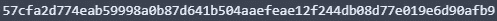

# CSC 学校:密码学#4

> 原文：<https://medium.com/coinmonks/csc-school-cryptography-4-30534b2d94dd?source=collection_archive---------62----------------------->

跳到区块链对第一步不好。进入其中需要密码学的知识。在这个讲座中，我们将看看我们在区块链需要的密码学(特别是 CSC)及其概念。

## 密码系统

密码学，或称密码学，是在敌对行为存在的情况下对安全通信技术的实践和研究。更一般地说，密码学是关于构造和分析防止第三方或公众读取私人信息的协议。

> 不知道什么时候买卖，试试[复制交易](http://coincodecap.com/go/bityard)。

加密签名是区块链的关键部分。它们用于证明地址的所有权，而不会暴露其私钥。这主要用于签署事务，但也可用于签署任意消息。在本文中，您将找到在 CSC 环境中这些签名如何工作的技术解释。

## 公钥和私钥

我们希望从钱包开始这一部分，因为它们是软件，我们需要安装和设置它们，所以我认为密钥是加密钱包为您管理的事情的一部分，所以让我们先开始。钥匙。

关于密码学，首先要知道的是，你永远不应该丢失你的私钥或初始短语，请永远不要忘记这一点。

规则是，你必须将你的私钥输入到一个安全的加密钱包程序中，并且永远不要将其作为文本文件保存在你的个人电脑或手机上，并且它太长了，无法在人类的脑海中记住，所以要写在纸上以确保安全，为此，任何有权访问你的个人电脑或手机的人都无法读取它。

在一些国家，你担心政府可能会寻找你的钥匙，但有更大的房屋被烧毁或被水破坏的风险，所以确保你在不同的安全地方有备份。

如果开发和测试不需要私钥，在源文件中编码，确保不要在日常交易中使用这个开发密钥，当你的密钥放在 GitHub 等中也不算太差。

这同样适用于您的 seed 语句，这是一种将私钥编写为一系列短词的方式，作为开发人员，您直接使用私钥，但最后，用户在加密和纸质钱包之间移动时，会将他们的私钥用作初始表达式。

你还应该知道，你不应该无缘无故地与人分享你的地址和公钥，这样没有人可以在没有你的私钥的情况下直接窃取你的令牌。攻击者可以向您发送钓鱼令牌，这些令牌会将您引向网络上的程序，这些程序会试图欺骗您使用您的私钥来做一些愚蠢的事情。

## 什么是钥匙？

私钥或公钥只是一种数据类型，在 ECC 的特殊情况下，这两个密钥都是非常大的数字，大到可以存储为 string 或 bigInteger。

## 私人密钥

ECC 的私钥是一个随机生成的整数，可以是十六进制的形式:



在许多区块链网络中，这个密钥必须小于某个质数。

这在 hexadecimal‌:是个大数字


使用这个质数的原因超出了本课程的范围，但是这个质数设定的极限是很重要的。不是每个随机整数都是有效的私钥，如果你想创建自己的密钥，它必须小于第一个数字。

```
let privateKey  
do {
    privateKey = generateRandomInteger()
  } while(privateKey > 0xfffffffffffffffffffffffffffffffffffffffffffffffffffffffefffffc2fn)
```

## 公开密钥

ECC 的公钥是两个连接在一起的整数，这两个数字可以具有私钥的长度，但它们不是随机的。这两个数字是根据私钥计算出来的。

公钥如下图所示:


从私钥计算公钥的功能，它基于特定的算法和一些预定的参数，所有与 CSC 网络交互的系统必须使用相同的算法和参数来实现相同的结果。

```
let privateKey
do {
    privateKey = generateRandomInteger()
  } while(privateKey > 0xfffffffffffffffffffffffffffffffffffffffffffffffffffffffefffffc2fn)
const publicKey = generatePublicKey(privateKey)
```

## 种子短语

种子短语也称为秘密恢复短语，是 12 到 24 个短随机单词的列表，用于生成一个或多个私钥，并最终生成公钥和地址。

种子语句可能类似于以下示例:


虽然您可以直接生成一个私钥，但许多加密钱包程序使用一个密钥短语来为您生成它们，许多人使用多个地址。

种子表达式的概念是它是一个随机的单词列表，但从该表达式创建几个私钥的算法是确定的，这允许您从一个表达式中生成几个密钥，从种子语句中检索所有这些密钥，否则您必须单独记下每个私钥。


消极的一点是，如果你的种子短语被盗，所有生成的私钥也将被盗，这意味着无论什么对你的私钥是真的，对你的初始表达式也是十倍真的，因为它与多个私钥是一样的。

永远不要在电脑或智能手机上的加密钱包应用程序之外写你的初始短语，永远不要把它存储在 S3 桶或 GitHub 中，等等。如果您的智能手机或笔记本电脑丢失或损坏，要找回您的密钥，您可以将种子短语写在一张纸上，并将其保存在安全的地方。

## 钥匙是用来做什么的？

到目前为止，你已经知道了键是什么，以及应该如何使用它们，但是它们到底是用来做什么的呢？

私钥和公钥用于不同的任务。它们的有用性来自于这样一个事实:每个人都可以拥有你的公钥，而任何人都不应该拥有你的私钥。

## 用私钥签署消息

他们使用私钥对数据进行签名，签名意味着在数据上附加一个签名。签名是使用签名算法创建的，该算法使用您的私钥和要签名的数据。

关键是没有私钥就不能生成签名数据。

在 Base64 版本中，签名可能是这样的:


公钥是用来验证签名的，如果你用私钥签名的话，相关的公钥结合签名算法，签名和被签名的数据会产生是或否的结果，这个来自私钥的签名是正确的。

当您是唯一拥有您的私钥的人时，您是唯一可以创建这些签名的人，如果您的密钥被盗，其他人可以声称他们是原始所有者，如果您丢失了您的私钥，您将不再能够创建签名，并且您的公钥系统不会相信您是您所说的那个人。

在图 2 中，您可以看到这三部分是如何相互作用的。


## 用公钥加密消息

您了解了可以使用公钥来验证签名，但这并不是使用公钥所能做的唯一事情，公钥能够加密只有相应的私钥才能打开的消息。

如果你想使用非对称加密进行私人通信，你必须交换公钥，任何人只要有你的公钥，就可以给你发送只有你能阅读的信息。

下图显示了简化的流程。出于性能原因，该映像中的消息通常不是您想要发送的实际数据，而是与私钥持有者交换的对称加密密钥，然后用于加密/解密双方之间的所有当前消息。


## ECDSA

椭圆曲线数字签名算法(ECDSA)是一种数字签名算法(DSA ),它使用从椭圆曲线加密(ECC)导出的密钥。这是一个基于公钥加密(PKC)的特别有效的等式。

ECDSA 在许多安全系统中使用，在安全消息应用中很受欢迎，它是比特币安全的基础(比特币“地址”充当公钥)。

ECDSA 还用于传输层安全性(TLS ),它是安全套接字层(SSL)的继任者，通过加密 web 浏览器和 web 应用程序之间的连接来实现。HTTPS 网站的加密连接(由浏览器中显示的物理挂锁图像表示)是通过使用 ECDSA 的签名证书实现的。

与另一种流行的算法 RSA 相比，ECDSA 的一个主要特征是，ECDSA 以较短的密钥长度提供了更高程度的安全性。这进一步增加了它的投资回报率，因为 ECDSA 比 RSA 使用更少的计算机能力，这是一个不太安全的竞争等式。

使用[椭圆曲线点操作](https://en.wikipedia.org/wiki/Elliptic_curve_point_multiplication)，我们可以从私钥中导出一个值，这个值是不可逆的。这样，我们可以创建安全且防篡改的签名。得出这些值的函数被称为[活板门函数](https://en.wikipedia.org/wiki/Trapdoor_function)。

## 使用 ECDSA 签名和验证

ECDSA 签名包含两个数字(整数):`r`和`s`。CSC 还使用一个额外的`v`(恢复标识符)变量。签名可以记为`{r, s, v}`。

要创建一个签名，你需要要签名的消息和要签名的私钥(`dₐ`)。“简化的”签名过程如下所示:

1.  从要签名的消息中计算一个散列值(`e`)。
2.  为`k`生成一个安全随机值。
3.  通过将`k`乘以椭圆曲线的常数`G`来计算椭圆曲线上的点`(x₁, y₁)`。
4.  计算`r = x₁ mod n`。如果`r`等于零，返回步骤 2。
5.  计算`s = k⁻¹(e + rdₐ) mod n`。如果`s`等于零，返回步骤 2。

在 CSC 中，hash 通常用`Keccak256("\x19CSC Signed Message:\n32" + Keccak256(message))`计算。这确保签名不能用于 CSC 之外的目的。

因为我们对`k`使用随机值，所以每次得到的签名都不一样。当`k`不够随机时，或者当值不是秘密时，可以使用两个不同的签名来计算私钥(“故障攻击”)。但是，当你[在 MyCrypto](https://mycrypto.com/sign-and-verify-message/sign) 中对一条消息进行签名时，每次的输出都是一样的，那么这怎么保证安全呢？这些*确定性*签名使用 [RFC 6979 标准](https://tools.ietf.org/html/rfc6979)，该标准描述了如何基于私钥和消息(或散列)为`k`生成安全值。

`{r, s, v}`签名可以组合成一个 65 字节长的序列:32 字节用于`r`，32 字节用于`s`，1 字节用于`v`。如果我们将其编码为十六进制字符串，我们最终会得到一个 130 个字符长的字符串，大多数钱包和接口都使用这个字符串。例如，MyCrypto 中的完整签名如下所示:

我们可以在 MyCrypto 的“验证消息”页面使用这个，它会告诉我们`0x76e01859d6cf4a8637350bdb81e3cef71e29b7c2`签署了这个消息。


你可能会问:为什么要包含所有额外的信息，比如`address`、`msg`和`version`？你就不能验证一下签名本身吗？不完全是。这就像签署一份合同，然后删除合同中的任何信息，只保留签名。与事务签名不同(我们将对此进行更深入的讨论)，消息签名仅仅是一个签名。

为了验证消息，我们需要原始消息、签名时使用的私钥地址以及签名`{r, s, v}`本身。版本号只是 MyCrypto 使用的任意版本号。MyCrypto 的非常老的版本用于将当前日期和时间添加到消息中，创建一个散列，并使用上述步骤进行签名。这后来被改变以匹配 JSON-RPC 方法`[p](https://eth.wiki/json-rpc/API)ersonal_sign`的行为，所以版本“2”被引入。

恢复公钥的(再次“简化”)过程如下所示:

*   计算要恢复的消息的哈希(`e`)。
*   计算椭圆曲线上的点`R = (x₁, y₁)`，其中`v = 27`为`r`，而`v = 28`为`r + n`。
*   计算`u₁ = -zr⁻¹ mod n`和`u₂ = sr⁻¹ mod n`。
*   计算点`Qₐ = (xₐ, yₐ) = u₁ × G + u₂ × R`。

`Qₐ`是签名地址的*公钥*对*私钥*的点。我们可以从中导出一个地址，并检查它是否与提供的地址匹配。如果是，则签名有效。

## 恢复标识符(“v”)

`v`是签名的最后一个字节，可以是 27 ( `0x1b`)或 28 ( `0x1c`)。这个标识符很重要，因为我们正在处理椭圆曲线，曲线上的多个点可以单独从`r`和`s`计算。这将导致可以被恢复的两个不同的公钥(因此是地址)。`v`只是指示使用这些点中的哪一个。

在大多数实现中，`[v](https://github.com/ethereum/go-ethereum/issues/19751#issuecomment-504900739)`[在内部只是 0 或 1](https://github.com/ethereum/go-ethereum/issues/19751#issuecomment-504900739)，但是 27 被添加为用于签署比特币消息的任意数字，CSC 也适应了这一点。

由于 [EIP-155](https://eips.ethereum.org/EIPS/eip-155) ，我们也使用链 ID 来计算`v`值。这防止了跨不同链的重放攻击:为 CSC 签名的事务不能用于 Ethereum Classic，反之亦然。然而，目前这仅用于签署交易，而不用于签署消息。

## 已签名的交易

到目前为止，我们主要讨论了消息上下文中的签名。与消息一样，事务在发送之前也要签名。对于像 Ledger 和 Trezor 设备这样的硬件钱包，这发生在设备本身。对于私钥(或密钥库文件、助记短语)，这是直接在 MyCrypto 上完成的。这使用了一种非常类似于消息签名的方法，但是事务的编码稍有不同。

已签名的交易采用 [RLP](https://eth.wiki/en/fundamentals/rlp) 编码，由所有交易参数(随机数、汽油价格、汽油限额、to、值、数据)和签名(v、r、s)组成。已签名的事务如下所示:

```
0xf86c0a8502540be400825208944bbeeb066ed09b7aed07bf39eee0460dfa261520880de0b6b3a7640000801ca0f3ae52c1ef3300f44df0bcfd1341c232ed6134672b16e35699ae3f5fe2493379a023d23d2955a239dd6f61c4e8b2678d174356ff424eac53da53e17706c43ef871
```

## 被推荐的

[密码术](https://en.wikipedia.org/wiki/Cryptography)

[ECDSA](https://en.wikipedia.org/wiki/Elliptic_Curve_Digital_Signature_Algorithm)

[RSA](https://en.wikipedia.org/wiki/RSA_(cryptosystem))

> 加入 Coinmonks [电报频道](https://t.me/coincodecap)和 [Youtube 频道](https://www.youtube.com/c/coinmonks/videos)了解加密交易和投资

# 另外，阅读

*   [去中心化交易所](https://coincodecap.com/what-are-decentralized-exchanges) | [比特恩斯 FIP](https://coincodecap.com/bitbns-fip) | [Pionex 评论](https://coincodecap.com/pionex-review-exchange-with-crypto-trading-bot)
*   [用信用卡购买密码的 10 个最佳地点](https://coincodecap.com/buy-crypto-with-credit-card)
*   [最好的卡达诺钱包](https://coincodecap.com/best-cardano-wallets) | [Bingbon 副本交易](https://coincodecap.com/bingbon-copy-trading)
*   [如何给 MetaMask 钱包添加 Arbitrum？](https://coincodecap.com/how-to-add-arbitrum-to-metamask-wallet)
*   [KuCoin vs 北海巨妖 vs BitYard](https://coincodecap.com/kucoin-vs-kraken-vs-bityard)