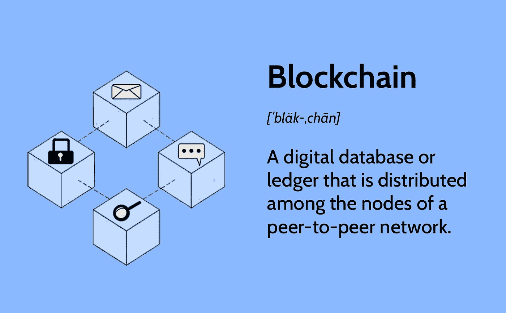
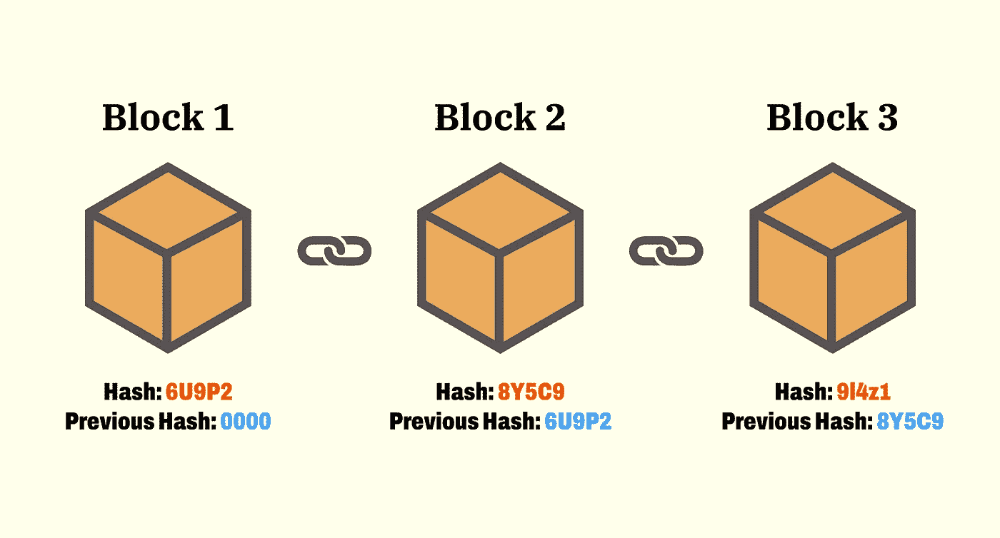
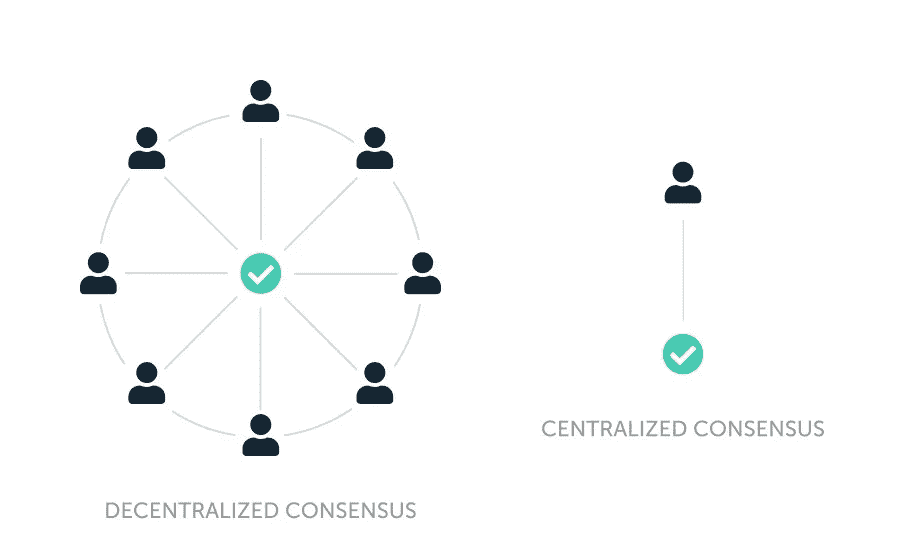

# CSC 学校:CSC 生态系统#1

> 原文：<https://medium.com/coinmonks/csc-school-csc-eco-system-1-410d2f527438?source=collection_archive---------30----------------------->

## CSC 是什么？

Coinex 智能链是一个基于支持智能合约的 **CPOS** 共识协议的分散式区块链。CSC 不仅仅是一个支付网络或新型货币，它是一个分散的通用平台。这意味着 CSC 可以用来建立一个银行，一个商店，游戏服务等。智能合同是建立在 CSC 使用其编程语言 Solidity 之上的。

> 从顶级交易者那里复制交易机器人。免费试用。

开发人员可以构建分散的应用程序，这些应用程序可以在以太坊虚拟机(EVM)上的 CSC 网络上执行，因此 CSC 几乎与以太坊相同，所以您为 CSC 开发的每个 Dapp 都可以在以太坊上执行，反之亦然。

## 区块链

Source: investopedia.com

区块链是一种分布式账本技术( **DLT** )，它由不断增长的记录列表组成，称为**块**，这些记录使用加密技术安全地链接在一起。这意味着区块链是一个分布式的永久数据库，由计算机网络上的多个节点共享。他们记录数据的方式使得修改或入侵系统在概率上是不可能的。每个块包含前一个块的加密散列、时间戳和事务数据(通常表示为 Merkle 树，其中数据节点用树叶表示)。

Source: Money.com

时间戳证明事务数据在块创建时就存在。由于每个块包含关于前一个块的信息，它们有效地形成了一个**链**(比较链表数据结构)，每个附加的块链接到它前面的块。因此，区块链交易是不可逆的，因为一旦它们被记录，任何给定块中的数据在不改变所有后续块的情况下不能被追溯性地改变。

区块链通常由对等(P2P)计算机网络管理，用作公共分布式分类帐，其中节点共同遵守共识算法协议来添加和验证新的事务块。

第一个去中心化的区块链是由一个叫中本聪的人(或一群人)在 2008 年提出的。Nakamoto 以一种重要的方式改进了设计，使用一种类似 Hashcash 的方法来标记块，而不要求它们由可信方签名，并引入一个难度参数来稳定块添加到链中的速率。该设计于次年由 Nakamoto 实施，作为加密货币比特币的核心组件，它充当网络上所有交易的公共账本。

## 共识；一致

Source: Ledger.com

分布式计算和多代理系统中的一个基本问题是在存在大量错误进程的情况下实现整个系统的可靠性。这通常需要协调过程以达成**共识**，或者就计算过程中需要的一些数据值达成一致。consensus 的应用实例包括同意将哪些事务以何种顺序提交给数据库、状态机复制和原子广播。

Coinex 智能链采用 CPOS 共识协议，在支持高性能交易方面完全兼容以太坊虚拟机(EVM)，最大容量可同时支持 101 个验证器。同时，CSC 坚持去中心化和免许可的原则，这样任何人都可以通过 CET 成为验证者。

CSC 的目标:

1.  生成块的时间周期更短
2.  与以太坊的兼容性更高
3.  分散

虽然工作证明(POW)已被证明是一种实用的分布式网络解决方案，但它不是环境友好的，并且需要大量的参与者来维护网络安全。

另一方面，一些其他网络在不同的场景中使用授权证明(POA)或其变体，包括测试网络和主网络。POA 提供了 51%攻击的防御，在防止一些拜占庭节点作恶方面更有效。然而，POA 协议不够分散，因为验证者拥有极大的权力，容易受到腐败和安全攻击。

因此，一些区块链项目在不牺牲去中心化的前提下，引入了其他的共识方案，如 EOS 和 Cosmos 采用的 DPOS，允许令牌持有者投票选举验证者节点，使区块链更加去中心化，有利于社区管理。

CoinEx 团队经过严谨的调查研究，坚持去中心化的原则，结合 POS 和 POA 的特点，实现 CPOS，又不失网络的稳定性和安全性。CPOS 的特点如下:

1.  生成的块最多有 101 个验证器节点。
2.  任何人都可以在没有任何许可的情况下通过下注 CET 成为验证者。
3.  验证器轮流生成块。当验证器节点正常产生块时，难度为 2；当验证器节点不按预定顺序产生块时，难度降为 1；当方块分叉时，会系统地选择难度最大的链。
4.  任何人都可以为他们信任的验证器下注。
5.  验证器

## 大学英语四六级考试

CSC 上的 CET 运行方式与 ETH 在以太坊上的运行方式相同，其主要功能有:

1.  作为对验证者的整体奖励
2.  向 CSC 支付传输和合同调用的天然气费用
3.  支付在 CSC 上部署智能合同的交易费用
4.  委托给选定的验证者

欢迎每个人通过参加 CET 申请成为认证者。验证器的第一次赌注必须超过 1000 CET，随后的每次赌注必须超过 1000 CET。基于整体的标桩排名，区块链将在每 200 个块中选择前 101 个节点作为验证器。验证器有义务生成块并验证链上信息。作为回报，验证者将根据他们的赌注比例获得批量佣金和一定数量的批量生产奖励(目前为`1 CET`)。

1.  立桩标界

欢迎大家通过下注 CET 来协助节点成为验证者。可以通过合同调用或命令操作直接拆分资产，这些 CET 将在 86，400 块之后可用于撤回。

1.  系统合同

CSC 通过系统契约来管理节点堆栈和治理。系统合同已在 CSC 启动后部署。目前，为 CSC 设计了两套系统合同:

*   验证器合同

通过标桩合同，任何人都可以创建节点，为节点标桩并获利。

*   斜线合同

由于网络、硬件、配置等因素，CSC 可能会因网络异常、机器崩溃等潜在问题而导致不稳定。因此，中国证监会引入了惩罚机制。斜杠契约主要负责跟踪验证器节点的错误块记录。当错误的块记录达到某个阈值时，将从验证者的押记资产中扣除 500 CET 的罚款。

## 奖励

主要是对验证者的奖励来自大宗交易奖励(每笔 1 CET)和大宗交易佣金。奖励根据验证者赌注在总赌注中的比例而不同。由于验证者以相同的概率轮流生成块(如果它们保持 100%在线)，所有验证者的收益只与它们的赌注比例有关。

区块链按每 200 块赌注的比例分配奖励。验证器的奖励接收地址可以通过调用契约或通过节点命令行来检索奖励。每 28800 块可以提现奖励。

## 斜线

CSC 惩罚不能正常产生阻塞的验证器节点。所有验证器节点轮流生成块。当轮到一个节点产生一个块但它失败时，错误的块记录将加 1。每 200 个块将所有节点的错误块记录减少一个。当错误的块记录达到 48，500 CET 时，将从验证者的资产中扣除罚款。如果不止一个地址被标桩到该节点，则损失与标桩成比例。

您可以通过调用契约或通过节点命令行来查询节点的错误块记录。

## 被推荐的

[Coinex 智能链文档](https://docs.coinex.org/#/en-us/introduction)

[区块链](https://en.wikipedia.org/wiki/Blockchain)

[简单解释一下区块链是如何工作的](https://www.youtube.com/watch?v=SSo_EIwHSd4)

[密码术](https://en.wikipedia.org/wiki/Cryptography)

> 加入 Coinmonks [电报频道](https://t.me/coincodecap)和 [Youtube 频道](https://www.youtube.com/c/coinmonks/videos)了解加密交易和投资

# 另外，阅读

*   [最佳网上赌场](https://coincodecap.com/best-online-casinos) | [币安评论](/coinmonks/binance-review-ee10d3bf3b6e) | [BitMEX 评论](https://coincodecap.com/bitmex-review)
*   [麻雀交换评论](https://coincodecap.com/sparrow-exchange-review) | [纳什交换评论](https://coincodecap.com/nash-exchange-review)
*   [美国最佳加密交易机器人](https://coincodecap.com/crypto-trading-bots-in-the-us) | [经常性评论](https://coincodecap.com/changelly-review)
*   [在印度利用加密套利赚取被动收入](https://coincodecap.com/crypto-arbitrage-in-india)
*   [Godex.io 审核](/coinmonks/godex-io-review-7366086519fb) | [邀请审核](/coinmonks/invity-review-70f3030c0502) | [BitForex 审核](https://coincodecap.com/bitforex-review)